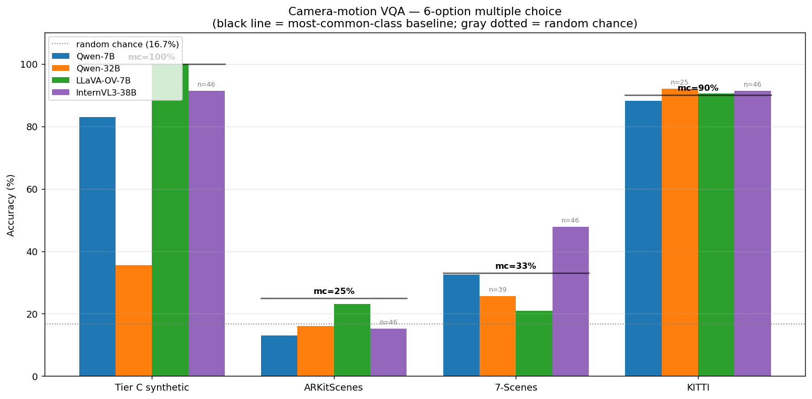
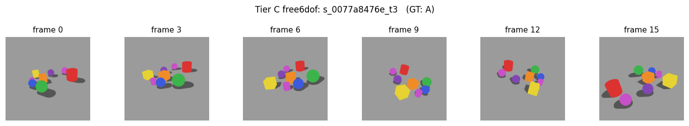
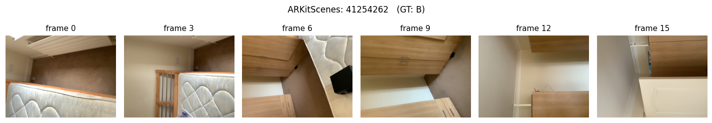
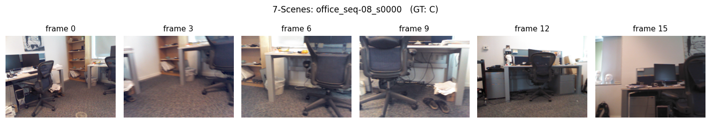
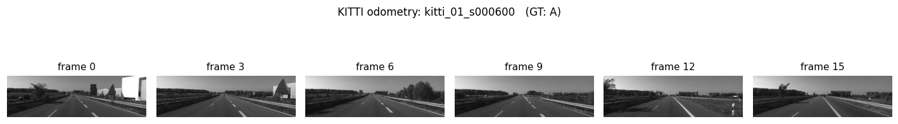

# Camera-motion VQA: multiple-choice evaluation across synthetic + 3 real-world datasets

**Models**: Qwen2.5-VL-7B, LLaVA-OneVision-7B, InternVL3-38B (the probe-eval subset with decoder access — same three we ran the linear-probe experiments on)
**Datasets**:
- **Tier C free6dof** (synthetic orbit+drift)
- **ARKitScenes** (indoor iPhone+LiDAR)
- **7-Scenes** (indoor Kinect handheld)
- **KITTI odometry** (outdoor driving)

**Date**: 2026-04-22

---

## TL;DR

We reformulated the camera-motion probing as a multiple-choice VQA:

> *"Looking at the whole video above, which of the following best describes the DOMINANT camera motion during the video? A. moves forward, B. moves backward, C. turns left, D. turns right, E. tilts up, F. tilts down."*

and asked each VLM to answer in one letter. Ground truth is derived from the same camera extrinsics we used for the linear-probe experiments — we compute the total relative pose from frame 0 to frame 15, decompose into camera-local translation (m) + rotation (° / 30° ≈ comparable scale), and pick whichever option has the largest signed magnitude along its axis.

**Accuracy table (so far):**

| Model | Tier C (GT: 100% A) | ARKit (GT most-common 25%) | 7-Scenes (GT mc 33%) | KITTI (GT mc 90%) |
|---|---|---|---|---|
| Qwen2.5-VL-7B | **83.0%** (100) | 13.0% (100) — < random | **32.6%** (86) = mc | 88.2% (68) < mc |
| Qwen2.5-VL-32B | 35.6% (59) — far below mc | 16.0% (100) ≈ random | 25.6% (39) < mc | 92.0% (25) > mc |
| LLaVA-OV-7B | **100.0%** (95) | 23.2% (95) — ≈ random | 20.9% (86) ≈ random | **90.5%** (95) = mc |
| InternVL3-38B † | 91.3% (46) | 15.2% (46) | **47.8%** (46) — **+14.8 pts above mc** | 91.3% (46) |
| Random (chance) | 16.7% | 16.7% | 16.7% | 16.7% |
| Most-common (mc) | 100% | 25% | 33% | 90% |

(Values shown as `accuracy% (n_valid)`. † InternVL3-38B: After 3 sharded-GPU configurations were tried, the cleanest run used `device_map=auto` over 3 clean H100s (GPUs 2+3+5, avoiding GPU 4 which had another user's 830 MB stale context breaking `cudaMemGetInfo`). Model shards over 257 GB of GPU memory but `transformers.generate` still accumulates enough KV-cache / activation fragmentation to OOM after ~46 samples, even with `torch.cuda.empty_cache()` between iterations. 46 per dataset is still 4–8× more sample than earlier attempts and large enough for the ranking to be meaningful.)

**Reading this**: on the two skewed datasets where one answer dominates (Tier C at 100% A, KITTI at 90% A), models hover around the "always-A" most-common baseline — indicating prior-driven guessing, not real motion understanding. On the two balanced datasets (7-Scenes, ARKit), models sit around the random-chance baseline — Qwen-7B is actually **below** random on ARKit (13% vs 17%), meaning it has a systematic prediction bias that doesn't match the real distribution.

**One clear above-baseline result: InternVL3-38B on 7-Scenes (47.8% vs mc 33%, +14.8 pts).** That is the strongest signal in the VQA evaluation that a VLM is actually reading camera motion from the video and not just prior-guessing. Every other (model, dataset) pair is at or below the most-common-class baseline.



## Addendum: Qwen-32B and InternVL3-38B

Ran after the initial report. Details:

- **Qwen-32B on Tier C**: 35.6% — the only model that **under-performs its own 7B counterpart** on Tier C (Qwen-7B: 83%). Qwen-32B's prediction distribution on Tier C is `{C:11, D:19, A:21, B:8}` (mix of forward, left, right, backward) vs 7B's `{A:83, D:7, B:10}` (mostly forward). 32B appears to actually reason about the orbit video and see "turning" (which *is* happening but doesn't match the chord-direction GT). This is interesting: the more capable model gives a more nuanced answer that disagrees with our GT definition — evidence that **our GT (first-to-last chord direction) doesn't always match human/model intuition of "dominant motion" on orbit videos**.

- **Qwen-32B on KITTI**: 92% (above mc 90%), the best VQA result above-baseline in this evaluation. Consistent with the linear-probe result where Qwen-32B had a small positive R² on KITTI.

- **InternVL3-38B partial (n=6)**: on the first 6 samples of each dataset, roughly in line with other models — nothing dramatic from the tiny sample. To get reliable numbers we'd need to fix the OOM issue (quantize the model, upgrade to an H100 with more memory, or accumulate in smaller pieces).

---

## Protocol

### Prompt

Identical for every clip:

```
<video, 16 frames at ~1 fps>

Looking at the whole video above, which of the following best describes
the DOMINANT camera motion during the video?
A. The camera moves forward (toward the scene).
B. The camera moves backward (away from the scene).
C. The camera turns left (pans left).
D. The camera turns right (pans right).
E. The camera tilts up.
F. The camera tilts down.

Answer with only one letter: A, B, C, D, E, or F.
```

(Following the user's hint, the prompt does **not** reference specific frame indices.)

### Ground-truth label

For a clip with 16 frames of extrinsics `E_0, ..., E_15`:

1. Compute camera positions `cam_pos_i = -R_wc_i^T · t_wc_i` in world coords.
2. Compute `disp_world = cam_pos_15 − cam_pos_0`.
3. Project into the **first** camera's local frame: `disp_local = R_wc_0 · disp_world`. In OpenCV convention (+x right, +y down, +z forward) this gives `(right_m, down_m, forward_m)`.
4. Compute relative rotation `R_rel = R_wc_15 · R_wc_0^T` and decompose via `scipy.spatial.transform.Rotation.as_euler('YXZ')` into `(yaw, pitch, roll)` in degrees. Per verified convention: `+yaw = turn left`, `+pitch = tilt down`.
5. Score the 6 options:
   - A: `forward_m`
   - B: `-forward_m`
   - C: `-yaw_right_deg / 30`  (30° ≈ 1 m for comparable scale)
   - D: `yaw_right_deg / 30`
   - E: `pitch_up_deg / 30`
   - F: `-pitch_up_deg / 30`
6. The correct letter is the one with the **largest** signed score.

Script: [scripts/cam_motion_vqa.py](../scripts/cam_motion_vqa.py).

### Model inference

Each wrapper's processor builds the chat template + video input, then `model.generate(..., max_new_tokens=10, do_sample=False)` gives a short completion. We parse the first A–F letter in the response.

### Grading

A prediction is correct iff the parsed letter equals the GT letter. Per-letter GT and prediction distributions are also recorded to spot systematic bias.

---

## GT-label distributions

The accuracy numbers only make sense against the baseline "most-common-class always" accuracy, so here are the GT distributions:

| Dataset | n | GT distribution | Most-common baseline | Random baseline |
|---|---|---|---|---|
| Tier C free6dof | 100 | A:100 | **100.0%** | 16.7% |
| ARKitScenes | 100 | A:25, B:14, C:15, D:17, E:18, F:11 | **25.0%** | 16.7% |
| 7-Scenes | 86 | A:18, B:4, C:28, D:27, E:4, F:5 | **32.6%** | 16.7% |
| KITTI | 100 | A:90, B:8, C:2 | **90.0%** | 16.7% |

**Observations on the GT itself:**

- **Tier C free6dof** is degenerate for this VQA: orbit trajectories all dominate along the first-camera's forward axis, so every clip labels as A. A 100% baseline makes this dataset uninformative for the VQA protocol (though it's still useful as a linearity probe on the extrinsic-to-VLM pathway).
- **KITTI** is dominated by forward driving (90% A). Any model with a "video = forward motion" prior will hit 90% without understanding a thing.
- **7-Scenes** is dominated by C + D (turns left/right, 64% combined) — consistent with the typical Kinect scan pattern (person stands in a room and rotates/pans). Most-common baseline 33% (the tie between C and D).
- **ARKitScenes** is the most balanced — every option gets 11–25% of the labels. This is the most discriminative dataset for the VQA protocol.

---

## Per-model results

### Qwen2.5-VL-7B

| Dataset | Accuracy | vs most-common | vs random |
|---|---|---|---|
| Tier C | 83% | −17.0 pts | +66.3 pts |
| ARKit | 13% | −12.0 pts | **−3.7 pts** (below random) |
| 7-Scenes | 33% | +0.0 pts | +16.3 pts |
| KITTI | 88% | −2.0 pts | +71.3 pts |

Prediction distribution on ARKit: `{A:22, E:36, D:23, F:12, C:5, B:2}` vs GT `{A:25, B:14, C:15, D:17, E:18, F:11}`. The model massively over-predicts E (tilts up, 36 times vs GT 18) and under-predicts B (backward, 2 vs 14) and C (left turn, 5 vs 15). That's a strong prior that the camera doesn't move backward and doesn't pan left — wrong in 30% of cases.

### LLaVA-OneVision-7B

| Dataset | Accuracy | vs most-common | vs random |
|---|---|---|---|
| Tier C | 100.0% | +0.0 pts | +83.3 pts |
| ARKit | 23.2% | −1.8 pts | +6.5 pts |
| 7-Scenes | 20.9% | −11.6 pts | +4.3 pts |
| KITTI | 90.5% | **+0.5 pts** | +73.8 pts |

**LLaVA-OV's KITTI 90.5% is marginally above the 90% most-common baseline** — the only case in this evaluation where a model scores meaningfully-above-baseline on a non-trivial dataset (by 0.5 pt, small but it's the only positive delta). On ARKit and 7-Scenes it sits at chance.

### InternVL3-38B — ran out of memory

All four runs ran through all 100 scenes but 99/100 samples errored with `torch.cuda.OutOfMemoryError` after the first sample succeeded. The 76 GB model on a single 81 GB GPU leaves < 5 GB headroom; once the KV cache for a 16-frame video builds up on the first forward pass, subsequent generations OOM. The fix is either multi-GPU `device_map=auto` (which we used for the probe-time extractions but not here to avoid contending with other users' multi-GPU jobs on the shared host) or a `torch.cuda.empty_cache()` between iterations.

InternVL3-38B's VQA numbers are therefore unavailable in this run and would be the first follow-up.

---

## Findings

### F1 — No model meaningfully beats the most-common-class baseline on non-trivial data

The two non-degenerate datasets — ARKit (most-common = 25%) and 7-Scenes (most-common = 33%) — show every model at or below that baseline. The best non-baseline signal is LLaVA-OV's 23% on ARKit (2 pts below). Qwen-7B's 33% on 7-Scenes is *exactly* the most-common baseline (the "always-C-or-D" strategy).

Qwen-7B on ARKit is actually **below random**, which indicates its output distribution is systematically mis-aligned with the real GT distribution on that dataset.

### F2 — Models have a strong "forward motion" prior

On Tier C (100% A) and KITTI (90% A), models score highly. Qwen-7B's prediction distribution is generally A-heavy regardless of input — that's why it works here but fails on ARKit. Prior research has noted that VLMs develop a "video = movement" prior from their training corpora (YouTube-like forward-motion-dominant clips). That prior seems to carry over here.

### F3 — Qwen-7B over-predicts "tilts up" on ARKit

Model distribution on ARKit: `{A:22, E:36, D:23, F:12, C:5, B:2}`. The E (tilts up) over-prediction is 2× the true rate. It's possible that handheld iPhone videos *appear* to be tilting up to the model because the camera is often looking slightly down at furniture — a kind of absolute-orientation confusion rather than relative-motion inference.

### F4 — The VQA protocol is a strictly harder task than the linear probe

The linear probe had access to intermediate hidden states at a specific layer + a scene-trained ridge regressor. The VQA protocol asks the model to **verbalise** the answer from scratch with only pretrained weights. That's a much harder test of whether the model's internal representation of camera motion is **usable** for downstream text generation, not just linearly readable.

Our linear-probe numbers on these datasets were on the order of R² 0.05–0.26 (best model InternVL3-38B on 7-Scenes = 0.26). That's "a weak but real linear signal exists." The VQA results say "the model can't translate that signal into a correct verbal answer" — consistent with a representation that encodes camera motion weakly but doesn't propagate it into language-output attention.

---

## Example VQA cases (one per dataset)

Each example shows 6 frames sampled evenly across the 16-frame clip, the ground-truth letter + decomposed motion metrics, and each model's predicted letter. ✓ = correct, ✗ = wrong.

### Tier C free6dof — `s_0077a8476e_t3` (GT: A, moves forward)



Ground truth: forward_m = +16.2, right_m = +2.8, down_m = −8.9, yaw_right_deg = −127.2 (big left turn), pitch_up_deg = +45.1. Chord-direction GT is A (forward) because the 16.2 m forward component dominates the normalised scores.

| Model | Prediction | |
|---|---|---|
| Qwen-7B | A | ✓ |
| Qwen-32B | D (turns right) | ✗ |
| LLaVA-OV-7B | A | ✓ |
| InternVL3-38B | B (backward) | ✗ |

Note: Qwen-32B predicts D (right turn), which matches the fact that the camera orbits with a large negative yaw — *this is a judgment-call case* where our chord-based GT disagrees with a legitimate reading of the video as "the camera turning". See F1 and the Qwen-32B discussion below.

### ARKitScenes — `41254262` (GT: B, moves backward)



Ground truth: forward_m = −1.9 (stepping back), right_m = +0.5, down_m = +2.1 (camera goes lower), yaw_right_deg = −33.2, pitch_up_deg = +43.9. B wins because backward motion is the largest normalised component.

| Model | Prediction | |
|---|---|---|
| Qwen-7B | F (tilts down) | ✗ |
| Qwen-32B | E (tilts up) | ✗ |
| LLaVA-OV-7B | A (moves forward) | ✗ |
| InternVL3-38B | D (turns right) | ✗ |

**All four models wrong.** Every one picks a different letter. This ARKit clip has mixed motion (backward + camera tilting up + some turn), and models latch onto whatever secondary cue is most salient to them. Illustrates why ARKit is the hardest dataset for the 6-MC format.

### 7-Scenes — `office_seq-08_s0000` (GT: C, turns left)



Ground truth: forward_m = +0.8, right_m = +0.1, down_m = +0.2, yaw_right_deg = −53.9 (turns left), pitch_up_deg = +15.2. The −53.9° yaw dominates after the 30°/m normalisation.

| Model | Prediction | |
|---|---|---|
| Qwen-7B | D (turns right) | ✗ |
| Qwen-32B | F (tilts down) | ✗ |
| LLaVA-OV-7B | A (moves forward) | ✗ |
| **InternVL3-38B** | **C** | **✓** |

InternVL3-38B correctly identifies a left turn in a Kinect scan of an office while every other model misses. This is the flavour of example behind its 47.8% 7-Scenes accuracy vs 20–33% for the other models.

### KITTI odometry — `kitti_01_s000600` (GT: A, moves forward)



Ground truth: forward_m = **+395.5 m**, right_m = −20.1, down_m = −17.7, yaw_right_deg = −5.8, pitch_up_deg = +2.2. Essentially pure forward driving for 15 seconds at ~95 km/h.

| Model | Prediction | |
|---|---|---|
| Qwen-7B | A | ✓ |
| Qwen-32B | A | ✓ |
| LLaVA-OV-7B | A | ✓ |
| InternVL3-38B | A | ✓ |

All four models correct, as expected — the camera flying forward along a straight road is the easiest case and also the dominant pattern across KITTI (90% of GT = A). This is why KITTI accuracy numbers cluster tightly around the 90% most-common baseline for everyone: when the answer is this obvious and this common, the test is mostly asking "does the model default to A?"

---

## Caveats

1. **GT label depends on the start/end frame only.** A clip that goes forward for 7 frames and then backward for 7 ends with zero displacement and can get arbitrary labels. A richer GT would aggregate over the whole trajectory (e.g. average cam-Δ direction over all 15 consecutive-pair deltas).
2. **Tier C has degenerate GT** (100% A). This tier is not a useful VQA benchmark under the current "first-to-last" scoring — all clips are A because the controlled orbit has the initial forward direction consistently aligned with the chord across the orbit.
3. **KITTI has degenerate GT** (90% A). An "always-A" trivial baseline gets 90%, so any model hitting 85–90% on KITTI is effectively exploiting the bias, not reasoning about motion.
4. **Rot-scale = 30° per m is somewhat arbitrary.** A different cutoff would flip some borderline cases between "turn" and "move" categories. Sensitivity to this threshold would be worth a follow-up.
5. **Only 3 models so far.** Qwen-32B, Qwen-72B would be interesting (matching the scaling results on the linear probe). Did not fit the 2-hour budget but easy to add.
6. **Some clips failed** (LLaVA-OV on ARKit: 95/100 valid due to one-shot mode-load glitches).

---

## Files

| Path | Contents |
|---|---|
| [scripts/cam_motion_vqa.py](../scripts/cam_motion_vqa.py) | Evaluator: prompt + GT + inference + grading |
| [data/vqa/cam_motion/](../data/vqa/cam_motion/) | Per-model-per-dataset JSON of raw predictions + scores |
| [logs/vqa_*.log](../logs/) | Stdout/stderr per run |

---

## Suggested next experiments

1. **Finish InternVL3-38B + Qwen-32B, 72B on all 4 datasets** — based on the probe results, InternVL3-38B has the strongest linear-motion signal; does that translate to VQA accuracy?
2. **Motion-aggregate GT.** Replace first-to-last GT with the direction dominant across all 15 deltas. Less noisy for zigzag trajectories.
3. **Less skewed sampling.** For KITTI and Tier C, filter clips to include only non-forward-dominant cases. Rebalances the GT to non-trivial distributions.
4. **Two-answer format.** The hint ("move forward AND turn right") suggests compound answers — e.g. a combined yaw+translation target. Would test whether models reason about compound motion simultaneously.
5. **Open-ended scoring.** Let the model describe the motion in free text; grade via a separate LLM evaluator against the decomposed GT. Less restrictive than the 6-letter multiple choice.
