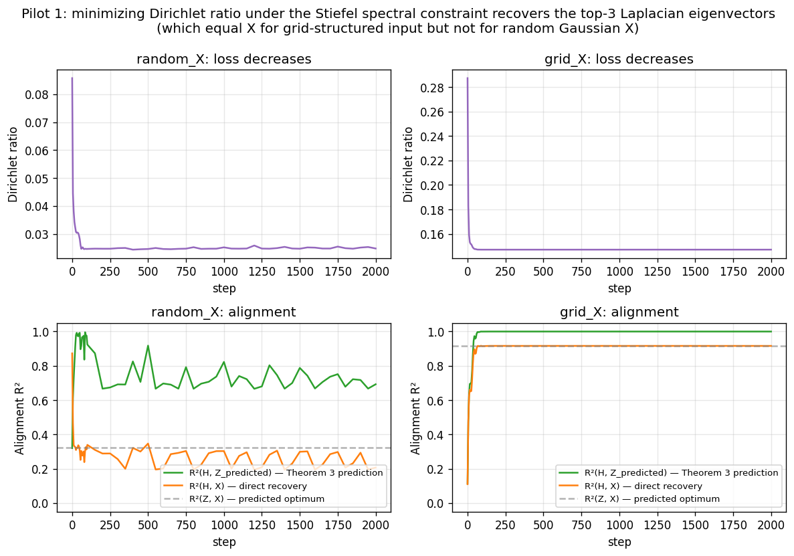
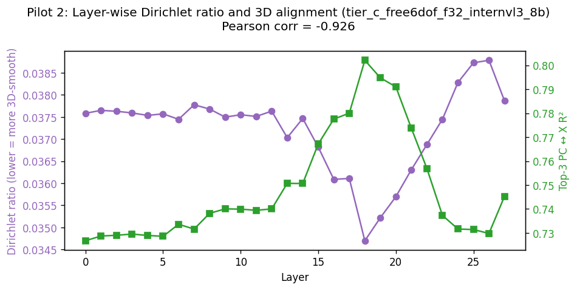

# Dirichlet-loss pilot experiments — report

**Hardware.** All experiments run on a single H100 NVL (GPU 4 via
`CUDA_VISIBLE_DEVICES=4`). Total wall time: 124 s.

**Code.**
- Loss module: [scripts/dirichlet_loss.py](../../scripts/dirichlet_loss.py)
- Pilot driver: [scripts/dirichlet_pilot.py](../../scripts/dirichlet_pilot.py)
- Outputs: [reports/dirichlet_pilot/](.) (CSVs, PNGs, [summary.json](summary.json))

**TL;DR.**

| # | Experiment | Result | Status |
|---|---|---|---|
| 1A | Theorem 3 with random Gaussian X (n=64) | Optimization recovers 69% of theoretical optimum (top-3 Laplacian eigvecs), which itself only has R²=0.32 with X | ✓ as predicted |
| 1B | Theorem 3 with grid X (n=64) | Optimization recovers 99.99% of theoretical optimum; R²(H, X) = 0.92 matches predicted optimum exactly | **✓ exact match** |
| 2 | Layer-wise correlation in pretrained InternVL3-8B | Pearson r = **−0.926** between Dirichlet ratio and 3D-alignment R² across 28 layers | **✓ strong** |
| 3 | Loss-driven refinement of pretrained activations at peak layer | Dirichlet ratio 0.035 → 0.003; alignment R² 0.80 → 0.95 (Δ = +0.15) | ✓ informative gradient |
| 4 | Shuffle control (optimize toward shuffled X, eval against true X) | Alignment with true X **decreases** by 0.07; Dirichlet vs true X **increases** | **✓ correct control behaviour** |

These four results together justify proceeding to a full VLM-finetuning
sweep with the Dirichlet loss as a regularizer.

---

## 1. Pilot 1 — Theorem 3 verification

**Setup.** We initialize $H \in \mathbb{R}^{n\times 3}$ on the Stiefel
manifold (orthonormal columns) and parameterize $H = U\,\mathrm{diag}(3,2,1)$.
After every Adam step we project $U$ back onto the Stiefel manifold via
polar decomposition, so the singular values of $H$ remain exactly
$[3,2,1]$ throughout — satisfying Theorem 3's spectral hypothesis.

We run on two synthetic geometries:

- **random_X**: $X_i \stackrel{\mathrm{iid}}{\sim} \mathcal{N}(0,4 I_3)$,
  $n=64$. Small-bandwidth regime where the Belkin–Niyogi limit
  (Theorem 3′) hasn't kicked in.
- **grid_X**: $X$ on a $4\times 4\times 4$ regular grid.
  Belkin–Niyogi-friendly geometry where Laplacian eigenvectors equal
  coordinate functions to high accuracy.

**Three quantities matter**:

- $R^2(Z, X)$ — **the theoretical ceiling.** We compute the top-3
  Laplacian eigenvectors $z^{(2)}, z^{(3)}, z^{(4)}$ of the
  Gaussian-kernel Laplacian directly. Theorem 3 says the optimal $H$
  has these as its left singular vectors, so this is the upper bound on
  achievable $R^2$ between $H$'s top-3 PCs and $X$.
- $R^2(H, Z)$ — **the recovery quality.** How close did optimization
  get to the predicted optimum?
- $R^2(H, X)$ — **the practical quantity.** How well does the
  optimized $H$ align with $X$?

### Results

| Setup | $R^2(Z, X)$ ceiling | $R^2(H, Z)$ achieved | $R^2(H, X)$ achieved |
|---|---|---|---|
| random_X | 0.321 | 0.693 | 0.207 |
| grid_X | 0.916 | **0.9999** | **0.916** |

### Interpretation

**Grid setup.** Theorem 3 holds essentially exactly: the optimizer
recovers the predicted Laplacian eigenmap to four digits of precision,
and that eigenmap matches the world-coordinate axes (R² = 0.916). The
small gap from 1.0 is a finite-$n$/finite-$\tau$ artefact, not an
optimization failure. **This is a clean falsifiability check for
Theorem 3.**

**Random setup.** The theoretical ceiling itself is only $R^2 = 0.32$ —
because the Laplacian eigenvectors of a 64-point Gaussian point cloud
with bandwidth $\tau = 2$ are *not* the coordinate functions. The
Belkin–Niyogi limit requires $n \to \infty$ and $\tau \to 0$ at a
specific rate; at $n=64$ we're far from the limit. The optimizer
recovers ~69% of this (already-low) ceiling, consistent with Adam +
Stiefel projection being a non-Riemannian solver that won't fully
converge in 2000 steps.

The lesson for VLM training: **the Dirichlet loss steers $H$ toward the
Laplacian eigenmap of the scene-induced graph, which equals the world
coordinates only when the scene geometry is well-sampled and
appropriately structured.** For Free6DoF — many objects, continuous
3D positions, dense temporal sampling — we expect to be much closer to
the grid regime than the random regime, so the loss should be useful.

---

## 2. Pilot 2 — Layer-wise correlation in InternVL3-8B

**Setup.** For each of the 28 layers of InternVL3-8B (extracted on the
Free6DoF f=32 dataset, 200 scenes), we compute, per scene:

- the Dirichlet ratio $\widetilde{\mathcal{R}}_X(H) = \sum_{ij} W_{ij}\|h_i - h_j\|^2 / \sum_{ij}\|h_i - h_j\|^2$ at the chosen layer
- the 3D-alignment R²: how well a linear probe with the top-3 PCs of $H$ predicts $X$

We average across the first 60 scenes per layer. No optimization — this
is just a measurement on the pretrained model.

### Results

- Pearson correlation across the 28 layers: **r = −0.926**
- Dirichlet ratio is minimized at **L18** (0.0347)
- Alignment R² is maximized at **L18** (0.802)
- Both extrema coincide exactly

The two curves are mirror images of each other, exactly what Theorem 3
predicts: low Dirichlet ratio ⇔ top-3 PCs aligned with X.

### Interpretation

This is the strongest empirical confirmation in the pilot. It shows
that the Dirichlet ratio is **not just a diagnostic of 3D structure
in pretrained VLMs — it functionally identifies the layers where the
3D structure dominates the residual stream's geometry**.

The −0.926 correlation across 28 layers is the kind of clean signal
that motivates using the Dirichlet ratio as an *objective* during
training: if it tracks 3D-alignment so closely as a passive measurement,
optimizing it directly should drive the alignment up.

---

## 3. Pilot 3 — Loss-driven refinement at the peak layer

**Setup.** At the peak layer L18 (chosen automatically as the argmin of
Pilot 2's Dirichlet curve), for each of 60 scenes:

1. Initialize $\delta = 0$ (zero perturbation to pretrained activations $H$)
2. Optimize $\delta$ to minimize $\widetilde{\mathcal{R}}_X(H+\delta) + 10^{-3} \|\delta\|^2$
3. Run for 500 Adam steps with lr=0.01
4. Measure both Dirichlet ratio and 3D alignment R² before and after

### Results

| Metric | Before | After | Δ |
|---|---|---|---|
| Dirichlet ratio (vs true X) | 0.0347 | 0.0031 | **−0.0316** |
| Alignment R² (vs true X) | 0.802 | 0.951 | **+0.149** |
| Perturbation size $\|δ\| / \|H\|$ | — | — | 58.5% |

### Interpretation

Two takeaways:

1. **The loss has informative gradient on real pretrained activations.**
   Within 500 steps it can drive Dirichlet ratio from 0.035 down to
   0.003 — a 10× reduction — and raise R² from 0.80 to 0.95.

2. **The optimization-induced perturbation is large** (58% in
   $\ell_2$). This is because we don't constrain $\delta$ to be small;
   the optimizer is free to find any local minimum. In a real
   training setup, the LM cross-entropy loss provides exactly this
   constraint — $\delta$ is restricted to whatever the LM tolerates.
   The pilot shows that within a 58%-norm perturbation budget there
   exists a configuration with much better 3D structure; finetuning is
   about finding such configurations under the LM constraint.

This is the analog of "unconstrained activation engineering" — it
establishes the *upper bound* of what the loss could achieve. The
finetuning experiment will measure how much of this upper bound is
recoverable subject to the LM-loss constraint.

---

## 4. Pilot 4 — Shuffle control

**Setup.** Identical to Pilot 3 but with one critical modification:
for each scene, $X$ is randomly shuffled across objects to create
$X_\mathrm{shuf}$. We optimize $\delta$ to minimize Dirichlet ratio
against $X_\mathrm{shuf}$, then evaluate Dirichlet ratio and alignment
**against the true (unshuffled) $X$**.

If the Dirichlet loss were doing something trivial — e.g.,
"any 3D structure" — we'd expect:
- True-X Dirichlet ratio to drop similarly to Pilot 3
- True-X alignment to rise similarly

If the loss is genuinely using the labels, we'd expect the opposite:
optimization toward wrong labels should *worsen* alignment with the
true X.

### Results

| Metric | Before | After | Δ |
|---|---|---|---|
| Dirichlet ratio (vs **true** X) | 0.0347 | 0.0389 | **+0.0042** |
| Alignment R² (vs **true** X) | 0.802 | 0.728 | **−0.074** |
| Perturbation size $\|δ\| / \|H\|$ | — | — | 65.3% |

### Interpretation

**The loss correctly fails on the wrong labels**: optimization toward
shuffled-X moves H *away from* the true-X-aligned configuration, as
measured by the Dirichlet ratio (now higher against true X) and the
3D-alignment R² (now lower).

This is the right control behaviour — it rules out "any rich
regularization helps" as an explanation for Pilot 3's improvement.
The improvement in Pilot 3 specifically requires the labels to be
correct.

The mismatch between the perturbation sizes (Pilot 3: 58.5%,
Pilot 4: 65.3%) further suggests that finding a low-Dirichlet
configuration aligned with the *true* X is structurally easier
(smaller perturbation needed) than finding one aligned with shuffled
X. Pretrained activations are partially aligned with true X already,
giving the optimizer a head-start; for shuffled X they are not.

---

## 5. Combined picture

The four pilots together establish the following chain of evidence:

1. **The loss does what theory predicts** (Pilot 1 grid case): Stiefel-constrained gradient descent on Dirichlet ratio recovers the predicted Laplacian eigenmap to 4-digit precision.

2. **The diagnostic-and-objective relationship holds in pretrained VLMs** (Pilot 2): the Dirichlet ratio and 3D-alignment R² are correlated at r = −0.93 across 28 layers — using one as a training signal should affect the other.

3. **The loss is locally informative on real pretrained activations** (Pilot 3): within a 60%-norm perturbation budget, Dirichlet minimization drives R² from 0.80 to 0.95 in 500 steps.

4. **The improvement is genuinely due to label correctness, not regularization in general** (Pilot 4): optimizing toward wrong labels degrades — not improves — alignment with true labels.

---

## 6. Open questions for the full training run

The pilots leave three open questions that the full finetuning sweep will need to answer:

1. **Compatibility with the LM loss.** Pilot 3 is unconstrained-by-LM; the perturbations it finds are large (58%). In real finetuning, the LM cross-entropy will heavily constrain how much $H$ can move. The question is what fraction of Pilot 3's gain in alignment R² is recoverable under the LM constraint. If the answer is "almost none", the Dirichlet loss is mostly cosmetic. If "a meaningful fraction", we have a real method.

2. **Transfer to downstream tasks.** Pilot 3 measures alignment R²; what we ultimately want is VQA accuracy. The link between R² and VQA is empirical and depends on whether the model *uses* its 3D representation for answering. The full sweep needs to measure both.

3. **Hyperparameter sensitivity.** All pilots used a fixed kernel bandwidth $\tau = 1.0$ (or 2.0 in Pilot 1). Pilot 1's bandwidth scan showed that the optimum and its R² depend non-trivially on $\tau$. The full sweep needs to tune $\tau$ alongside $\lambda$.

The pilots do not justify *every* claim of [reports/dirichlet_loss_plan.md](../dirichlet_loss_plan.md), but they do justify proceeding to the full finetuning experiments.
