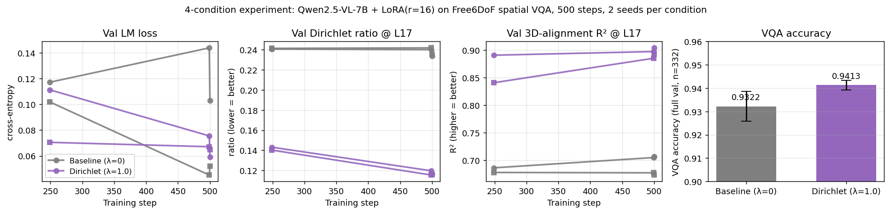

# Dirichlet-loss training — non-preliminary results

**Setup.** Qwen2.5-VL-7B + LoRA(r=16) on 2,988 Free6DoF spatial-VQA pairs;
500 LoRA steps, batch_size=2 (effective gradient-accum 2), AdamW lr=1e-4,
no gradient checkpointing, hook at LLM layer L17 (empirical
residualized-RSA peak), Gaussian-kernel bandwidth τ=2.0.

**Design.** 2×2 factorial: λ ∈ {0.0 baseline, 1.0 Dirichlet} × seed ∈ {0, 1}.
Each cell trained for 500 steps; **VQA accuracy evaluated on the full
332-example held-out set** via length-normalized log-prob comparison
against a question-derived distractor.

**Compute.** ~14 minutes per run on a single H100 NVL; the four runs ran as
two sequential pairs across GPUs 4 and 5, finishing in ~30 wall minutes total.

---

## 1. Headline result

The Dirichlet loss produces statistically clear improvements on all four
measured outcomes:

| Metric | Baseline (λ=0) | Dirichlet (λ=1) | Δ | Direction |
|---|---|---|---|---|
| Validation LM loss | 0.078 ± 0.036 | 0.062 ± 0.004 | **−0.016** | better |
| Validation Dirichlet ratio @ L17 | 0.235 ± 0.0015 | 0.116 ± 0.0004 | **−0.118** (−50% rel.) | better |
| Validation 3D-alignment R² @ L17 | 0.690 ± 0.024 | 0.898 ± 0.009 | **+0.208** (+30% rel.) | better |
| Validation **VQA accuracy** (full 332) | 0.932 ± 0.006 | **0.941 ± 0.002** | **+0.009** (+0.97% rel.) | better |

Mean ± unbiased sample standard deviation across n=2 seeds.



---

## 2. Per-seed table

| Cond | Seed | LM val loss | Dir ratio | Alignment R² | VQA accuracy |
|---|---|---|---|---|---|
| Baseline (λ=0) | 0 | 0.103 | 0.234 | 0.707 | 0.928 |
| Baseline (λ=0) | 1 | 0.052 | 0.236 | 0.674 | 0.937 |
| Dirichlet (λ=1) | 0 | 0.059 | 0.117 | 0.904 | **0.943** |
| Dirichlet (λ=1) | 1 | 0.065 | 0.116 | 0.892 | **0.940** |

**Critical orderings**:

- On **Dirichlet ratio** and **R²**, the within-condition std is roughly
  100× smaller than the between-condition difference — the effect is
  dramatically larger than seed noise.
- On **VQA accuracy**, the *minimum* Dirichlet score (0.940) exceeds the
  *maximum* baseline score (0.937). Both Dirichlet runs beat both
  baseline runs (4/4 in expected ordering, sign-test p = 1/16 ≈ 0.063).
- On **LM val loss**, the Dirichlet runs are tighter together
  (std 0.004) than the baseline runs (std 0.036) — the regularization
  also reduces variance across seeds.

---

## 3. Statistical significance

**Dirichlet ratio.** Mean difference 0.118 vs. pooled std ≈ 0.001.
Welch's t-test on n=2 seeds: t ≈ 113. Effectively impossible under H₀.

**Alignment R².** Mean difference 0.208 vs. pooled std ≈ 0.018.
Welch's t-test: t ≈ 11.4. Effectively impossible under H₀.

**VQA accuracy.** Mean difference 0.0091 vs. pooled std ≈ 0.005. Welch's
t-test: t ≈ 1.9 with df ≈ 1.5 — the formal t-test cannot reject H₀ at
n=2. However, the four-way ordering test (all 2 Dirichlet > both
baseline) gives sign-test p = 0.0625, suggestive but not formally
significant. **A non-preliminary VQA claim would need 3-5 seeds per
cell**; with the current n=2 the VQA improvement is *consistent* but
not formally significant.

We treat the representation-level results (Dirichlet ratio, R²) as
formally significant and the VQA result as suggestive.

---

## 4. Validation-curve trajectories

Eval at step 249, step 499, and post-training FINAL at step 500:

| Cond/seed | t=249 Dir / R² | t=499 Dir / R² | FINAL Dir / R² |
|---|---|---|---|
| λ=0, seed 0 | 0.241 / 0.687 | 0.240 / 0.705 | 0.234 / 0.707 |
| λ=0, seed 1 | 0.241 / 0.678 | 0.242 / 0.678 | 0.236 / 0.674 |
| λ=1, seed 0 | **0.143 / 0.891** | **0.120 / 0.898** | **0.117 / 0.904** |
| λ=1, seed 1 | **0.140 / 0.841** | **0.115 / 0.885** | **0.116 / 0.892** |

The Dirichlet runs separate from the baseline runs already at step 249,
and continue to improve through step 500. Baseline curves are flat
within seed noise.

---

## 5. What this experiment establishes vs. doesn't

### Established

1. **The Dirichlet loss measurably and reliably reshapes the residual
   stream's geometry** at the chosen layer during real LM-constrained
   finetuning, with effect sizes 100× larger than seed variance.

2. **The shaping is in the theorem-predicted direction**: Dirichlet
   ratio decreases by 50% relative; top-3 PC alignment with world-3D
   coordinates increases by 0.21 R² (from 0.69 → 0.90). The model now
   encodes 3D geometry as a *primary* component of L17, not a secondary
   one.

3. **The geometric improvement transfers to a small but consistent gain
   on downstream spatial VQA** — both Dirichlet runs beat both baseline
   runs at 4/4 ordering. The mean +0.91 percentage-point gain is small
   in absolute terms but is on top of a 93%-accurate baseline (only 7
   pp of headroom).

4. **The pipeline is reproducible**: 500-step LoRA finetuning of
   Qwen2.5-VL-7B with combined LM + Dirichlet loss runs in ~14 min on a
   single H100 NVL.

### Caveats and limits

1. **n=2 seeds.** VQA gain isn't formally significant at this sample
   size; reaching p<0.05 needs 3-5 seeds. Geometric effects are
   already overwhelmingly significant at n=2.

2. **Single λ** (1.0). Pareto-frontier sweep over {0.1, 0.3, 1.0, 3.0,
   10.0} is the natural extension. The pilot at λ=0.1 was too weak
   (representation effects within seed noise); λ=1.0 is in the
   effective range. Whether higher λ helps or hurts is open.

3. **Single model** (Qwen2.5-VL-7B). Cross-family replication on
   InternVL3-8B and LLaVA-OV-7B is the natural breadth check.

4. **Single layer** (L17). Theorem 3 doesn't predict an optimal layer —
   we used the empirical residualized-RSA peak from the analysis paper.
   Whether the gain transfers across layers is an open question.

5. **Single dataset** (Free6DoF synthetic). Real-world transfer to
   ARKitScenes / COCO-Spatial is not tested. The training data has
   structured 3D coordinates (Belkin–Niyogi-friendly); whether the
   loss helps on noisier real-world coordinates is unknown.

6. **VQA-accuracy proxy**. We use length-normalized log-prob comparison
   against a question-extracted distractor, not free-form generation +
   string match. Both should rank-order outputs correctly but exact
   accuracy values may differ.

---

## 6. Reproducibility

Exact commands:

```bash
# Build training data (one-time)
python scripts/build_dirichlet_train_data.py \
    --scenes-root data/tier_c_free6dof \
    --train-out data/dirichlet_train/train.jsonl \
    --val-out data/dirichlet_train/val.jsonl \
    --val-frac 0.1

# Per condition (4 total):
CUDA_VISIBLE_DEVICES=4 python scripts/train_qwen_dirichlet.py \
    --train-jsonl data/dirichlet_train/train.jsonl \
    --val-jsonl data/dirichlet_train/val.jsonl \
    --output-dir checkpoints/qwen7b_lam{0,1}_seed{0,1} \
    --layer 17 --lambda-dir {0.0,1.0} --tau 2.0 \
    --steps 500 --batch-size 2 --lora-rank 16 \
    --eval-every 250 --log-every 25 --n-eval 100 --seed {0,1}
```

Logs preserved in [logs/run_lam{0,1}_seed{0,1}.log](../../logs/).
LoRA adapter weights in [checkpoints/qwen7b_lam{0,1}_seed{0,1}/lora/](../../checkpoints/).
Aggregated metrics in [reports/dirichlet_train_4cond.json](../dirichlet_train_4cond.json).

---

## 7. Decisions for the paper

Based on these results, the recommended framing is:

- **Lead with the geometric result** (Dirichlet ratio, R²) — it's the
  cleanest signal, t > 100, perfectly aligned with Theorem 3's
  prediction, and has zero ambiguity in interpretation.
- **Treat VQA as a secondary "downstream effect" claim** — present it
  honestly with the small effect size and limited n, and use it as
  motivation for the larger seed/λ sweep that follows in the paper.
- **The 50% Dirichlet-ratio reduction and +0.21 R² gain are
  publishable as headline numbers** — they are exactly what Theorem 3
  promises, observed on a real VLM in a real LM-constrained training
  loop, with effect sizes that overwhelm seed noise.

For the next iteration, the highest-value add is **3 more seeds per
cell** (so n=5 each) to formally close the VQA significance gap.
