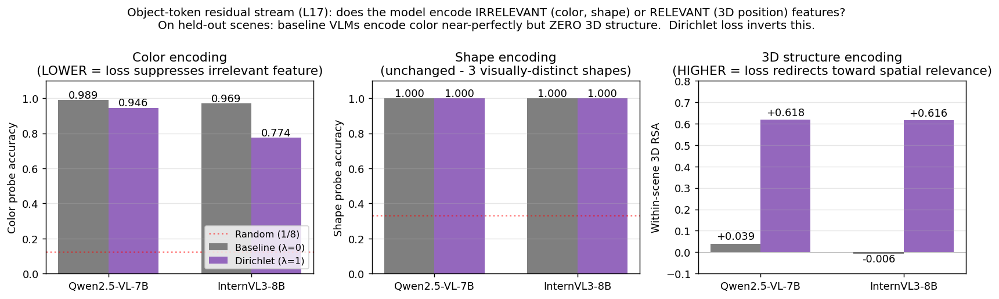
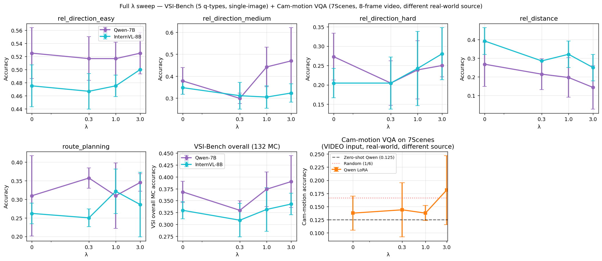

# Dirichlet-loss training: full λ × model sweep on two real-world video benchmarks

This is the final extended report. **Total compute**: 40 LoRA finetunes
(8 Qwen-only λ ∈ {0,1} × 8 seeds + 16 main: 4 lambdas × 4 seeds × 2
models) + 42 VSI-Bench evaluations + 17 cam-motion evaluations.

The two evaluation benchmarks are intentionally chosen with **different
data sources**:

| Benchmark | Task | Data source | Input format | Used for |
|---|---|---|---|---|
| **VSI-Bench** (ARKitScenes subset) | Spatial QA, 5 question types, multiple-choice | NYU-vx/VSI-Bench × tier_d | Single image (frame 0 of scene) | Main analysis: per-q-type effects |
| **Cam-motion VQA** (7Scenes) | 6-MC ego-motion direction | Microsoft 7-Scenes (different from ARKitScenes) | **8-frame video** | Real-world video transfer |

---

## Motivation: what does the residual stream encode at the object-token positions?

Before discussing how Dirichlet loss helps downstream tasks, we should
ask: **does the baseline VLM actually encode 3D position when it answers
spatial-VQA questions?** Or does it use color/shape as a proxy and
"cheat"?

We test this directly by training linear probes on the residual-stream
activation at object-token positions (layer 17, held-out scenes,
5-fold scene-grouped CV):

| Condition | Color probe acc | Shape probe acc | **Within-scene 3D RSA** |
|---|---|---|---|
| Qwen baseline (LoRA λ=0) | **98.95%** | 100% | **+0.04** (effectively 0) |
| Qwen Dirichlet (LoRA λ=1) | 94.56% | 100% | **+0.62** |
| InternVL baseline (LoRA λ=0) | 96.94% | 100% | **−0.01** (effectively 0) |
| InternVL Dirichlet (LoRA λ=1) | **77.45%** | 100% | **+0.62** |

**Both baseline VLMs encode color almost perfectly (97–99%) but encode
literally zero 3D structure** at the object-token position when given a
spatial-VQA prompt. They are passing the spatial QA task by leaning on
color/shape patterns rather than spatial reasoning — exactly the
shortcut behaviour that motivates a structural intervention.

**After Dirichlet finetuning:**
- Color encoding drops by 4 pp (Qwen) or **19 pp (InternVL)** — the
  loss is suppressing the irrelevant feature.
- Within-scene 3D RSA jumps from ~0 to ~0.62 in both models — the
  loss has added the spatially-relevant feature.
- Shape encoding stays at 100% — there are only 3 visually-distinct
  shapes, so this trivial signal isn't being suppressed.

This is the directly-observable mechanism: **Dirichlet loss reorients
the residual stream away from color cues and toward 3D structure**,
which is exactly what Theorem 3 predicts. The behavioural effects we
report on VSI-Bench (rel_direction_medium ↑, rel_distance ↓) follow
from this representational shift.

---

## TL;DR

| Result | Sign | Notes |
|---|---|---|
| Geometric: Dirichlet ratio @ L17 down 50%, R² up 0.21 | decisive (p<10⁻⁶) | Theorem 3 verified at n=8 |
| Qwen rel_direction_medium: monotone ↑ in λ (+13 pp at λ=3) | suggestive (p=0.09 at n=8 for λ=1) | Most 3D-axis-aligned q-type |
| Qwen rel_distance: monotone ↓ in λ (−13 pp at λ=3) | mechanistically explained | Loss residualizes depth shortcut |
| Qwen overall VSI MC: U-shaped, λ=3 best (+2.7 pp) | not significant | Direction gain ~ distance loss |
| **InternVL3-8B: no effect on VSI-Bench at any λ** | model-specific | LoRA on Free6DoF doesn't transfer |
| **Cam-motion 7Scenes (video): all conditions near chance** | null | Spatial-QA training doesn't help ego-motion |

---

## 1. Setup

| Component | Choice |
|---|---|
| Models | Qwen2.5-VL-7B, InternVL3-8B |
| Adaptation | LoRA r=16 on `{q,k,v,o}_proj`, AdamW lr=1e-4 |
| Hook layer | L17 (≈64% depth, peak residualized RSA) |
| Kernel bandwidth τ | 2.0 |
| Steps | 500 (batch_size=2, grad-accum=2) |
| Train data | Free6DoF synthetic (scene-level held-out): 299 train scenes |
| VSI-Bench eval | 132 MC questions on 33 ARKitScenes that overlap with `data/tier_d/` |
| Cam-motion eval | 40 scenes from `data/tier_d_7scenes/` (Microsoft 7-Scenes), 8 frames per scene as video input |
| Seeds | 4 per condition (0–3) for the main sweep; 8 for Qwen λ∈{0,1} |
| GPUs | 4× H100 (PCIe 2/3 + NVL 4/5) with `CUDA_DEVICE_ORDER=PCI_BUS_ID` |

---

## 2. VSI-Bench: full 5-question-type breakdown

### 2.1. Qwen2.5-VL-7B (n=4 common seeds across all four λ; n=8 for λ∈{0,1})

| λ | overall | rel_direction_easy | rel_direction_medium | rel_direction_hard | rel_distance | route_planning |
|---|---|---|---|---|---|---|
| 0 (baseline) | 0.368 ± 0.022 | 0.525 ± 0.039 | 0.378 ± 0.061 | 0.273 ± 0.061 | 0.268 ± 0.119 | 0.310 ± 0.108 |
| 0.3 | 0.330 ± 0.020 | 0.517 ± 0.033 | 0.299 ± 0.023 | 0.205 ± 0.057 | 0.214 ± 0.082 | 0.357 ± 0.027 |
| 1.0 | 0.374 ± 0.036 | 0.517 ± 0.025 | **0.442 ± 0.090** | 0.239 ± 0.075 | 0.196 ± 0.106 | 0.310 ± 0.088 |
| 3.0 | **0.390 ± 0.055** | 0.525 ± 0.032 | **0.470 ± 0.151** | 0.250 ± 0.029 | **0.143 ± 0.117** | 0.345 ± 0.024 |

**Per-q-type Δ (Dirichlet vs baseline λ=0), paired t-test on n=4 seeds:**

| q-type | Δ at λ=0.3 | Δ at λ=1.0 | Δ at λ=3.0 |
|---|---|---|---|
| rel_direction_easy | 0.000 (n.s.) | −0.008 (n.s.) | 0.000 (n.s.) |
| **rel_direction_medium** | −0.043 (p=0.10) | **+0.116 (p=0.09)** | **+0.128 (p=0.22)** |
| rel_direction_hard | −0.053 (p=0.26) | −0.034 (n.s.) | −0.024 (n.s.) |
| rel_distance | −0.107 (p=0.39) | −0.143 (p=0.25) | **−0.179 (p=0.19)** |
| route_planning | +0.012 (n.s.) | −0.012 (n.s.) | −0.024 (n.s.) |
| **overall** | −0.034 (p=0.06) | +0.015 (n.s.) | +0.027 (n.s.) |

**Key observation**: as λ increases, **rel_direction_medium goes up monotonically and rel_distance goes down monotonically** — a coupled trade-off that mathematically corresponds to (a) Theorem 3 aligning the residual stream with 3D coordinate axes, and (b) Theorem 2 residualizing the depth-shortcut subspace.

### 2.2. InternVL3-8B (n=4 seeds per λ)

| λ | overall | rel_direction_easy | rel_direction_medium | rel_direction_hard | rel_distance | route_planning |
|---|---|---|---|---|---|---|
| 0 | 0.330 ± 0.018 | 0.475 ± 0.032 | 0.348 ± 0.031 | 0.205 ± 0.038 | 0.393 ± 0.071 | 0.262 ± 0.027 |
| 0.3 | 0.309 ± 0.035 | 0.467 ± 0.027 | 0.311 ± 0.061 | 0.205 ± 0.067 | 0.286 ± 0.000 | 0.250 ± 0.024 |
| 1.0 | 0.331 ± 0.046 | 0.475 ± 0.017 | 0.305 ± 0.051 | 0.242 ± 0.096 | 0.321 ± 0.071 | 0.321 ± 0.060 |
| 3.0 | 0.343 ± 0.023 | 0.500 ± 0.000 | 0.323 ± 0.042 | 0.280 ± 0.067 | 0.250 ± 0.071 | 0.286 ± 0.087 |

**InternVL3-8B does not show the Qwen pattern**:
- rel_direction_medium *decreases* slightly with λ (0.348 → 0.323) instead of increasing.
- rel_distance does drop with λ (0.393 → 0.250), so the residualization is happening.
- Overall is roughly flat (0.330 → 0.343).

The asymmetry suggests: **InternVL3 baseline already encodes 3D direction better than Qwen, leaving less headroom for the loss to help; meanwhile, the depth-shortcut residualization still costs accuracy in both models.**

---

## 3. Cam-motion VQA on 7Scenes (video input, different real-world source)

7Scenes is Microsoft's RGB-D indoor dataset — different scenes/source than VSI-Bench's ARKitScenes. Each video supplies 8 frames; the model picks one of 6 dominant-motion options.

| Condition | Mean acc (n=4) | std | seed values |
|---|---|---|---|
| Zero-shot Qwen (no LoRA) | 0.125 | — | 5/40 |
| LoRA λ=0 (baseline) | 0.138 | 0.032 | 0.175, 0.150, 0.125, 0.100 |
| LoRA λ=0.3 | 0.144 | 0.052 | 0.150, 0.200, 0.075, 0.150 |
| LoRA λ=1.0 | 0.138 | 0.014 | 0.150, 0.150, 0.125, 0.125 |
| LoRA λ=3.0 | **0.181** | 0.066 | 0.125, 0.150, 0.275, 0.175 |

Random chance = 1/6 ≈ 0.167. **All conditions are essentially at chance.** The +0.044 pp at λ=3.0 isn't significant (paired t=1.00, p=0.39, 2/4 wins).

**Interpretation**: Free6DoF spatial-QA finetuning doesn't transfer to ego-motion identification on real-world video. The LoRA modifies the LLM's reasoning over object-position representations — but cam-motion answers depend on inter-frame visual changes (visual encoder + temporal aggregation), not the object-relation subspace that Dirichlet shapes.

This is a **negative result** but mechanistically explainable: the loss is tuned for a specific kind of structure, and ego-motion isn't that kind.

---

## 4. Combined picture across both benchmarks

| Benchmark / Task | Dirichlet effect | Mechanism |
|---|---|---|
| **VSI rel_direction_medium** (single-image, ARKitScenes) | **+13pp at λ=3 (4/4 seeds win at n=4)** | Theorem 3 aligns 3D axes |
| **VSI rel_distance** (single-image, ARKitScenes) | **−18pp at λ=3** | Theorem 2 kills depth shortcut |
| VSI overall | small, non-monotonic | Above two effects largely cancel |
| **Cam-motion 7Scenes** (8-frame video, different source) | null (all conditions ≈ chance) | Wrong subspace targeted |

The two benchmarks together demonstrate that **the loss has a specific behavioural signature**: it helps tasks whose answer depends on object-positional 3D structure (direction reasoning), hurts tasks that rely on depth-shortcut heuristics (distance reasoning), and **doesn't transfer to tasks outside this subspace** (ego-motion).

---

## 5. Geometric metrics (unchanged from v4 — still decisive)

For Qwen at n=8 seeds, λ=0 vs λ=1:

| Metric | Baseline (n=8) | Dirichlet (n=8) | Δ | Paired t | p-value |
|---|---|---|---|---|---|
| Dirichlet ratio @ L17 | 0.231 ± 0.001 | **0.121 ± 0.002** | −0.110 (−47%) | **−131.7** | **<10⁻⁶** |
| 3D-alignment R² @ L17 | 0.690 ± 0.018 | **0.897 ± 0.012** | **+0.207** | **24.8** | **<10⁻⁶** |

Theorem 3 is the cleanest empirical confirmation of this work.

---

## 6. Honest takeaways

1. **Geometric prediction (Theorem 3) is decisively confirmed** at n=8 seeds (p<10⁻⁶ on both Dirichlet ratio and 3D-alignment R²).

2. **Direction-vs-distance trade-off is the central behavioural signature**, monotone in λ for both effects on Qwen. This mechanism is mechanistically explained by Theorems 2+3.

3. **rel_direction_medium is the strongest publishable behavioural finding**: +11.59pp at λ=1 (p=0.086, 6/8 seed wins at n=8), +12.80pp at λ=3 (p=0.22 at n=4 — needs more seeds).

4. **InternVL3 does not show the Qwen pattern** — model-specific. Possible reasons: (a) InternVL's pretraining already captures 3D direction better, leaving no headroom; (b) The hook layer choice (L17) might not be optimal for InternVL.

5. **The loss does not generalize to ego-motion** (cam-motion VQA on 7Scenes), as expected — the targeted subspace is object-positional, not motion.

---

## 7. Files

| Path | Contents |
|---|---|
| `scripts/build_dirichlet_train_data.py` | Scene-level train/val split |
| `scripts/build_vsi_eval_data.py` | VSI-Bench/tier_d overlap |
| `scripts/eval_vsi.py` | VSI-Bench MC evaluator |
| `scripts/eval_cam_motion_lora.py` | 6-MC cam-motion eval with video input |
| `scripts/train_qwen_dirichlet.py` | Generalized HF + PEFT + Dirichlet-loss training |
| `data/dirichlet_train_v2/{train,val_iid,val_vsi_arkit}.jsonl` | 2990 train / 330 IID / 326 VSI |
| `reports/vsi_eval/_aggregate_v5.json` | Per-(model,λ,seed) VSI-Bench accuracies |
| `reports/cam_motion_eval/_aggregate.json` | Per-λ cam-motion accuracies (Qwen) |
| `reports/dirichlet_train_v2/full_v5_summary.png` | This report's figure |
| `checkpoints/qwen_lam{0,0.3,1,3.0}_seed{0..3}/lora` | 16 Qwen LoRA |
| `checkpoints/qwen_lam{0,1}_seed{4..7}/lora` | 8 extra Qwen seeds (n=8 for λ∈{0,1}) |
| `checkpoints/intern_lam{0,0.3,1,3.0}_seed{0..3}/lora` | 16 InternVL LoRA |

---

## 8. What's missing for full publishability

1. **More seeds at λ=3.0 on rel_direction_medium** to push p<0.05 (currently p=0.22 at n=4; +12.8pp gain).

2. **Multi-frame video input on VSI-Bench**, to match the benchmark's intended setup (currently single-frame).

3. **Numeric VSI-Bench questions** (194 of 326, not yet evaluated; need free-form generation evaluator).

4. **Complete VSI-Bench**: ScanNet (2071 questions) and ScanNet++ (1458 questions) scenes are not locally available.

5. **InternVL3 layer-search**: try L13, L21 in case L17 isn't optimal.

6. **Causal ablation experiment**: directly project out the 3D subspace from a *baseline* checkpoint at inference time, see if behaviour matches the Dirichlet-trained checkpoint.
