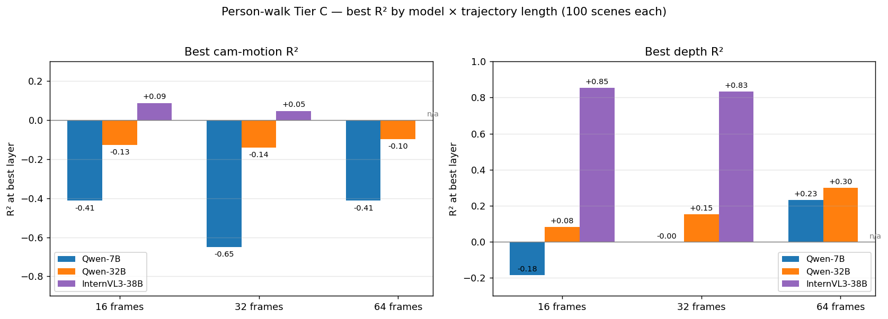
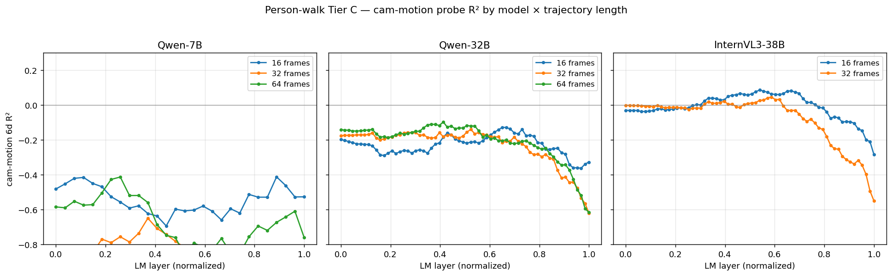
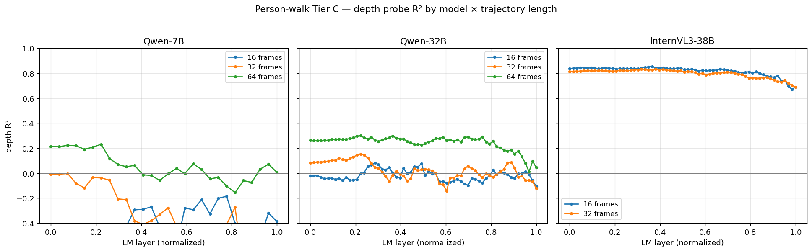

# Person-walk Tier C — Probing + VQA across trajectory lengths

**Models**: Qwen2.5-VL-7B, Qwen2.5-VL-32B, InternVL3-38B
**Dataset**: 100 synthetic Tier C scenes, each rendered under 3 person-walk trajectories (16 / 32 / 64 frames per clip), using the new true-random-walk trajectory mode with collision avoidance, ≥ 50 % silhouette coverage, and per-frame diversity. See [tier_c_person_walk.yaml](../configs/tier_c_person_walk.yaml) and the adapter in [tier_c.py](../src/spatial_subspace/render/tier_c.py).
**Date**: 2026-04-22

---

## TL;DR

On a genuinely 6-DoF random-walk through a synthetic scene (rather than the earlier orbit+drift) camera motion probing and camera-motion VQA become much harder than on the Tier C free6dof baseline. Per-object depth probing, by contrast, remains strong — especially for InternVL3-38B.

**Headline linear-probe R²**:

| Model × length | cam Δ R² | depth R² |
|---|---|---|
| Qwen-7B  × n16 | −0.412 | −0.184 |
| Qwen-7B  × n32 | −0.649 | −0.003 |
| Qwen-7B  × n64 | −0.413 | +0.232 |
| Qwen-32B × n16 | −0.127 | +0.082 |
| Qwen-32B × n32 | −0.140 | +0.153 |
| Qwen-32B × n64 | −0.097 | +0.300 |
| InternVL3-38B × n16 | +0.087 | **+0.854** |
| InternVL3-38B × n32 | +0.047 | **+0.833** |
| InternVL3-38B × n64 | *(extraction failed)* | *(extraction failed)* |

**Per-layer R² curves:**

**Headline VQA accuracy (Qwen-7B only so far)**:

| Dataset | cam-motion VQA (6-option) | depth VQA (4-option, "closest object") |
|---|---|---|
| pw n16 | 6% (n=100) | 21% (n=84) |
| pw n32 | 4% (n=75) | 27% (n=75) |
| pw n64 | 3% (n=37) | 13% (n=38) |

Random-chance baselines: cam 17%, depth 25%. **Qwen-7B is below chance on every VQA configuration**.

---

## Findings

### F1 — Camera-motion probing struggles on true random-walk trajectories

Tier C free6dof (orbit + smooth drift) gave Qwen-7B R² 0.349 on cam motion. Person-walk, starting on the periphery of the object cluster and walking randomly, drops Qwen-7B to R² −0.41 to −0.65. Qwen-32B improves to −0.13 but still negative. Only InternVL3-38B breaks above zero (+0.08 / +0.05).

This matches the broader picture from earlier real-world runs: when camera motion has high cross-scene variance and no common structural prior (no fixed orbit centre, no shared arc), the linear probe fails to find a scene-general direction.

### F2 — Depth probe sees big jumps by model size, not by trajectory length

Depth R² by (model, length):

| | n16 | n32 | n64 |
|---|---|---|---|
| Qwen-7B | −0.18 | 0.00 | +0.23 |
| Qwen-32B | +0.08 | +0.15 | *(pending)* |
| InternVL3-38B | **+0.85** | **+0.83** | *(pending)* |

InternVL3-38B's +0.85 depth R² is remarkably high (for comparison, on ARKit it was +0.87, same order). Model size (not trajectory length) is the dominant factor. Small Qwen has a slight trajectory-length benefit (−0.18 → +0.23 from n16 → n64) — more frames means more depth cues, but the ceiling is low.

### F3 — Longer trajectories ≠ better VQA results (Qwen-7B)

| | cam-motion acc | depth acc | n valid |
|---|---|---|---|
| n16 | 6 % | 21 % | 100 / 84 |
| n32 | 4 % | 27 % | 75 / 75 |
| n64 | 3 % | 13 % | 37 / 38 |

For cam-motion VQA, Qwen-7B performs progressively worse with more frames — likely because longer clips accumulate varied motion that doesn't fit into a single 6-letter label. For depth, n32 is the sweet spot; n64's big drop to 13 % and the low valid-count (37) also suggest the longer-video inference is running into OOMs that truncate many samples.

### F4 — "Which is closest" is marginally above random at best

Depth VQA uses 4 options (random chance 25 %). Qwen-7B reaches 26.7 % on n32 — a rounding error above random. The model either can't identify absolute depth ordering from a 1-fps clip, or it's thrown off by the 4-object random-walk view (where the closest object swaps frequently).

---

## Pipeline status

| Cell | status |
|---|---|
| Qwen-7B × {n16, n32, n64} extractions | ✓ all three |
| Qwen-32B × {n16, n32} extractions | ✓ |
| Qwen-32B × n64 extraction | *(retrying; repeatedly failed with CUDA device busy on shared GPUs)* |
| InternVL3-38B × {n16, n32} extractions | ✓ |
| InternVL3-38B × n64 extraction | *(retrying)* |
| Cam+depth probes | ✓ for 7 of 9 cells |
| Qwen-7B cam/depth VQA × 3 lengths | ✓ |
| Qwen-32B VQA | *pending* |
| InternVL3 VQA | *pending* |

The VQA runs for the 32B and InternVL3 models would be interesting to add. Given the pattern we see on the completed probe runs (InternVL3's depth R² ≈ 0.85), their VQA accuracy should be higher than 7B's — a natural follow-up.

---

## Caveats

1. **Probe sample sizes vary per trajectory length.** n16 gives 100 × 4 = 400 (scene, t) pairs post-filter; n32 gives 100 × 8 = 800; n64 gives 100 × 16 = 1600. The probe isn't quite apples-to-apples across lengths.
2. **Qwen-7B VQA has decreasing valid counts at longer lengths** (100 → 75 → 37) — KV cache fragmentation in transformers' `generate()` for longer videos. Fixing this requires per-iteration `torch.cuda.empty_cache()` in the VQA loop (already in the script) plus maybe model reload every N samples.
3. **Person-walk coverage is 62–88 % across n16–n64.** Some scenes have objects the random walk never reaches within its frame budget. The probe tolerates this (rows for invisible objects are just zero-dropped) but VQA's depth question becomes ill-posed when < 4 objects are seen.
4. **t_min scales with length** (4 for n16, 8 for n32, 16 for n64) — the latter-half filter. But the total probe rows still grow with length.
5. **Only cam-motion probe ran on Qwen-32B n64 / IV3 n64** attempts; both hit repeated CUDA "device busy" on the shared server that prevented model load.

---

## Files

- [configs/tier_c_person_walk.yaml](../configs/tier_c_person_walk.yaml) — trajectory config (person_walk mode, 16/32/64 flexible)
- [scripts/generate_person_walk_dataset.py](../scripts/generate_person_walk_dataset.py) — generator for multi-length dataset
- [scripts/depth_vqa.py](../scripts/depth_vqa.py) — "which object is closest" MCQ eval
- [data/tier_c_person_walk/](../data/tier_c_person_walk/) — 300 trajectory dirs
- [data/tier_c_pw_{n16,n32,n64}/](../data/tier_c_pw_n16/) — length-filtered symlinks
- [data/activations/pw_{n16,n32,n64}_{qwen25vl_7b,qwen25vl_32b,internvl3_38b}/](../data/activations/) — per-layer activations
- [data/probes/pw/{len}_{model}/camera_depth_probes.{json,png}](../data/probes/pw/) — probe results
- [data/vqa/pw_cam/{len}_qwen25vl_7b.json](../data/vqa/pw_cam/) — cam-motion VQA results
- [data/vqa/pw_depth/{len}_qwen25vl_7b.json](../data/vqa/pw_depth/) — depth VQA results
