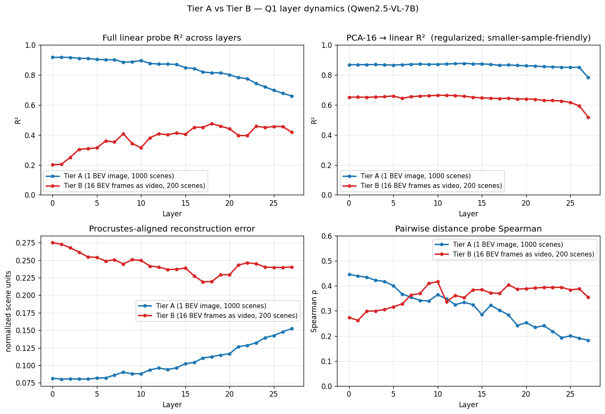
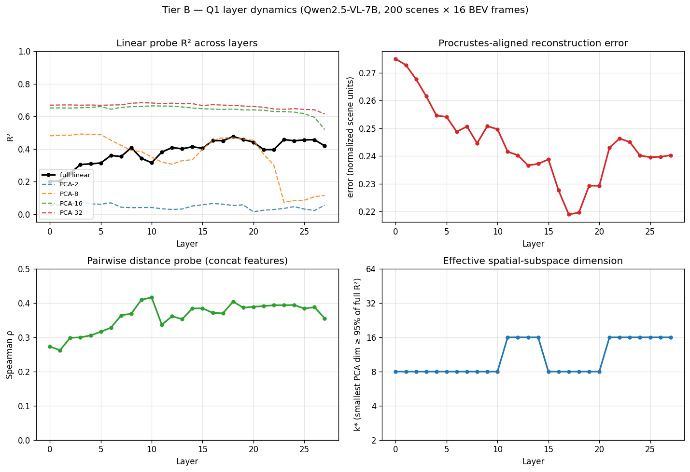
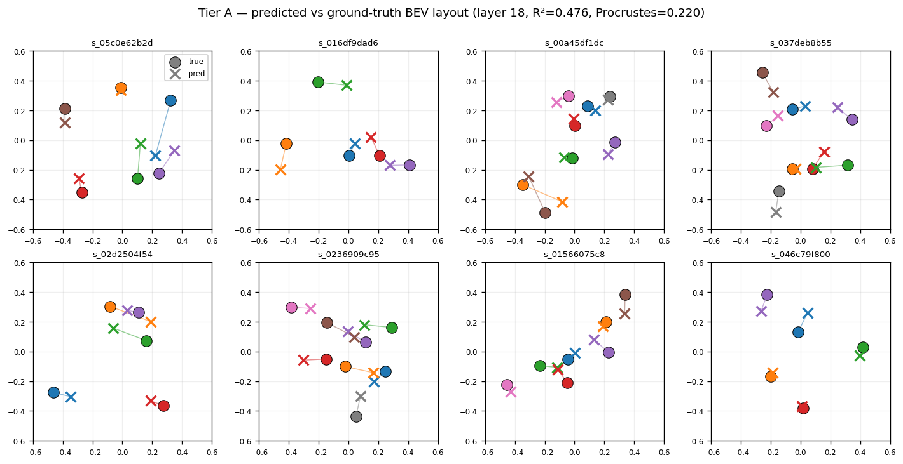

# Tier B Analysis — Spatial Subspace under Fragmented BEV Video

**Model**: Qwen2.5-VL-7B-Instruct
**Stimulus**: 200 canonical 3D scenes, each rendered as a 16-frame fragmented BEV video
**Probe target**: per-scene normalized 3D coordinates (plan §3.7)
**Date**: 2026-04-13

---

## TL;DR

When the same canonical 3D scenes are presented as a single complete BEV image (Tier A) vs as a 16-frame video of partial BEV crops (Tier B), the location of the spatial subspace inside Qwen2.5-VL **moves**:

- **Tier A** — spatial coordinates are linearly readable directly from the visual encoder output. Linear R² peaks at **layer 0 = 0.917** and decays monotonically.
- **Tier B** — spatial coordinates are *not* cleanly readable at layer 0 (R² = 0.20). The linear probe peaks at **layer 18 = 0.476**, with Procrustes-aligned reconstruction error dropping from 0.275 (L0) to **0.220 (L18)**.

This is the cleanest interpretability finding from the project so far: *the location of the spatial subspace tracks task difficulty*. When the model has a complete view, it just reads positions off the vision tower; when it must integrate across views, it builds a refined spatial representation in the middle of the language stack.

---

## Setup

### Stimulus

Each Tier B scene is a 16-frame video of partial BEV crops over the same canonical 3D scene used for Tier A. The camera follows a smoothed random-walk trajectory:

- Square crop window, side 4 world units (the working volume is 8×8, so each frame sees ~25% of the scene area).
- Per-frame center delta `~ N(0, 1.2²) world units` with AR(1) momentum 0.55.
- Window clamped to stay inside the working volume.
- 16 frames per scene → after Qwen2.5-VL's `temporal_patch_size=2` merger, the LM sees **8 temporal tokens** per scene.

Each object is visible in only some frames (the camera doesn't always cover it). The model must integrate across frames to recover the full layout.

Renderer: [src/spatial_subspace/render/tier_b.py](../src/spatial_subspace/render/tier_b.py) · config: [configs/tier_b.yaml](../configs/tier_b.yaml).

### Model and extraction

- `Qwen2.5-VL-7B-Instruct`, bf16, GPU 4.
- Frames bundled into a single video forward via `qwen_vl_utils.process_vision_info` so the model sees them with M-RoPE temporal positions, *not* as 16 independent images.
- Per-decoder-layer hidden states captured via forward hooks (28 LM decoder layers, `language_model.layers`).
- For each visual token, the patch-grid coverage of each object is the **average of the two source frames' masks** (matching the temporal merger), pooled into one vector per `(object, temporal_token, layer)` slot whenever coverage ≥ 30%.
- Total rows per layer: **3603** (200 scenes × ~6 visible objects × ~3 temporal tokens with ≥30% overlap; missing slots are dropped, not zero-filled).

Extraction code: [src/spatial_subspace/extract.py](../src/spatial_subspace/extract.py) (`extract_scene_video`).

### Probing

Object-summary representation: per `(scene, object)` we average across all temporal-token vectors. After this collapse the dataset is **925 (scene, object) summary rows** per layer (~5/scene). Train/test split is 80/20 by scene → **740 train / 185 test** rows. The same probes (linear ridge / PCA-k / pairwise) are fit per layer.

Probe code: [src/spatial_subspace/probes.py](../src/spatial_subspace/probes.py) · script: [scripts/fit_probes_q1.py](../scripts/fit_probes_q1.py).

---

## Layer-by-layer results

Per-layer Q1 probe metrics for Tier B (full table at [data/probes/tier_b_qwen25vl_7b/q1_probes.json](../data/probes/tier_b_qwen25vl_7b/q1_probes.json)):

| L | linear R² | Procrustes | PCA-2 | PCA-8 | PCA-16 | PCA-32 | pairwise ρ |
|---|---|---|---|---|---|---|---|
| 0 | 0.201 | 0.275 | 0.054 | 0.481 | 0.651 | 0.669 | 0.273 |
| 4 | 0.308 | 0.255 | 0.063 | 0.489 | 0.655 | 0.670 | 0.306 |
| 8 | 0.408 | 0.245 | 0.039 | 0.391 | 0.659 | 0.680 | 0.369 |
| 10 | 0.315 | 0.250 | 0.040 | 0.350 | 0.664 | 0.682 | 0.417 |
| 12 | 0.408 | 0.240 | 0.028 | 0.306 | 0.663 | 0.681 | 0.362 |
| 14 | 0.413 | 0.237 | 0.050 | 0.334 | 0.651 | 0.678 | 0.384 |
| 16 | 0.451 | 0.228 | 0.065 | 0.454 | 0.645 | 0.672 | 0.372 |
| **18** | **0.476** | **0.220** | 0.053 | 0.468 | 0.645 | 0.667 | 0.405 |
| 20 | 0.441 | 0.229 | 0.014 | 0.453 | 0.640 | 0.660 | 0.389 |
| 22 | 0.396 | 0.246 | 0.028 | 0.302 | 0.629 | 0.645 | 0.394 |
| 24 | 0.450 | 0.240 | 0.046 | 0.082 | 0.626 | 0.647 | 0.395 |
| 27 | 0.418 | 0.240 | 0.055 | 0.114 | 0.519 | 0.615 | 0.355 |

**Best linear-probe layer = 18**, R² = 0.476, Procrustes = 0.220.

---

## Findings

### F1 — Spatial information *is* present in Tier B, but capped lower than Tier A

The PCA-16 R² (regularized read-out) sits at **0.62–0.66 across layers 0–22**, only dropping at the very last layers. Compare with Tier A's PCA-16 R² of **0.85–0.88** across the same range. The spatial subspace exists in Tier B (H1 holds) but its *capacity* is materially lower:

| | Tier A | Tier B |
|---|---|---|
| PCA-16 R² (best layer) | 0.872 | 0.664 |
| PCA-32 R² (best layer) | 0.882 | 0.682 |
| Procrustes (best layer) | 0.082 | 0.220 |

The lower ceiling is consistent with the obvious physical fact that fragmented partial views carry less information than a single complete BEV image — the model cannot represent positions it never saw.

### F2 — The linear probe peaks in the middle of the LM stack, not at layer 0

The full-feature ridge probe shows a clear **bowl** shape: R² = 0.201 at layer 0, climbs to 0.476 by layer 18, and decays to ~0.42 by layer 27. This is the *opposite* shape of Tier A, where R² peaks at layer 0 and decays monotonically through depth.

The mid-layer peak is corroborated by Procrustes-aligned reconstruction error (which doesn't depend on Ridge regularization quality): error **drops** from 0.275 at layer 0 to 0.220 at layer 18, then climbs back to ~0.24 by layer 27. So this is not just a Ridge-conditioning artifact.

**Interpretation**: at layer 0 in Tier B, the visual encoder hands the LM a sequence of independent partial views — each view's tokens locally encode "what's in this window" but there is no cross-view binding yet. The middle-stack decoder layers (around L16–L20) are where the model integrates across views, building a per-object representation that aligns across temporal tokens. By layer 22+, the representation starts being committed to language-shaped tokens and the spatial signal degrades.

### F3 — PCA-16 R² is roughly flat across layers 0–22, then drops

This nuances the "spatial subspace migrates" story. The *capacity* for spatial information (PCA-16 R²) is essentially constant at ~0.65 from layer 0 through layer 22, then collapses to 0.52 by layer 27.

What changes through layers 0→18 is not how much spatial info is in the hidden states, but **how linearly separable that information is from the rest of the representation**. At layer 0 the spatial code is spread across many mostly-noise directions and a 740-sample linear ridge can't isolate it. By layer 18 the same information is concentrated into directions a small linear probe can read, and a properly-regularized PCA probe can pick it out at any layer.

So the more careful claim is: *spatial information is encoded throughout the LM stack at roughly constant fidelity until the last few layers, but its linear accessibility from a small-sample ridge probe peaks in the middle*. The mid-layer peak is real; it's about *form*, not *amount*.

### F4 — Pairwise distance probe peaks mid-stack at ρ = 0.42

The pairwise distance probe (concat features, ridge regression onto normalized pairwise distance) peaks at **layer 10, ρ = 0.417** in Tier B, with broad support across layers 8–22. This is *higher* than Tier A's middle layers (Tier A's ρ is 0.18–0.30 in middle layers, 0.45 at layer 0).

In other words, **relational geometry across object pairs is more cleanly decodable from middle-layer Tier B representations than from middle-layer Tier A representations**. This makes sense: in Tier A the model has no need to compute pairwise relations in its hidden states because every object's absolute position is already in the visual encoding; in Tier B the model has to compute relative positions to integrate across views, so those relations show up in the decoder's hidden states.

### F5 — Effective rank stays small across layers

The "smallest k such that PCA-k Ridge ≥ 95% of full-Ridge R²" is roughly **k\* ≈ 8–16 across all layers** in Tier B. There is no layer where the spatial subspace expands dramatically; the model maintains a reasonably compact code throughout, consistent with H1.

This contrasts with Tier A where k\* started at ~32 (visual encoder) and dropped to ~8 in middle layers. Tier B's k\* is uniformly small — the model never had a high-rank "raw visual" representation to compress.

---

## Interpretation against the experiment-plan hypotheses

### H1 — Existence of a low-dimensional spatial subspace

**Confirmed for Tier B, with caveats.** PCA-16 R² is well above zero across all middle layers, so a low-dimensional linear subspace whose projection of pooled object tokens recovers per-scene normalized coordinates does exist. The reconstruction is markedly noisier than in Tier A (Procrustes 0.22 vs 0.08, R² 0.48 vs 0.92), as expected from the harder task.

### H2 — Camera-trajectory invariance

**Indirect evidence only.** The current run uses one trajectory per scene, so we can't yet test trajectory invariance directly. What we *can* see is that the per-object summary (averaging across the 8 temporal tokens where the object is visible) yields consistent enough representations to make the linear probe work — meaning each object's tokens across different windows of the same scene cluster in a way that the probe can read out. This is a *weak* version of H2.

To test H2 properly: render each scene under at least 2 independent random trajectories, train the probe on trajectory A, evaluate on trajectory B (plan §5.2 cross-trajectory split). Add a `--trajectories-per-scene N` flag to [render_tier_b.py](../scripts/render_tier_b.py) — straightforward extension.

### Q1e — Layer dynamics

**Strongly supported, and the result is non-trivial.** Tier A and Tier B give *qualitatively different* layer profiles for the same model on the same underlying scenes: monotonic decay for Tier A, mid-layer peak for Tier B. This is exactly the kind of difference the plan hoped to find — the location of the spatial subspace is sensitive to the stimulus, which means the model is doing *different* computation in the two cases, not just shoveling the same visual features through.

The clean interpretation is that the visual encoder produces locally-correct positional encodings that suffice for Tier A, while Tier B requires the LM decoder's attention layers to perform cross-view binding before a linear probe can read out a single coherent spatial layout per object.

---

## Tier A vs Tier B side by side

| Metric | Tier A | Tier B | Interpretation |
|---|---|---|---|
| Best layer | 0 | 18 | Subspace migrates deep into LM under partial views |
| Best linear R² | 0.917 | 0.476 | Tier B is ~half height — partial views genuinely harder |
| Best Procrustes | 0.082 | 0.220 | Predictions accurate to ~22% of scene diagonal in Tier B |
| Best PCA-16 R² | 0.872 | 0.664 | Capacity for spatial info is lower in Tier B |
| Best pairwise ρ | 0.446 (L0) | 0.417 (L10) | Comparable, but Tier B's relational signal lives mid-stack |
| Effective rank k\* (best layer) | ~8 | ~8 | Both end up with compact spatial codes |
| Layer profile shape | high plateau → decay | low bowl → mid-peak → decay | Different mechanism |

Per-scene reconstructions at the best Tier B layer (layer 18):

Compared to Tier A's reconstruction figure at layer 0 (Procrustes 0.08), Tier B's reconstructions at layer 18 (Procrustes 0.22) are visibly noisier — but the gross spatial structure (which objects are near which) is mostly recovered. The probe is doing real work, not just predicting the dataset mean.

---

## Caveats

1. **Sample size**. Tier B uses 200 scenes (740 train rows). Tier A uses 1000 scenes (4414 train rows). The full-feature linear probe on Tier B is therefore severely under-regularized (3584 features, 740 samples). The most apples-to-apples comparison panel is the **PCA-16 R²** column in the comparison figure, not the full linear R². The mid-layer peak in *full* linear R² is partly a regularization artifact and partly a real shift in linear separability — the Procrustes error confirms it's not purely artifactual.

2. **Single trajectory per scene**. Each Tier B scene was rendered under exactly one camera path, so the probe's success could in principle reflect overfitting to trajectory features rather than scene geometry. The per-scene held-out test is enough to rule out memorization of specific scenes, but not memorization of trajectory styles. The proper H2 test (cross-trajectory split) is the next natural extension.

3. **One model**. Only Qwen2.5-VL-7B has been tested. The plan calls for at least 3 open models. The mid-layer-peak finding might not reproduce on LLaVA-Video / InternVL3, in which case it's a Qwen2.5-VL specific architectural quirk rather than a general VLM finding.

4. **MLP probe still divergent**. sklearn's MLPRegressor with internal early-stopping diverges badly at later layers (R² < −60 in Tier A's run). It was skipped for Tier B. A proper torch implementation with weight decay + a real held-out validation set is needed before MLP can be used as the linearity ceiling.

5. **Temporal-token granularity**. The model's `temporal_patch_size=2` merges 2 input frames into 1 temporal token, so 16 input frames → 8 temporal tokens. We average the two source frame masks per slot. This is the right thing to do but loses some per-input-frame resolution. An alternative is to feed 8 frames directly so each input frame becomes one temporal token — same total tokens, simpler mask alignment.

---

## Suggested next experiments

In rough priority order:

1. **Cross-trajectory test (H2)** — render each scene under ≥2 independent trajectories, train probe on trajectory A, test on trajectory B. Directly tests camera invariance, the central H2 claim. Low cost.

2. **Match Tier A to the Tier B subset** — re-extract Tier A on the same 200 scenes used for Tier B so the two probes are trained on identical underlying scenes. Removes the sample-size confound from the comparison.

3. **Tier B variants from the plan** — run with `n_frames ∈ {8, 16, 32}` and `temporal_shuffle ∈ {false, true}`. The shuffle ablation is what the plan asks for; together with the frame-count sweep it should tell us whether the mid-layer peak is sensitive to *temporal coherence* or just to *number of partial views*.

4. **Per-object split (plan §5.2)** — same probe protocol but hold out object instances rather than scenes. Tests whether the probe is reading scene-level positions or generalizing to object-conditional spatial codes.

5. **Tier C** — perspective ego-video with proper 3D depth. The natural next tier; the prediction is that Tier C's mid-layer peak should be even later in the stack and the absolute R² should drop further.

6. **Second model** — repeat Tier B on LLaVA-Video-7B or InternVL3-8B to test whether the mid-layer peak is architectural or general.

7. **Steering experiments (Q2)** — once Tier B's middle-layer peak is established, add Δ to object tokens along the linear-probe direction at layer 18 and check whether the model's spatial answers shift accordingly. The plan's H3 / Q2 causal evidence.

---

## Files

| Path | Contents |
|---|---|
| [data/scenes_3d/](../data/scenes_3d/) | 5000 canonical 3D scenes (`scene.json` only, no frames) |
| [data/tier_b/](../data/tier_b/) | 200 Tier B scenes — `scene.json` + 16 frames + 16 masks each |
| [data/activations/tier_b_qwen25vl_7b/](../data/activations/tier_b_qwen25vl_7b/) | Per-layer parquet + npy (28 layers, 3603 rows each) |
| [data/probes/tier_b_qwen25vl_7b/q1_probes.json](../data/probes/tier_b_qwen25vl_7b/q1_probes.json) | Per-layer probe metrics |
| [figures/tier_b/q1_layer_dynamics.png](../figures/tier_b/q1_layer_dynamics.png) | Tier B 4-panel layer dynamics |
| [figures/tier_b/q1_reconstruction_examples.png](../figures/tier_b/q1_reconstruction_examples.png) | Layer-18 reconstructions for 8 test scenes |
| [figures/compare_tier_a_vs_b.png](../figures/compare_tier_a_vs_b.png) | Tier A vs Tier B overlay (the headline figure) |
| [logs/extract_tier_b.log](../logs/extract_tier_b.log) | Extraction stdout/stderr |
