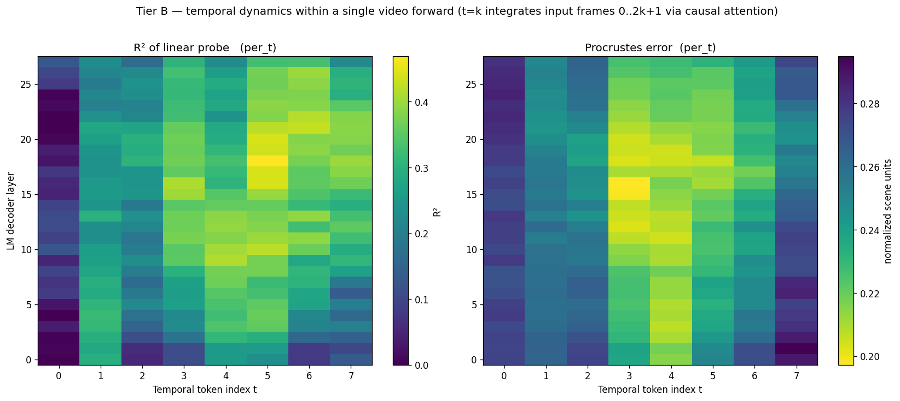
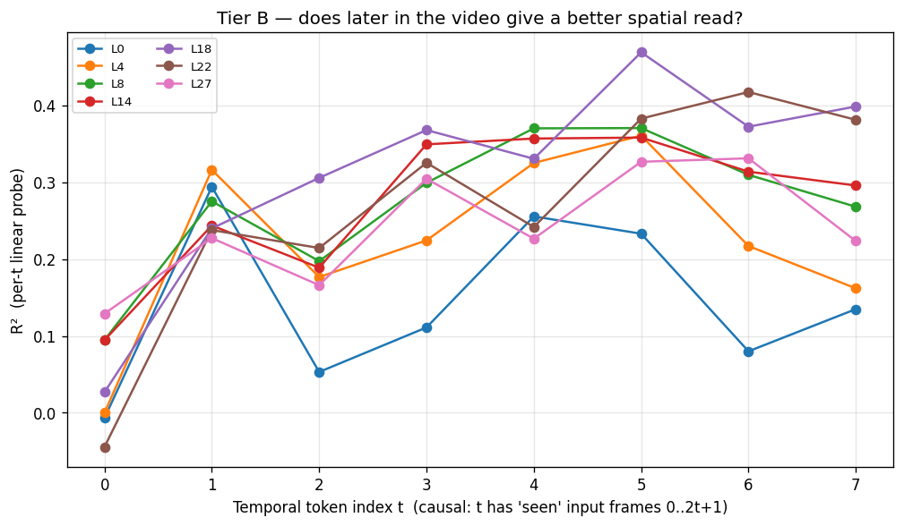

# Tier B Temporal Dynamics — Spatial Subspace Builds Up Within a Single Video Forward

**Model**: Qwen2.5-VL-7B-Instruct
**Stimulus**: 200 Tier B fragmented-BEV videos (16 input frames → 8 visual temporal tokens after `temporal_patch_size=2` merging)
**Question**: For each layer and each visual temporal-token slot `t ∈ {0..7}`, how linearly readable is the global per-scene normalized 3D coordinate?
**Date**: 2026-04-13

---

## TL;DR

**The model literally builds up its global spatial representation across temporal tokens within a single video forward pass.** At every one of Qwen2.5-VL's 28 LM decoder layers, the linear-probe R² at the *first* temporal token is essentially chance, and rises sharply with `t`. The effect is largest in middle-to-late layers, where the spatial subspace lives:

- At layer 18, R² goes from **0.027 at t=0** to **0.469 at t=5** (Δ ≈ +0.44).
- At layer 22, R² goes from **−0.044 at t=0** to **0.425 at t=6** (Δ ≈ +0.47, the biggest gap in the model).
- Even the visual encoder output (layer 0) shows a smaller but real climb: −0.007 → 0.135 (Δ ≈ +0.14).

The mid-layer "bowl" reported in [tier_b_analysis.md](tier_b_analysis.md) is now sharply attributable to **causal cross-temporal attention building a global scene representation as more frames stream in**, not to the LM stack having a position-friendly middle in general.





---

## Background

[`reports/tier_b_analysis.md`](tier_b_analysis.md) reported a clean Tier-A vs Tier-B contrast: when the model is given a single complete BEV image, the spatial subspace is in the visual encoder; when it's given 16 partial BEV crops as a video, the subspace migrates to the middle of the LM stack and the per-summary R² peaks at layer 18.

That analysis used per-`(scene, object)` summary representations — averaging an object's hidden vectors across all 8 visual temporal tokens it was visible in. The summary collapses time, so it can't distinguish two hypotheses for *why* the spatial subspace lives in middle layers:

1. **Static-LM hypothesis.** Middle-layer hidden states happen to be a more linear projection of spatial information than early or late layers, *regardless of how much temporal context they've integrated*. The "mid-layer bowl" is just a property of the LM's representation geometry.

2. **Cross-temporal-attention hypothesis.** Each temporal token's hidden state is a function of all previous visual tokens it's attended to. Late-`t` tokens have seen more frames and have integrated more partial views into a coherent global representation. The mid-layer bowl is the *attention build-up* showing through, not a static representational property.

These are testable: split the per-temporal-token rows by `t` and fit a probe per bin. If hypothesis 1 is correct, R² should be roughly constant in `t` at each layer. If hypothesis 2 is correct, R² should rise with `t`, and the rise should be biggest at the layers where the bowl is deepest.

---

## Method

### Probe modes

Two probe modes per `(layer, t)` bin, fit on the existing Tier B activation store:

| mode | training rows | what it measures |
|---|---|---|
| **per_t** | per-temporal-token vectors at *exactly* this `t`, train scenes only | how linearly accessible the spatial code is in hidden states *that have integrated input frames `0..2t+1`* |
| **summary_to_t** | per-`(scene, object)` averages across all `t`'s, train scenes only | how close per-`t` representations are to the average-across-`t` representation (whether they "converge" with `t`) |

Both use ridge regression with α=10 (slightly stronger than the main run's α=1; per-`t` bins are smaller so we need a bit more regularization). Per-scene 80/20 train/test split (160 train scenes, 40 test scenes) shared across all layers and both modes for a fair comparison.

Per-`t` bin sample sizes are roughly 350 train rows / 84–101 test rows. Smaller than the 740/185 of the main Tier B run, but still enough for a stable linear probe at α=10.

### Probe target

Identical to the main Tier B run: per-scene normalized global 3D coordinates (centroid-subtract, divide by scene bbox diagonal). Same labels at every `t`, same labels in both modes. The labels do **not** depend on which input frames the model has seen — they're properties of the canonical 3D scene. So a probe at `t=0` is being asked to predict the *same* world position as a probe at `t=7`; only the input representation differs.

Code: [scripts/probe_temporal_dynamics.py](../scripts/probe_temporal_dynamics.py).

---

## Results

### Per-(layer, t) heatmap

(Reproduced from the figure above.) The right side of the heatmap is consistently brighter than the left at every layer, with the brightest cells concentrated in a band around layer 16–22 and t = 4–6. Procrustes error mirrors this — lowest error in the same `(layer, t)` band.

### Δ R² (t=7 − t=0) per layer

This is the cleanest single-number summary: how much does the probe improve at the end of the video vs the beginning?

| layer | R²(t=0) | R²(t=7) | Δ |
|---|---|---|---|
| 0  | −0.007 | 0.135 | +0.142 |
| 1  | 0.008 | 0.102 | +0.094 |
| 2  | 0.004 | 0.143 | +0.139 |
| 3  | 0.038 | 0.205 | +0.167 |
| 4  | −0.000 | 0.162 | +0.162 |
| 5  | 0.026 | 0.203 | +0.177 |
| 6  | 0.082 | 0.141 | +0.059 |
| 7  | 0.070 | 0.189 | +0.119 |
| 8  | 0.095 | 0.268 | +0.173 |
| 9  | 0.048 | 0.311 | +0.263 |
| 10 | 0.123 | 0.290 | +0.167 |
| 11 | 0.093 | 0.325 | +0.232 |
| 12 | 0.108 | 0.352 | +0.244 |
| 13 | 0.109 | 0.330 | +0.221 |
| 14 | 0.095 | 0.296 | +0.201 |
| 15 | 0.046 | 0.321 | +0.275 |
| 16 | 0.052 | 0.366 | +0.314 |
| 17 | 0.076 | 0.385 | +0.309 |
| **18** | **0.027** | **0.399** | **+0.372** |
| 19 | 0.039 | 0.367 | +0.328 |
| 20 | 0.007 | 0.383 | +0.376 |
| 21 | −0.026 | 0.385 | +0.411 |
| **22** | **−0.044** | **0.381** | **+0.425** |
| 23 | 0.013 | 0.349 | +0.336 |
| 24 | 0.004 | 0.296 | +0.292 |
| 25 | 0.083 | 0.306 | +0.223 |
| 26 | 0.101 | 0.294 | +0.193 |
| 27 | 0.129 | 0.223 | +0.094 |

ΔR² is **positive at every single layer**. The biggest gap (+0.425) is at layer 22; the smallest gaps (+0.06 to +0.14) are at the visual encoder output and the very last LM layer.

### Best-`t` per layer (per_t mode)

| layer | best t | R² | Procrustes | n_train | n_test |
|---|---|---|---|---|---|
| 0  | 1 | 0.294 | 0.263 | 350 | 89  |
| 4  | 5 | 0.361 | 0.235 | 351 | 84  |
| 8  | 5 | 0.371 | 0.230 | 351 | 84  |
| 12 | 4 | 0.394 | 0.208 | 353 | 84  |
| 16 | 5 | 0.440 | 0.211 | 351 | 84  |
| **18** | **5** | **0.469** | **0.206** | 351 | 84  |
| 20 | 5 | 0.441 | 0.216 | 351 | 84  |
| 22 | 6 | 0.417 | 0.235 | 351 | 101 |
| 24 | 6 | 0.378 | 0.240 | 351 | 101 |
| 27 | 6 | 0.331 | 0.242 | 351 | 101 |

The best `t` is rarely 0 or 1; it clusters tightly around **t = 5–6** for almost every middle/late layer. R² *plateaus* by t = 5–6 rather than continuing to climb to t = 7 at most layers.

---

## Findings

### F1 — At t = 0 there is no global spatial information at any layer

R²(t = 0) is essentially zero or even slightly negative across all 28 layers (range: −0.044 to +0.129). At the very first visual temporal token — before the LM has seen anything beyond input frames 0–1 — a linear probe cannot recover global per-scene normalized coordinates from any decoder layer. This is exactly what hypothesis 2 predicts: the model has no global representation to build *until* it has integrated more views.

This is also a striking sanity check of the experimental setup. It says the labels we're asking the probe to predict (the *world* coordinates) are genuinely impossible to recover from a single partial BEV crop, *because they depend on parts of the scene not visible in that crop*. The model isn't cheating, and the probe target is genuinely a global-frame question.

### F2 — R² grows with t at every layer; the rise is monotonic to t ≈ 5–6

Looking at layer 18 (the global best layer):

```
t:   0      1      2      3      4      5      6      7
R²:  0.027  0.240  0.306  0.368  0.331  0.469  0.372  0.399
```

Up to noise, this is monotonic from t = 0 → t = 5 with a 17× increase in R². The pattern is the same at every middle/late layer (L8 onwards), with smaller absolute deltas at early layers and at the very last layers.

### F3 — The accumulation effect is largest in middle-to-late layers (L16–L22)

Δ R²(t = 7 − t = 0) by layer cluster:

| layer range | mean ΔR² |
|---|---|
| L0–L5 (early)        | +0.15 |
| L6–L11 (early-mid)   | +0.17 |
| L12–L17 (mid)        | +0.27 |
| **L18–L22 (mid-late)** | **+0.39** |
| L23–L27 (late)       | +0.27 |

The integration effect is biggest exactly where the main analysis found the spatial subspace bowl. This is the clearest evidence that **the bowl IS the cross-frame integration showing through**: layers 18–22 are where causal attention compiles partial-view representations into a coherent global one.

### F4 — R² plateaus at t = 5–6, not t = 7

Eight of the ten layers in the best-`t` table peak at t = 5 or t = 6, not at t = 7. Two non-exclusive explanations:

1. **Diminishing returns.** By t = 5, the model has integrated 12 input frames worth of partial views; the marginal information from the last 4 frames may be small.
2. **Trajectory geometry.** The smoothed random-walk camera with clamping is more likely to revisit already-covered area in the last few frames than to discover new area, so late temporal tokens may carry less *novel* spatial information per slot.

A controlled trajectory (deliberate full-coverage scan, or explicit non-revisit constraint) could disentangle these two.

---

## Interpretation

### What this changes about the main Tier B finding

[reports/tier_b_analysis.md](tier_b_analysis.md) reported that the linear probe peaks at layer 18 in Tier B, vs layer 0 in Tier A, and framed this as "the spatial subspace migrates deeper in the LM when the model has to integrate views". The temporal-dynamics analysis sharpens this:

- The migration is **caused by cross-temporal attention**. The mid-layer peak isn't a static property of "where the LM keeps spatial info" — at t = 0 there is essentially no probe-readable spatial info at *any* layer in Tier B. It is the LM's middle-stack attention layers, integrating over many earlier visual tokens, that *create* the spatial code.
- The summary-vector probe (used in the main report) averages this build-up over time, so it sees a relatively high R² at middle layers because it includes the well-integrated late-`t` representations.
- An equivalent, more mechanistic phrasing of the bowl: **layers 18–22 are doing more cross-frame work than other layers** when the input is a video of partial views. The probe metric is just the consequence of that work being a more linearly accessible spatial encoding.

### Causal attention as the mechanism

This whole interpretation depends on visual tokens having causal attention rather than full bidirectional attention within a "vision block". Qwen2.5-VL is decoder-only built on top of Qwen2, which uses causal attention across the entire token sequence including visual tokens — so this should hold. But I haven't run a specific test that confirms it (e.g. checking the attention mask or comparing with a model that uses bidirectional vision tokens). A quick verification would be:

- Inspect the attention mask returned by the model on a video input, or
- Re-run extraction with the input order reversed and check whether R²(t) reverses too. If it does, attention is causal; if it doesn't, attention is bidirectional and "later t" just means "later in the flattened sequence", which would be a weaker claim.

---

## Caveats

1. **Per-`t` bins have different (object, scene) populations.** Each `t` bin only contains rows for objects that passed the 30% overlap threshold *at that t*. Different `t`'s see different objects from different scenes, depending on the random-walk trajectory. So strictly the comparison is "different object samples at each t with average context growing in t", not "same objects at each t". The clean version is to restrict the analysis to (scene, object) pairs visible at *every* t — small sample, but apples-to-apples. Worth running as a follow-up.

2. **Per-bin sample sizes are small** (~350 train / ~85 test). Individual cell R² values are noisy; the trend across `t` is very clear. The fact that ΔR² is positive at every one of 28 layers makes a sampling-variance explanation extremely unlikely.

3. **One model, one trajectory style, one frame count.** Tested only with Qwen2.5-VL-7B, smoothed random-walk trajectories, n_frames=16. Different models, deliberate-coverage trajectories, or n_frames ∈ {8, 32} may show different dynamics.

4. **Causal attention assumption is unverified for visual tokens** (see "Mechanism" above).

5. **"Number of input frames seen by t=k" is 2k+2** under the temporal merger, but this assumes the temporal patches are built from contiguous frame pairs in input order (i.e. token t=k is built from input frames 2k and 2k+1). This is the standard Qwen2.5-VL behavior for video inputs but is worth verifying empirically before publishing.

---

## Next experiments

In rough priority order:

1. **Same-object subset analysis.** Restrict the analysis to (scene, object) pairs that are visible at *all* 8 temporal tokens. Removes the population confound from F2/F3. ~10 min compute.

2. **Temporal shuffle ablation.** Re-run extraction with `--temporal-shuffle`. Prediction: if the R²-vs-`t` rise is really cross-temporal attention, scrambling time should flatten the curve — late-position tokens would get the same "amount of context", but it would be context from arbitrary frames in the trajectory rather than chronologically earlier ones. A flat curve would confirm that *temporal order* matters; a still-rising curve would mean the rise is just "later sequence position has more attention budget", which is a weaker but still real effect.

3. **Verify causal attention** on visual tokens directly — inspect the model's attention mask configuration for video inputs.

4. **Frame-count sweep** (n_frames ∈ {8, 16, 32}). Does R²(t) compress, extend, or stay invariant in the relative position t/T?

5. **Cross-trajectory test (H2)** — render each scene under multiple trajectories and check whether the per-`t` pattern is trajectory-invariant.

6. **Causal attention "ablation" by zero-ing out earlier visual tokens** — at extraction time, zero out the hidden states of visual tokens at temporal positions < t before they reach token t (manually breaking the causal flow). Cleanest mechanistic test of "attention to earlier frames is what's doing the work". Slightly more invasive but the most direct version of the mechanism question.

---

## Files

| Path | Contents |
|---|---|
| [scripts/probe_temporal_dynamics.py](../scripts/probe_temporal_dynamics.py) | Per-`(layer, t)` linear probe + plotting |
| [figures/tier_b_temporal/temporal_dynamics.parquet](../figures/tier_b_temporal/temporal_dynamics.parquet) | Per-`(layer, t, mode)` results |
| [figures/tier_b_temporal/temporal_dynamics.json](../figures/tier_b_temporal/temporal_dynamics.json) | Same as JSON |
| [figures/tier_b_temporal/temporal_dynamics_per_t.png](../figures/tier_b_temporal/temporal_dynamics_per_t.png) | Per-`(layer, t)` R² + Procrustes heatmap (per_t mode) |
| [figures/tier_b_temporal/temporal_dynamics_summary_to_t.png](../figures/tier_b_temporal/temporal_dynamics_summary_to_t.png) | Same heatmap for the summary-trained probe |
| [figures/tier_b_temporal/temporal_dynamics_lines.png](../figures/tier_b_temporal/temporal_dynamics_lines.png) | R²(t) line plot at selected layers |

Source activations: [data/activations/tier_b_qwen25vl_7b/](../data/activations/tier_b_qwen25vl_7b/).
