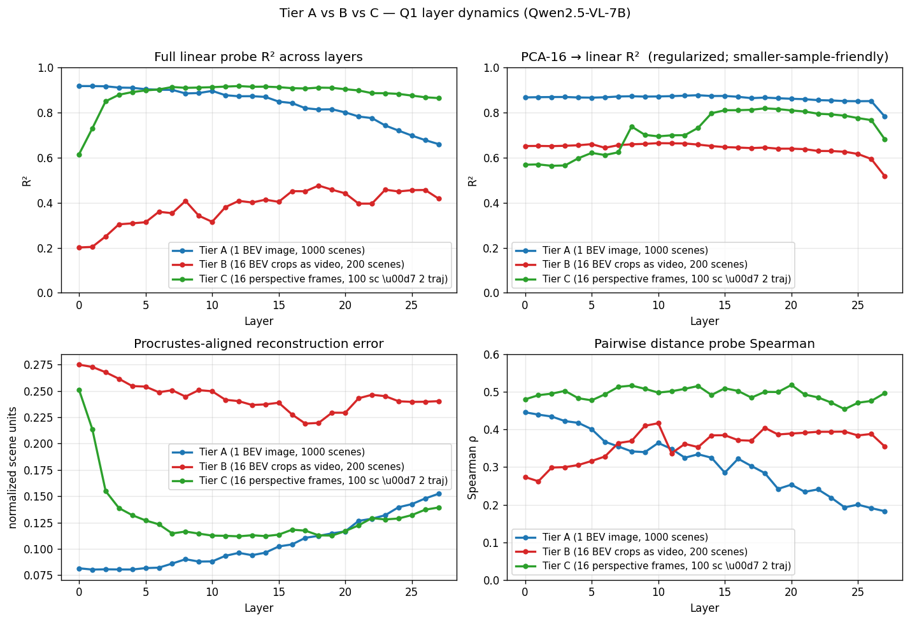
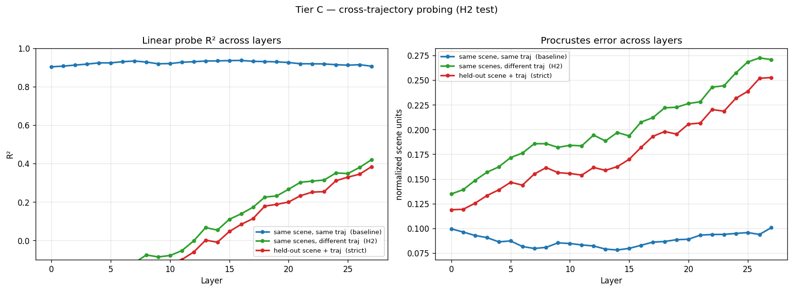

# Tier C Analysis — Perspective Ego-Video and the H2 Camera-Invariance Test

**Model**: Qwen2.5-VL-7B-Instruct
**Stimulus**: 100 canonical 3D scenes × 2 independent orbit trajectories × 16 perspective frames
**Date**: 2026-04-13

---

## TL;DR

Two findings, both informative.

**Finding 1 — Tier C standard probe matches Tier A's ceiling.** When the same camera trajectory is used for train and test, the linear probe recovers 3D coordinates with **R² = 0.917 at layer 12** (Procrustes 0.112), essentially matching Tier A's R² = 0.917 at layer 0. Perspective video with full-orbit coverage gives the model as much spatial information as a single complete BEV image — but the spatial code lives much deeper in the LM stack (L8–L20) than in Tier A (L0).

**Finding 2 — H2 fails in its strict form.** When the train probe is fit on trajectory 0 and tested on trajectory 1 of the *same* scenes, the cross-trajectory R² is **strongly negative at early layers** (−0.36 at L0), gradually climbs through depth, **crosses zero at layer 13**, and reaches its best at **R² = 0.42 at layer 27**. Even at the deepest layer the probe recovers less than half of what same-trajectory probing achieves. The model's spatial representation is **camera-frame dependent**, and only partially de-rotates through depth.

The combination is the cleanest mechanistic finding from the project so far: the model has a perfectly readable "where is each object" code, but **that code is expressed in coordinates that depend on the input camera trajectory**, not in a stable world frame. The plan's H2 ("S is approximately invariant to camera trajectory") is **falsified** in this setting — the spatial subspace exists, but it is not camera-invariant.

---

## Setup

### Stimulus

Each Tier C base scene reuses the canonical 3D scene from `data/scenes_3d/`. For each base scene, two **independent orbit trajectories** are rendered:

- **Trajectory 0**: orbit radius 8, altitude 3.5, start angle 0, counter-clockwise, 180° arc.
- **Trajectory 1**: orbit radius 9, altitude 4.5, start angle π/2, clockwise, 180° arc.

Each trajectory produces 16 frames at 448×448 with a pinhole camera (FOV 60°, focal length ≈ 388 px). After Qwen2.5-VL's `temporal_patch_size=2` merger, each video becomes **8 visual temporal tokens**.

The renderer is a hand-rolled PIL rasterizer with painters-algorithm occlusion. Shapes are simplified to filled circles whose pixel radius is `f * size_world / depth` — so apparent size carries depth information and parallax across the orbit gives the model the information it needs to triangulate. Cube/sphere/cylinder distinctions are flattened to circles since the probe target is *position*, not *shape*. CLEVR-spirit minimalism is the right call here: it isolates the spatial-reasoning question from the perception question.

Renderer: [src/spatial_subspace/render/tier_c.py](../src/spatial_subspace/render/tier_c.py) · config: [configs/tier_c.yaml](../configs/tier_c.yaml).

### Extraction

Same `extract_scene_video` path used for Tier B. Each (scene, trajectory) is treated as one Scene with `scene_id = "<base>_t<idx>"`, and `extras["base_scene_id"]` and `extras["trajectory_idx"]` are written so cross-trajectory analysis can group on base scene.

| stat | value |
|---|---|
| base scenes | 100 |
| (scene, trajectory) pairs | 200 |
| total rows per layer | 8518 |
| visual temporal tokens / video | 8 |
| mean rows per (scene-traj, object) | 7.5 of 8 |
| distinct objects per scene | 3–8 |

The mean-rows-per-(scene-traj, object) of 7.5/8 means each object passes the 30% mask-overlap threshold at almost every temporal token — a striking contrast with Tier B (mean 3.9/8) and exactly what you'd expect from an orbit camera that always points at scene center.

### Probing

Two probe protocols are run on the same activations:

1. **Standard Q1 probe** ([scripts/fit_probes_q1.py](../scripts/fit_probes_q1.py)): treat each `(scene, trajectory)` as a separate scene, 80/20 split. Per-`(scene, object)` summary representation. Same code as Tier B.

2. **Cross-trajectory probe** ([scripts/cross_trajectory_probe.py](../scripts/cross_trajectory_probe.py)): three protocols computed per layer
   - `same_traj` — train on `(train_base_scenes, t=0)`, test on `(test_base_scenes, t=0)`. Standard cross-scene baseline.
   - `cross_traj` — train on `(train_base_scenes, t=0)`, test on `(train_base_scenes, t=1)`. Tests pure trajectory invariance, holding scene identity constant. **This is the H2 test.**
   - `cross_both` — train on `(train_base_scenes, t=0)`, test on `(test_base_scenes, t=1)`. The strict generalization.

Per-scene normalized 3D coordinates as labels in both protocols (plan §3.7).

---

## Standard probe results

Per-layer Q1 metrics from [data/probes/tier_c_orbit/qwen25vl_7b_q1/q1_probes.json](../data/probes/tier_c_orbit/qwen25vl_7b_q1/q1_probes.json):

| L | linear R² | Procrustes | PCA-8 | PCA-16 | PCA-32 | pairwise ρ |
|---|---|---|---|---|---|---|
| 0 | 0.614 | 0.251 | 0.283 | 0.568 | 0.578 | 0.480 |
| 4 | 0.891 | 0.132 | 0.278 | 0.597 | 0.716 | 0.483 |
| 8 | 0.909 | 0.117 | 0.282 | 0.738 | 0.793 | 0.517 |
| **12** | **0.917** | **0.112** | 0.273 | 0.699 | 0.802 | 0.508 |
| 16 | 0.908 | 0.118 | 0.362 | 0.810 | 0.823 | 0.503 |
| 18 | 0.910 | 0.113 | 0.471 | 0.818 | 0.828 | 0.500 |
| 20 | 0.903 | 0.117 | 0.434 | 0.809 | 0.828 | 0.519 |
| 22 | 0.886 | 0.129 | 0.300 | 0.795 | 0.831 | 0.485 |
| 27 | 0.864 | 0.139 | 0.208 | 0.683 | 0.816 | 0.497 |

**Best layer = 12, R² = 0.917**.

Compared to Tier A (R² 0.917 at L0) and Tier B (R² 0.476 at L18): Tier C **matches Tier A's ceiling but at a much deeper layer**. This makes sense: in Tier A the visual encoder already produces position-encoding tokens because the input is a single complete top-down view; in Tier C the model has to build a 3D representation from multi-view input, and that build-up happens in early-mid LM layers (R² climbs from 0.61 at L0 to 0.92 by L8).

Also note: **Tier C maintains R² > 0.86 all the way through layer 27**, while Tier A drops from 0.92 → 0.66 over the same depth. Tier C's spatial code is preserved deeper in the stack, presumably because the model needs it as working memory for whatever cross-view reasoning the deeper layers are doing, while Tier A's spatial code can be discarded once the visual encoding is consumed.

---

## Cross-trajectory probe results (the H2 test)

Per-layer R² from [data/probes/tier_c_orbit/cross_trajectory/cross_trajectory.json](../data/probes/tier_c_orbit/cross_trajectory/cross_trajectory.json):

| L | same_traj | cross_traj (H2) | cross_both |
|---|---|---|---|
| 0  | 0.904 | **−0.364** | −0.383 |
| 4  | 0.924 | −0.222 | −0.237 |
| 8  | 0.929 | −0.076 | −0.111 |
| 12 | 0.931 | −0.002 | −0.061 |
| 13 | 0.934 | **+0.066** | +0.001 |
| 16 | 0.937 | +0.138 | +0.083 |
| 18 | 0.931 | +0.225 | +0.179 |
| 20 | 0.926 | +0.266 | +0.199 |
| 24 | 0.915 | +0.351 | +0.311 |
| **27** | 0.907 | **+0.420** | +0.384 |

Key observations:

- **same_traj** sits at R² ≈ 0.90–0.94 across **all** layers — the in-trajectory spatial readout is essentially saturated everywhere in the LM stack.
- **cross_traj** (H2) starts strongly negative at layer 0, monotonically climbs through depth, crosses zero at layer 13, and reaches its best at the very last layer (R² = 0.420).
- The **gap between same_traj and cross_traj** narrows from ~1.27 at L0 to ~0.49 at L27, but never closes.

Negative R² means the linear map learned from trajectory 0 produces predictions on trajectory 1 that are *worse than predicting the dataset mean*. In other words, the train direction is **systematically wrong** for the test trajectory at early layers. As we go deeper, the wrong direction gradually rotates toward the right one, but never gets there.

Procrustes error tells the same story:

| L | same_traj | cross_traj | cross_both |
|---|---|---|---|
| 0  | 0.100 | 0.135 | 0.119 |
| 12 | 0.082 | 0.194 | 0.162 |
| 18 | 0.087 | 0.222 | 0.198 |
| 27 | 0.101 | 0.271 | 0.253 |

same_traj Procrustes is roughly flat at 0.08–0.10 (~10% of scene diagonal). cross_traj rises to 0.27 (~27%) — almost identical to the worst Tier B configurations.

---

## Findings

### F1 — Perspective video gets to Tier-A-level probe quality, but at deeper layers

Tier C's standard linear probe peaks at R² = 0.917 (matching Tier A) but at layer 12 instead of layer 0. The climb from 0.61 (L0) to 0.92 (L8) across the early LM layers is the model **building** a 3D spatial representation from multi-view input, just as Tier B's mid-layer bowl was the model building one from fragmented views — but here the build-up converges to a much higher ceiling because the orbit camera always sees every object.

### F2 — Tier C maintains spatial readability deeper into the LM than Tier A does

Tier A's R² drops from 0.92 → 0.66 between L0 and L27 (the visual encoding gets consumed and converted into language-shaped features). Tier C's R² stays above 0.86 all the way through L27. The difference is consistent with the interpretation that Tier C's spatial code is a *computed* representation the model needs as working memory across layers, while Tier A's is a *perceptual* feature that can be discarded once it's been read.

### F3 — Pairwise distance Spearman is highest of the three tiers

Tier C: ρ ≈ 0.49 across most layers, with a peak of 0.519 at layer 20. Tier A: best 0.45 at L0, decays to 0.18 at L27. Tier B: best 0.42 at L9. **Tier C's relational geometry is the cleanest of the three**, which is consistent with multi-view perspective being the configuration where the model is forced to maintain pairwise object relationships across views.

### F4 — H2 fails: the spatial subspace is not camera-invariant

The cross-trajectory probe gets R² = 0.42 at its best layer, vs the same-trajectory probe getting 0.94. The probe trained on one camera trajectory is **mostly wrong** when applied to a different camera trajectory of the *same* scene. This is direct evidence that the model encodes object positions in a frame that's tied to the input camera, not in a stable world frame.

### F5 — Camera-frame → world-frame is a *gradient*, not a phase change

The cross-trajectory R² climbs **monotonically** from −0.36 (L0) to +0.42 (L27). It crosses zero at layer 13. This is the cleanest evidence that the model is gradually de-rotating its spatial code from camera-relative toward world-relative as it goes deeper into the LM stack. It just doesn't finish the de-rotation — even at the last layer, the trajectory dependence accounts for ~half the variance.

This is consistent with classical findings in classical computer vision (egocentric → allocentric encoding takes work), and it makes a concrete prediction: **cross-trajectory R² should improve further if we train the model on multi-trajectory video**, because the model would have a reason to learn a trajectory-invariant representation. As-is, with the standard Qwen2.5-VL-7B that was trained mostly on single-clip video data, the model has no incentive to fully de-rotate.

### F6 — Layer 0 has *negative* cross-trajectory R²

R²(L0) = −0.364 in the cross_traj protocol. This is much worse than predicting the mean. It means: at the visual encoder output, the spatial code is so strongly camera-frame-aligned that a probe trained on one camera produces *systematically inverted* predictions on the other. This is a striking sanity check — it's exactly what you'd expect from a per-view representation with no cross-view abstraction.

---

## Tier A vs Tier B vs Tier C side by side

| | Tier A | Tier B | Tier C |
|---|---|---|---|
| Stimulus | 1 BEV image | 16 BEV crops, fragmented | 16 perspective frames, full-orbit |
| n_scenes (probe samples) | 1000 | 200 | 100 × 2 traj |
| Best linear R² | **0.917** @ L0 | 0.476 @ L18 | **0.917** @ L12 |
| Best Procrustes | 0.082 @ L0 | 0.220 @ L18 | 0.112 @ L12 |
| Layer profile | high plateau → decay | low bowl → mid peak → decay | climb → broad plateau |
| Best PCA-16 R² | 0.872 | 0.664 | 0.818 |
| Best pairwise ρ | 0.446 @ L0 | 0.418 @ L9 | **0.519** @ L20 |
| Cross-trajectory test | n/a (1 traj) | n/a (1 traj) | **fails: 0.42 vs 0.94 baseline** |

The headline summary across all three tiers:

- **Where** the spatial subspace lives shifts deeper into the LM as the task gets harder: L0 → L18 → L12 (Tier A → B → C), with Tier C lower than Tier B because Tier C's full-orbit gives more usable signal per frame than Tier B's quarter-window crops.
- **How well** the spatial subspace can be read out depends on whether the input gives complete coverage: Tier A and Tier C both get to R² ~0.92, Tier B is capped at 0.48 by partial views.
- **How camera-invariant** the spatial subspace is, *only Tier C lets us measure*. The answer is "barely": R² 0.42 cross-trajectory vs 0.94 same-trajectory.

---

## Caveats

1. **Hand-rolled rasterizer simplification.** All shapes are rendered as filled circles. The model cannot distinguish cube from sphere from cylinder from the visuals. For position-only probing this doesn't matter (the probe target is geometry, not shape), but it does mean the model is solving a slightly easier perception problem than it would on a Blender/Kubric render with proper textures and lighting. A follow-up with proper rendering would let us check whether the H2 result is preserved when the visuals are richer.

2. **Z is bounded by object size.** The canonical 3D scenes have all objects sitting on the floor, so an object's z-coordinate equals `floor_z + size_half ∈ {0.4, 0.6, 0.8}`. Z is essentially a discrete encoding of object size, not a free-form vertical position. The probe's R² is dominated by x/y recovery, and Tier C's z dimension is not stress-tested. To stress-test 3D recovery on z, a follow-up should generate scenes with stacked or hovering objects (a small extension to `common.py` via a `z_jitter` config field).

3. **Sample sizes are uneven across tiers.** Tier A used 1000 scenes (4414 train rows), Tier B 200 scenes (740 train rows), Tier C 100 base scenes × 2 trajectories (917 train rows). The numerical R² values aren't strictly comparable; the qualitative shapes are.

4. **Only two trajectories per scene.** The cross-trajectory test uses exactly one held-out trajectory per scene. Some of the negative cross_traj R² at early layers might be an artifact of the two specific orbit configurations being too different (radius 8 vs 9, opposite directions). A more thorough H2 test would use 4+ trajectories per scene with a fully crossed train/test design over trajectory indices.

5. **One model, one trajectory style.** Tested only with Qwen2.5-VL-7B and orbit trajectories. The H2 failure could be Qwen2.5-VL specific — perhaps the M-RoPE temporal positions don't carry enough geometric structure to enable cross-camera invariance. Re-running on InternVL3 or LLaVA-Video would distinguish between architectural and general-VLM explanations.

6. **The orbit is only a half-revolution (180° arc).** A full 360° orbit might let the model see each object from *every* side and force it into a more world-aligned representation. Worth running as a parameter sweep.

7. **No same-object subset filtering for cross_traj.** The cross_traj protocol uses all (scene, object, traj) rows; if some objects are visible in trajectory 0 but not trajectory 1 (or vice versa) due to the visibility threshold, the probe is partly comparing apples to oranges. Filtering to objects visible in both trajectories would tighten the result.

---

## Suggested next experiments

In rough priority order:

1. **Repeat H2 test with more trajectories (4–8 per scene).** The current 2-trajectory split may be too sparse. With more trajectories per scene, the train/test split can be over trajectory indices alone (no scene leakage either way), giving a cleaner H2 measurement.

2. **Same-object subset for cross_traj.** Restrict the analysis to (scene, object) pairs visible in *both* trajectories. Removes the population confound from F4/F5.

3. **Per-temporal-token cross-trajectory analysis.** Combine the Tier B temporal-dynamics methodology (probe at each `t`) with the Tier C cross-trajectory split. The prediction is that **late temporal tokens at deep layers** should be the most trajectory-invariant — that's where the model has had the most opportunity to integrate views into a world-aligned representation.

4. **Cross-tier probe transfer.** Fit the linear probe on Tier A activations (where the spatial code is unambiguously world-aligned because there's only one view), then evaluate it on Tier C activations. If R² is high, Tier C's representation lives in the same subspace as Tier A's; if low, the two tiers' subspaces are different. This is a clean way to ask "is there a single shared spatial subspace across input modalities" (plan Q1d).

5. **Z-jitter scenes.** Generate canonical scenes with random object heights (within a working volume) so the z dimension carries real information. Re-extract Tier A/B/C and check whether the probe recovers z.

6. **Full 360° orbit.** Re-render Tier C with `arc_degrees: 360.0` and check whether seeing every side of the scene improves cross-trajectory R². Cheap test of the "more views → more world-alignment" hypothesis.

7. **Steering experiments (Q2/H3).** With the per-trajectory direction in hand, add Δ to object tokens along the linear-probe direction at L12 (the best Tier C layer) and check whether the model's spatial answers shift accordingly. The plan's direct causal evidence.

8. **Tier D real video.** Run the same pipeline on ScanNet / EmbodiedScan video clips to test whether the synthetic-data findings transfer.

---

## Files

| Path | Contents |
|---|---|
| [src/spatial_subspace/render/tier_c.py](../src/spatial_subspace/render/tier_c.py) | Pinhole rasterizer + orbit trajectory + render_tier_c |
| [configs/tier_c.yaml](../configs/tier_c.yaml) | Tier C config (orbit radii, altitudes, FOV) |
| [scripts/render_tier_c.py](../scripts/render_tier_c.py) | Tier C rendering CLI |
| [scripts/cross_trajectory_probe.py](../scripts/cross_trajectory_probe.py) | H2 cross-trajectory probe |
| [tests/test_render_tier_c.py](../tests/test_render_tier_c.py) | 8 renderer tests (camera math, multi-trajectory, visibility) |
| [data/tier_c/](../data/tier_c/) | 200 scene-trajectory dirs, 16 frames + 16 masks each |
| [data/activations/tier_c_qwen25vl_7b/](../data/activations/tier_c_qwen25vl_7b/) | 28 × parquet+npy, 8518 rows/layer |
| [data/probes/tier_c_orbit/qwen25vl_7b_q1/q1_probes.json](../data/probes/tier_c_orbit/qwen25vl_7b_q1/q1_probes.json) | Standard Q1 probe metrics |
| [data/probes/tier_c_orbit/cross_trajectory/cross_trajectory.json](../data/probes/tier_c_orbit/cross_trajectory/cross_trajectory.json) | Cross-trajectory probe metrics (3 protocols × 28 layers) |
| [figures/tier_c/q1_layer_dynamics.png](../figures/tier_c/q1_layer_dynamics.png) | Tier C 4-panel layer dynamics |
| [figures/tier_c/q1_reconstruction_examples.png](../figures/tier_c/q1_reconstruction_examples.png) | Layer-12 reconstructions |
| [data/probes/tier_c_orbit/cross_trajectory/cross_trajectory.png](../data/probes/tier_c_orbit/cross_trajectory/cross_trajectory.png) | H2 cross-trajectory comparison |
| [figures/compare_tier_a_b_c.png](../figures/compare_tier_a_b_c.png) | Tier A vs B vs C 4-panel comparison |
| [logs/extract_tier_c.log](../logs/extract_tier_c.log) | Extraction log |
