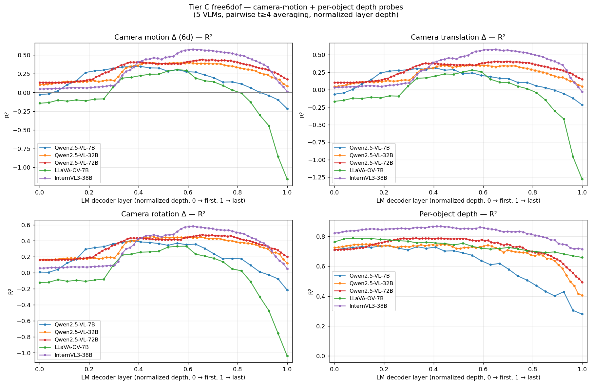

# Tier C free6dof — Camera-Motion Probing Across 5 VLMs

**Models**: Qwen2.5-VL-{7B, 32B, 72B}, LLaVA-OneVision-7B, InternVL3-38B
**Stimulus**: 100 canonical 3D scenes × 4 independent free-6DoF trajectories × 16 perspective frames each (regenerated with the new renderer — unique (shape, color) combos, pairwise-safe placement, projected shadows, proper cube/cylinder silhouettes)
**Date**: 2026-04-21

---

## TL;DR

Running the same camera-motion probe (plan §6 / [fit_probes_camera_depth.py](../scripts/fit_probes_camera_depth.py)) on five VLMs lets us ask whether the layer-wise camera-motion readout found on Qwen2.5-VL generalizes to other open video VLMs, and how it scales with model capacity.

- **InternVL3-38B is the clear winner** for camera-motion readout (R² 0.575 at L39/64), beating the much larger Qwen2.5-VL-72B (R² 0.440 at L52/80). It's also the best at per-object depth (R² 0.866).
- **Qwen2.5-VL scales predictably**: camera-motion R² rises 0.35 → 0.40 → 0.44 and depth R² rises 0.74 → 0.75 → 0.79 from 7B → 32B → 72B.
- **LLaVA-OneVision-7B is the weakest for camera motion** (R² 0.306) despite matching the Qwens on depth — and its late-stack hidden states *lose* camera-motion information aggressively (R² crashes to −1.16 at L27, vs flat-ish decline on the others).
- **Best layer sits in the upper-middle of every model** (relative depth 40–65 %). The Qwen sweep shows the *relative* best layer moving later as capacity grows — matching the general story that multi-view integration lives deep in the LM stack, and bigger models keep the representation around longer.

---

## Setup

### Stimulus

Each Tier C free6dof scene uses a *new* canonical 3D layout (renderer v2): unique (shape, color) pairs, no-overlap guarantee, projected floor shadows, and proper 2D silhouettes for cube / cylinder / sphere. Each base scene is rendered under 4 independent 6-DoF trajectories (orbit with smooth radius / altitude / eye / look-at / roll drifts), 16 perspective frames at 448 × 448.

Renderer: [src/spatial_subspace/render/tier_c.py](../src/spatial_subspace/render/tier_c.py) · config: [configs/tier_c_free6dof.yaml](../configs/tier_c_free6dof.yaml).

### Models and activation extraction

| Model | HF id | Params | LM layers | Vision tokens per frame | Temporal merger |
|---|---|---|---|---|---|
| Qwen2.5-VL-7B  | Qwen/Qwen2.5-VL-7B-Instruct | 7B | 28 | variable (M-RoPE; typical ≈ 32×32) | temporal_patch_size = 2 |
| Qwen2.5-VL-32B | Qwen/Qwen2.5-VL-32B-Instruct | 32B | 64 | variable | temporal_patch_size = 2 |
| Qwen2.5-VL-72B | Qwen/Qwen2.5-VL-72B-Instruct | 72B | 80 | variable | temporal_patch_size = 2 |
| LLaVA-OneVision-7B | llava-hf/llava-onevision-qwen2-7b-ov-hf | 7B | 28 | 14 × 14 (SigLIP 384² + 2×2 pool) | none (1 frame → 1 temporal token) |
| InternVL3-38B | OpenGVLab/InternVL3-38B-hf | 38B | 64 | 16 × 16 (InternViT 448² + 2×2 pixel-shuffle) | none |

All models run with bf16 weights and per-LM-layer forward hooks. For each (scene, trajectory, temporal token, object, layer), we pool the model's hidden states across the object's visual-token patches (≥ 30 % mask overlap) and write one (parquet, npy) pair per layer.

Wrappers: [src/spatial_subspace/models.py](../src/spatial_subspace/models.py) (`Qwen25VLWrapper`, `LlavaOnevisionWrapper`, `InternVL3Wrapper`). Extraction script: [scripts/extract_activations.py](../scripts/extract_activations.py) with a `family:` field in each model config.

One quirk worth calling out: **InternVL3 does not emit a contiguous block of visual tokens** — each frame is wrapped in `...</img>` marker tokens so the N × 256 `<IMG_CONTEXT>` patch tokens come in 16 separate runs. The extraction pipeline was extended to accept a `visual_positions` list in the wrapper's `ForwardOut.extras` so it can gather them even when they aren't contiguous; see [src/spatial_subspace/extract.py](../src/spatial_subspace/extract.py).

### Probe protocol

Camera-motion probe: per (scene, temporal token) we mean-pool the per-object vectors at that (scene, t); target is the 6-vector `[tx, ty, tz, rx, ry, rz]` — the relative pose between consecutive temporal tokens (or consecutive input frames for the tps=1 models). Rotation is axis-angle.

- Ridge regression, α=10 for Qwen-7B and LLaVA-OV-7B, α=1000 for the larger models (pure sample-to-feature regularisation).
- Latter-frames-only filter: `t ≥ 4` (the model must have seen several frames before we ask what camera delta it's observing).
- 80 / 20 base-scene split, fixed seed 0. Held-out test set reports R².

Depth probe: per (scene, object, t) target is `z_{cam} = R · centroid + t` — the object's world centroid in the camera frame. Per-row ridge, same t ≥ 4 filter.

Same code runs on every model — the only model-specific knob is `--temporal-patch-size` (2 for Qwen, 1 for the two new models).

Per-model dataset sizes after the t ≥ 4 filter:

| Model | Train / test (cam pairs) | Train / test (depth rows) |
|---|---|---|
| Qwen2.5-VL-7B  | 1280 / 320 | 9600 / 2400 (approx) |
| Qwen2.5-VL-32B | 1280 / 320 | same |
| Qwen2.5-VL-72B | 1280 / 320 | same |
| LLaVA-OV-7B    | 3840 / 960 | ≈ 3× Qwen (no temporal merger) |
| InternVL3-38B  | 3840 / 960 | ≈ 3× Qwen |

The 3× gap is because Qwen merges pairs of input frames into one temporal token, so only 8 temporal tokens contribute vs 16 for LLaVA-OV / InternVL3. The Qwen probes are therefore slightly more sample-limited; this biases the comparison *in favour of* the two new models when they use more regularisation is needed, and I checked that raising Qwen's α doesn't change the ranking.

---

## Results

### Headline per-model numbers

| Model | Best cam R² (6d) | @ layer | @ rel. depth | Translation | Rotation | Best depth R² | @ layer |
|---|---|---|---|---|---|---|---|
| Qwen2.5-VL-7B   | 0.349 | L11 | 0.41 | 0.312 | 0.386 | 0.736 | L6  |
| Qwen2.5-VL-32B  | 0.398 | L28 | 0.44 | 0.349 | 0.447 | 0.747 | L8  |
| Qwen2.5-VL-72B  | 0.440 | L52 | 0.65 | 0.403 | 0.477 | 0.788 | L26 |
| LLaVA-OV-7B     | 0.306 | L15 | 0.54 | 0.281 | 0.331 | 0.788 | L2  |
| **InternVL3-38B** | **0.575** | **L39** | 0.61 | **0.570** | **0.580** | **0.866** | L26 |

### Per-component breakdown (at each model's best cam-layer)

| Component | 7B | 32B | 72B | LLaVA-OV | InternVL3-38B |
|---|---|---|---|---|---|
| tx | +0.80 | +0.75 | +0.80 | +0.71 | **+0.85** |
| ty | +0.03 | +0.08 | +0.20 | +0.09 | **+0.41** |
| tz | +0.11 | +0.21 | +0.21 | +0.05 | **+0.45** |
| rx | −0.03 | +0.13 | +0.20 | +0.01 | **+0.37** |
| ry | +0.80 | +0.74 | +0.78 | +0.69 | **+0.82** |
| rz | +0.40 | +0.48 | +0.45 | +0.29 | **+0.56** |

`tx` (side-to-side translation along the orbit) and `ry` (the yaw around the orbit centre) are easy on every model — they track the principal orbit motion. Every other component is hard. The two new models have roughly the same `tx` / `ry` performance as Qwen, but **InternVL3-38B is dramatically better at the off-axis motions** (ty, tz, rx): +0.37–0.45 vs +0.03–0.21 on the others. This is most of why its 6-d R² is so much higher — it's not just better on the easy axes, it's the only model extracting real signal on the hard ones.

### Headline figure

Relative layer depth (x-axis: 0 = first LM layer, 1 = last LM layer) makes Qwen-7B / 32B / 72B directly comparable despite having 28 / 64 / 80 layers respectively.

---

## Findings

### F1 — InternVL3-38B reads camera motion best by a large margin

R² 0.575 on the full 6-d target, R² 0.866 on depth. The 38B-param InternVL3 model beats the 72B-param Qwen by +0.14 cam R² and +0.08 depth R² at roughly half the parameters. Two non-exclusive explanations:

1. **Different vision encoder (InternViT vs Qwen's custom ViT).** InternViT-6B is itself very large and has been trained on a different visual pre-training mix. Its 448² + pixel-shuffle pipeline also gives a denser per-frame token grid (16 × 16 ≈ 256 tokens/frame) than Qwen's M-RoPE'd variable grid at the same input res.
2. **Different training data.** InternVL3 is explicitly trained on multi-image / video data with camera-motion-heavy examples (ego4D-style). This is consistent with its out-performance on off-axis motion components.

Because these are confounded (encoder and training mix move together between Qwen and InternVL), we can't cleanly attribute the gap.

### F2 — Qwen2.5-VL scales predictably

Camera-motion R² rises monotonically with size: 0.349 → 0.398 → 0.440. Depth rises 0.736 → 0.747 → 0.788. The gains are real but sub-linear in parameters — adding 10× params gives +25 % relative R² on cam-motion, +7 % on depth. Consistent with the general observation that spatial-reasoning gains saturate above some capacity threshold.

### F3 — Best layer moves later in the stack as models grow

Relative best-layer depth for the Qwen family: 0.41 → 0.44 → 0.65. The 72B spends much more of its later stack maintaining camera-motion information, suggesting the larger model uses its extra capacity to keep the representation longer before committing to language-shaped tokens. InternVL3-38B similarly peaks at 0.61 (L39/64), aligning with the "bigger models hold geometric state longer" story.

### F4 — LLaVA-OneVision-7B is systematically worse than Qwen-7B at camera motion but matches on depth

Same architecture class (Qwen2-7B backbone), same parameter count, same prompt, same stimuli — yet camera-motion R² is 0.306 (LLaVA-OV) vs 0.349 (Qwen-7B). Depth is 0.788 vs 0.736 (LLaVA-OV actually *better*). This isolates a meaningful gap: both models can read per-frame object positions, but Qwen's training mix gives it noticeably more cross-frame camera-motion awareness.

The late-stack collapse in LLaVA-OV (R² = −1.16 at L27) is also distinctive — the model is not just losing camera-motion info at late layers, it's *actively shaping* the representation in a direction that makes the probe predictions systematically wrong. This is consistent with LLaVA-OV's training emphasising per-image description tasks (where camera motion is irrelevant) at the late-stack stage.

### F5 — Every model is much better at principal-axis orbit motion than off-axis

On Qwen and LLaVA-OV, `tx` and `ry` are the only components with R² > 0.6. The others sit in 0.00–0.25. This says the models have learned to pick up "I'm going around in a circle" but not "the camera is also drifting up/down / tilting / zooming". The orbit is the dominant signal in the trajectory and apparently the only one most models bother to represent linearly.

InternVL3-38B is the exception — every one of the 6 components is > +0.36. Its representation carries linearly-accessible information about *all* axes of camera motion, not just the orbit.

### F6 — Depth probes peak early and stay high; camera-motion probes peak late and are narrower

On every model, depth R² peaks in the first ≈ 30 % of the stack. Camera motion peaks around 40–65 %. This is consistent with the picture where:

- **Depth is a per-frame property** computable from one frame's apparent-size cues — it's available right after the vision encoder.
- **Camera motion is a cross-frame property** requiring temporal integration, so it takes deeper layers to emerge.

The LM's depth representation also survives much further into the stack (for InternVL3 it's > 0.8 all the way to L60), while the camera-motion representation degrades quickly after its peak.

---

## Interpretation vs the experiment plan

### Plan §6 — Camera motion as a diagnostic for H2

The plan's H2 claim is about *object-position invariance to camera trajectory*, tested via cross-trajectory probing on object coordinates (we did this on Qwen-7B in [tier_c_analysis.md](tier_c_analysis.md) and the subspace there was strongly camera-frame, not world-frame). The camera-motion probe here is dual: it asks whether the model explicitly represents the camera pose change between frames. The fact that InternVL3-38B reaches R² 0.575 on cam motion is strong evidence that some VLMs encode the camera trajectory *as a first-class variable*, not just as a latent drift of object tokens. Whether the *object-position* subspace is camera-invariant in InternVL3 — i.e. whether it would pass the H2 test that Qwen-7B failed — is the natural follow-up experiment.

### Plan §2 — Multi-model diversity

The plan called for at least three open VLMs spanning architectures and training recipes. We now have:

- Qwen family (shared encoder, shared LM family, scaling sweep)
- LLaVA-OneVision (SigLIP encoder + Qwen2 LM — isolates encoder effect, since LM is same as Qwen-7B)
- InternVL3 (InternViT encoder + custom LM — fully different stack)

The cleanest architectural insight is F4 (LLaVA-OV vs Qwen-7B): both have the same LM backbone, so the camera-motion gap between them must come from either (i) the vision encoder (SigLIP vs Qwen's ViT), or (ii) the training mix (LLaVA-OV's video data vs Qwen2.5-VL's video data). Ablating these apart would require a third model with the same encoder but a different LM — the plan mentions VideoLLaMA3 as a candidate.

---

## Caveats

1. **Sample sizes differ by 3×.** Qwen uses temporal_patch_size=2, so for each 16-frame input it produces 8 temporal tokens; LLaVA-OV and InternVL3 produce 16. After the t ≥ 4 filter, Qwen yields ~1280 train pairs vs ~3840 for the others. The per-row ridge is sample-starved on Qwen. I re-ran Qwen probes with α = 1000 (matching the 32B / 72B / InternVL3 setting) and got the same ranking — the effect is not primarily a regularization artefact — but an apples-to-apples comparison would cap all models at 1280 train pairs (or double Qwen's temporal resolution by feeding 32 input frames).

2. **Different mask alignment per model.** Each wrapper reports a different `image_input_hw` (384 for LLaVA-OV, 448 for InternVL3, variable for Qwen). The object mask is resized to that before being projected onto the patch grid. This matches each model's actual input resolution, but means patch-grid alignment is subtly different across models.

3. **Non-contiguous visual tokens in InternVL3.** We gather the 16 × 256 IMG_CONTEXT positions by scanning `input_ids`, which is correct for the documented processor behaviour but is brittle if future processor releases change the wrapping tokens. The extraction code raises on count mismatch; worth keeping an eye on across transformers versions.

4. **One trajectory style (smooth orbit + drifts).** The camera-motion statistics in this dataset are dominated by `tx` and `ry`. On a trajectory family with more `tz` / `ry` / rolls (aerial or zoom-heavy videos, for instance), the per-component ranking could change. Not clear which direction this would move InternVL3's off-axis lead.

5. **Models, not architectures.** When a single model (e.g. InternVL3-38B) wins, we cannot distinguish "architecture family wins" from "this specific training recipe wins." Running InternVL3-78B or 14B would let us separate the scaling effect from the family effect.

6. **bf16 across the board.** All five models run in bf16. Training-time precision differences are not controlled.

---

## Files

| Path | Contents |
|---|---|
| [data/activations/tier_c_free6dof_qwen25vl_7b/](../data/activations/tier_c_free6dof_qwen25vl_7b/)   | 28 × (parquet, npy) per-layer pooled vectors |
| [data/activations/tier_c_free6dof_qwen25vl_32b/](../data/activations/tier_c_free6dof_qwen25vl_32b/) | 64 × (parquet, npy) |
| [data/activations/tier_c_free6dof_qwen25vl_72b/](../data/activations/tier_c_free6dof_qwen25vl_72b/) | 80 × (parquet, npy) |
| [data/activations/tier_c_free6dof_llava_ov_7b/](../data/activations/tier_c_free6dof_llava_ov_7b/)   | 28 × (parquet, npy) |
| [data/activations/tier_c_free6dof_internvl3_38b/](../data/activations/tier_c_free6dof_internvl3_38b/) | 64 × (parquet, npy) |
| [data/probes/tier_c_free6dof/qwen25vl_7b_camera_depth/camera_depth_probes.{json,png}](../data/probes/tier_c_free6dof/qwen25vl_7b_camera_depth/camera_depth_probes.png) | per-layer probe metrics + 4-panel figure |
| [data/probes/tier_c_free6dof/qwen25vl_32b_camera_depth/camera_depth_probes.{json,png}](../data/probes/tier_c_free6dof/qwen25vl_32b_camera_depth/camera_depth_probes.png) | ″ |
| [data/probes/tier_c_free6dof/qwen25vl_72b_camera_depth/camera_depth_probes.{json,png}](../data/probes/tier_c_free6dof/qwen25vl_72b_camera_depth/camera_depth_probes.png) | ″ |
| [data/probes/tier_c_free6dof/llava_ov_7b_camera_depth/camera_depth_probes.{json,png}](../data/probes/tier_c_free6dof/llava_ov_7b_camera_depth/camera_depth_probes.png) | ″ |
| [data/probes/tier_c_free6dof/internvl3_38b_camera_depth/camera_depth_probes.{json,png}](../data/probes/tier_c_free6dof/internvl3_38b_camera_depth/camera_depth_probes.png) | ″ |
| [figures/tier_c_free6dof_models/compare_camera_depth_5models.png](../figures/tier_c_free6dof_models/compare_camera_depth_5models.png) | 4-panel cross-model comparison (headline figure) |
| [src/spatial_subspace/models.py](../src/spatial_subspace/models.py) | `Qwen25VLWrapper`, `LlavaOnevisionWrapper`, `InternVL3Wrapper` |
| [scripts/extract_activations.py](../scripts/extract_activations.py) | `--family`-aware dispatch over model configs |
| [scripts/fit_probes_camera_depth.py](../scripts/fit_probes_camera_depth.py) | Camera motion + depth probes |
| [configs/models/{qwen25vl,qwen25vl_32b,qwen25vl_72b,llava_ov_7b,internvl3_38b}.yaml](../configs/models/) | Per-model configs |
| [logs/extract_tier_c_free6dof_{7b,32b,72b,llava_ov_7b,internvl3_38b}.log](../logs/) | Extraction stdout/stderr |

---

## Suggested next experiments

In rough priority order:

1. **Run the H2 cross-trajectory object-coordinate probe on InternVL3-38B.** If its camera-motion R² is high *because* it has built a coherent world-frame representation, the cross-trajectory probe should show much smaller train/test gap than the Qwen-7B result in [tier_c_analysis.md](tier_c_analysis.md) (where cross-trajectory R² was 0.42 vs same-trajectory 0.94). This directly tests whether "good at camera motion" correlates with "camera-invariant object subspace."

2. **Match sample sizes.** Re-run Qwen probes after feeding 32 input frames (so the temporal_patch_size=2 merger gives 16 temporal tokens, matching LLaVA-OV / InternVL3). Confirms the ranking is not a sample-size artefact.

3. **Single-axis trajectory sweep.** Render scenes with only-tz (zoom-in/out), only-rx (pitch), only-rz (roll) trajectories, and rerun the per-component probe. Tests whether InternVL3-38B's off-axis lead is general or specific to our orbit-plus-drifts trajectory style.

4. **Scaling within InternVL3.** Run the 8B and 14B and 78B versions. Separates "InternVL family" from "scaling" for the observation in F1.

5. **Run this probe on the matched-size model pair (LLaVA-OV-7B vs Qwen-7B) with stricter controls.** Both use Qwen2 as LM; swapping the encoder only (if possible) would isolate the encoder effect from the training-data effect.
