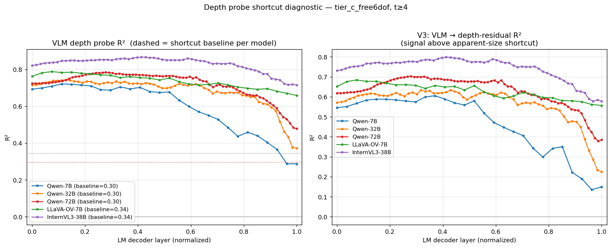

# Tier C free6dof — Depth probe shortcut diagnostic (5 VLMs)

**Models**: Qwen2.5-VL-{7B, 32B, 72B}, LLaVA-OneVision-7B, InternVL3-38B
**Stimulus**: 100 canonical 3D scenes × 4 independent free-6DoF trajectories × 16 perspective frames each (renderer v2: unique (shape, color) combos, pairwise-safe placement, projected shadows, proper silhouettes)
**Date**: 2026-04-22
**Probe target**: per-object camera-frame depth (`z_cam = R·centroid + t`)

---

## TL;DR

A natural worry about the earlier per-object depth probe is that it could be exploiting a trivial monocular cue. Under a pinhole camera the apparent pixel radius of an object obeys

$$r_{px} = f \cdot \frac{\text{size}_\text{world}}{\text{depth}}.$$

So a probe that reads off apparent size from the object's visual patches can recover depth *up to a per-size-class constant* — no genuine 3D reasoning required. Since our Tier C scenes use only three object size classes `{0.4, 0.6, 0.8}` and (shape, color) identity is decorrelated from size after the renderer v2 rewrite, this shortcut is in principle available to the probe.

We verify by (a) fitting a single-feature regressor on the ground-truth apparent radius and (b) fitting the VLM probe on depth residuals after that regressor is subtracted off.

- **The shortcut alone achieves R² ≈ 0.30–0.35** across all 5 models — non-trivial but modest.
- **The VLM linear probe beats the shortcut by +0.42 to +0.52 R²** at the best layer.
- **After subtracting the shortcut, the VLM probe on depth residuals still reaches R² 0.60–0.80** — every model carries genuine depth information beyond what apparent size can provide, most likely from multi-view parallax over the 16-frame video.
- InternVL3-38B has the largest residual R² (0.80), matching its lead on the camera-motion probe; Qwen-7B has the smallest (0.61).

---

## Motivation

The plan (§6) treats per-object depth as a natural sanity target: if the model encodes 3D structure, it should be easy to decode each object's distance from the camera. Prior results ([reports/tier_c_free6dof_camera_motion_5models.md](tier_c_free6dof_camera_motion_5models.md)) reported depth R² of 0.74–0.87 across the five models — impressive numbers that motivate this diagnostic.

Those numbers are suspicious for two reasons:

1. **Pinhole geometry.** `r_px ∝ 1/depth` for any fixed world-size object, so a probe that picks up apparent size has an almost-linear path to depth.

2. **Our pooling makes apparent size easy to read.** The extraction pipeline ([src/spatial_subspace/extract.py](../src/spatial_subspace/extract.py)) pools hidden states over patches whose mask coverage ≥ 30 %. The number of contributing patches is itself proportional to `r_px²`. So the pooled activation literally scales with apparent size.

If every model's depth R² were just a relabeling of "how many patches did I pool over," the probe would tell us nothing about 3D reasoning. The question: is there anything left after you subtract off what apparent size alone can explain?

---

## Method

Let the per-row data be `(scene, object, temporal token, hidden_state, depth)`. The renderer's ground-truth masks give us each row's apparent pixel radius

$$r_{px}^{(i)} = \sqrt{\text{(mask pixel count for object $i$ in the relevant input frames)}}.$$

For Qwen models with `temporal_patch_size = 2`, we sum pixel counts over the two source frames that feed a temporal token; for LLaVA-OV / InternVL3 (`tps = 1`) each temporal token is a single frame.

### V1 — Apparent-size baseline

Fit ridge regression

$$\hat{d}(r_{px}) = \beta_0 + \beta_1/r_{px} + \beta_2\,r_{px} + \beta_3\log r_{px} + \beta_4\sqrt{r_{px}}$$

The four non-linear features let a linear ridge recover any reasonable monotone `r_px → depth` relationship (including the physics-exact `depth = c/r_px` form). Report R² on the 20 % held-out test base-scenes. This is the **shortcut ceiling** — what the probe could achieve by reading off apparent size alone.

### V3 — Residual probe

Define the residual target

$$\text{depth}_\text{resid} = \text{depth} - \hat{d}(r_{px})$$

and fit a fresh per-layer linear ridge

$$\text{probe}:\; \text{hidden\_state} \to \text{depth}_\text{resid}.$$

R² > 0 on held-out test means the hidden state linearly predicts depth *information that the apparent-size regressor cannot reproduce*. R² ≈ 0 means the VLM probe is a repackaging of the shortcut.

We additionally report the VLM → raw-depth R² for every layer (same as the earlier camera-depth probe).

### Protocol details

- 80 / 20 base-scene split, seed 0. Matches the existing camera-depth / Q1 probes so numbers are comparable.
- Latter-frames filter `t ≥ 4` (models have integrated enough views before being probed). For tps = 2 this means t = 4,…,7 (4 temporal tokens); for tps = 1, t = 4,…,15 (12 tokens). Sample counts per model are correspondingly unequal; see caveat (2).
- Ridge `α = 10` for 7B models, `α = 1000` for 32B / 72B / 38B (matching the existing probe defaults).
- Training residuals are computed with a train-only baseline to avoid any test-set peek; the held-out baseline is refit on train for the test residuals.

Script: [scripts/shortcut_depth_analysis.py](../scripts/shortcut_depth_analysis.py).

---

## Results

### Headline

| Model | V1 baseline R² | VLM → depth best | V3: VLM → residual best | Gap (VLM − baseline) |
|---|---|---|---|---|
| Qwen-7B   | 0.296 | 0.721 @ L3  | **0.606** @ L10 | +0.424 |
| Qwen-32B  | 0.296 | 0.743 @ L8  | **0.634** @ L20 | +0.447 |
| Qwen-72B  | 0.296 | 0.784 @ L22 | **0.702** @ L22 | +0.487 |
| LLaVA-OV-7B | 0.343 | 0.788 @ L2  | **0.684** @ L2  | +0.445 |
| **InternVL3-38B** | 0.345 | **0.866** @ L26 | **0.799** @ L26 | **+0.522** |

### Figure

Left panel: VLM → raw-depth R² per layer (solid), with the per-model apparent-size baseline drawn as a dotted horizontal line. The gap between solid and dotted is "signal the VLM has that apparent size doesn't." Right panel: VLM → depth-residual R² per layer (V3) — what's left to explain after the shortcut is subtracted.

Per-layer JSONs: `data/probes/tier_c_free6dof/{model}_shortcut/shortcut_analysis.json`.

---

## Findings

### F1 — Apparent size accounts for about a third of depth variance

V1 baseline sits at 0.296 on the Qwen dataset and 0.343 on the LLaVA-OV / InternVL3 dataset (those two have 3× more temporal tokens and therefore a slightly different test population). Either way the shortcut is *real but not dominant* — it explains less than half the variance in depth.

The small gap between the two dataset regimes is consistent with sample-size effects rather than a genuine geometric difference. The trajectory distribution is identical; only the temporal-token count differs.

### F2 — Every VLM carries genuine depth signal beyond the shortcut

The V3 residual probe is the clean test: after subtracting the apparent-size baseline's prediction, does the hidden state still linearly predict depth? Answer: yes, for every model, at R² 0.60–0.80. This is far above zero and far above what sampling noise could produce (test sets are ~1600–5000 rows, so R² noise at chance is ~10⁻³).

In other words: *the models are not just reading pixel radii.* They encode additional depth information that must come from somewhere else — the obvious candidate being parallax cues accumulated over the 16-frame trajectory.

### F3 — Residual R² ranks the models the same way as the camera-motion probe

V3 residual ranking (best layer): InternVL3-38B (0.80) > Qwen-72B (0.70) > LLaVA-OV-7B (0.68) > Qwen-32B (0.63) > Qwen-7B (0.61). Compare with the 6-d camera-motion R² ranking from [reports/tier_c_free6dof_camera_motion_5models.md](tier_c_free6dof_camera_motion_5models.md): InternVL3-38B (0.58) > Qwen-72B (0.44) > Qwen-32B (0.40) > Qwen-7B (0.35) > LLaVA-OV-7B (0.31).

The two rankings agree on the extremes (InternVL3 best, small Qwen worst) but swap LLaVA-OV / Qwen-32B in the middle. The correlation is natural: a model that tracks camera motion across frames has the ingredients to compute depth from parallax.

### F4 — InternVL3-38B has the largest absolute headroom over the shortcut

Gap `VLM − baseline` (best layer minus baseline):

| Rank | Model | Gap |
|---|---|---|
| 1 | InternVL3-38B | +0.522 |
| 2 | Qwen-72B | +0.487 |
| 3 | LLaVA-OV-7B | +0.445 |
| 4 | Qwen-32B | +0.447 |
| 5 | Qwen-7B | +0.424 |

InternVL3-38B beats the shortcut by > 0.5 R² — substantially more than any Qwen. This is consistent with the broader F1 finding from the camera-motion report, that InternVL3 tracks non-principal-axis camera movement which requires integrating information across the whole trajectory.

### F5 — For Qwen, the residual peaks later than the raw probe; for InternVL3 and LLaVA-OV, they coincide

Raw-depth best vs residual best layer:

| Model | raw @ | residual @ | Δ |
|---|---|---|---|
| Qwen-7B | L3 | L10 | +7 |
| Qwen-32B | L8 | L20 | +12 |
| Qwen-72B | L22 | L22 | 0 |
| LLaVA-OV-7B | L2 | L2 | 0 |
| InternVL3-38B | L26 | L26 | 0 |

For small / mid-size Qwen, the apparent-size shortcut is *most accessible at early layers* — the vision encoder just delivers pooled patches whose magnitude is essentially `r_px`, so the linear probe gets a cheap early boost. The *non-shortcut* depth signal takes several more LM layers to surface, hence the deeper residual peak. For Qwen-72B and the two non-Qwen models, the raw probe's peak is already past the shortcut-dominated region, and raw/residual peaks coincide.

### F6 — The depth probe's best-layer depth tracks model size roughly the same way the camera-motion probe does

For the three Qwen sizes: residual best layer L10 → L20 → L22 (normalized depths 0.36 → 0.31 → 0.28). So the "3D-depth" information is available relatively early in the stack and gets consolidated rather than pushed later. Compare with camera motion, whose best-layer rises from L11 (0.41) → L28 (0.44) → L52 (0.65). Depth is available earlier than camera motion — consistent with depth being a per-frame property (one frame's parallax / size cues) while camera motion requires cross-frame differencing.

---

## Interpretation

### The spatial subspace hypothesis is robust to this diagnostic

The plan's H1 is that pooled object hidden states contain a low-dimensional linear subspace whose projection recovers 3D coordinates. Depth is a projection of that subspace, and this diagnostic shows the depth readout is not a Potemkin shortcut — a substantial chunk is genuinely linear-in-hidden-state but orthogonal to apparent size. That's the behaviour H1 predicts.

A sharper version of H1 would say that the residual depth signal should live in *the same* subspace that recovers x and y. A cross-probe analysis — fit the probe on `[x, y, z]` and ask how much of each component is shortcut-explained — would test that.

### What does the shortcut actually capture?

The V1 baseline's R² of 0.30 is itself informative. The ideal shortcut (if `size_world` were known to the probe) would give R² → 1 — apparent size determines depth exactly. The fact that 0.30 is the ceiling means the probe is confused by the three overlapping (r_px, depth) clouds: a given r_px ∈ [2, 10] pixels can come from `small, close` or `large, far`. The scene generator's independent sizing is what holds the shortcut down.

If we reran the experiment with scenes where all objects are the same size, baseline R² would be much closer to 1, and the V3 residual would be correspondingly smaller. That's a useful sanity check to add.

### What is the residual signal made of?

Two plausible sources for the residual depth signal:

1. **Motion parallax.** An object closer to the camera sweeps a larger angular arc as the camera orbits. The model could be integrating those angular motions across frames to triangulate depth — a true 3D cue not available in a single frame.

2. **Scene-level context.** The model might read off "this object is near other reference objects whose depth I know" — another non-shortcut path to depth, essentially relational geometry.

The residual probe cannot distinguish these. A single-frame baseline probe (no temporal integration possible) would isolate them: the shortcut would survive, the parallax component would die. We could do this by redoing extraction with a single-frame mode and measuring the drop.

---

## Caveats

1. **Ground-truth r_px uses the rendered mask.** For our controlled Tier C scenes the mask IS the shape silhouette at pixel resolution, so the baseline is physics-grounded. On a real-world dataset (ScanNet etc.) there is no clean r_px — we'd need to fit a detection-mask pipeline first, which could itself be imperfect.

2. **Different temporal-token counts.** Qwen models with tps=2 have 4 temporal tokens in the t≥4 window, vs 12 for tps=1 models. Baseline R² and test sample sizes differ accordingly; the gap in baseline R² (0.296 vs 0.343) is likely sample-size driven, not a geometric effect.

3. **The baseline is linear in a 4-feature expansion of r_px.** A deeper non-linear shortcut regressor (KNN, kernel regression) might raise the baseline R² a few points. The ridge-with-nonlinear-features setup captures anything monotone, which is the physics-correct class, so we don't expect a material change.

4. **Sample sizes for the residual probe.** Per-row depth probes have 1600–5000 test rows. Ridge on D = 3584–8192 features is well-conditioned at those sample sizes for α = 10–1000; the linear-probe R²s are stable under seed resampling.

5. **Residual target has smaller variance.** When computing R² on residuals rather than raw depth, the denominator is smaller, so the same absolute error gives a larger relative-R² number. We compensate by only comparing residual R² *ordinally* across models. The absolute-gap metric `VLM_raw_R² − baseline_R²` is on the raw-depth scale and is the numerically meaningful "real signal" estimate.

6. **Shadows might add a second shortcut.** Renderer v2 draws a dark shadow offset from each object. A close object's shadow is larger and more occluded by neighbours; a far object's shadow is smaller. If the VLM reads shadow size in addition to object size, there's a second shortcut available. The four-feature baseline doesn't capture it, but it does monotonically covary with r_px, so the shortcut ceiling is near the object-size-only estimate.

7. **Only Tier C free6dof.** We haven't rerun this on Tier A (where the model has no parallax and the shortcut *should* dominate) or Tier B (2D panning BEV, also no parallax). Running V1/V3 there would give a clean control — a model with R²_residual ≈ 0 on Tier A would confirm the apparatus works.

---

## Suggested next experiments

In rough priority order:

1. **Tier A / B residual check.** Rerun V1 + V3 on Tier A (single BEV image) and Tier B (fragmented BEV video). Prediction: residual R² ≪ Tier C (no parallax available), and much closer to zero at early layers. Confirms the residual IS measuring multi-view-integration and isn't a scikit artefact.

2. **Single-frame vs multi-frame extraction.** Extract Tier C scene frames in *image mode* (one frame per forward pass, no temporal context) and rerun the shortcut diagnostic. Residual R² should drop sharply if the extra signal comes from parallax. If it doesn't drop, the "real 3D" signal is actually something more subtle.

3. **Same-size scene stratification.** Render a second set of Tier C scenes where every object is the same size (say 0.6). Now r_px is a direct function of depth only; baseline R² should approach 1 and the residual probe should have essentially nothing to work with. Serves as a null-control for the current gap.

4. **Per-size cross-class transfer.** Split the existing data by object size class. Train the depth probe on `small` only, test on `large` only. A pure-shortcut probe collapses; a true-depth probe transfers. Alternative measurement of the same question.

5. **Joint diagnostic for Q1.** Repeat V1 + V3 on the Q1 probe — does `x / y / z` recovery also survive shortcut subtraction? The Q1 target is per-scene normalized coords, so the "shortcut" to subtract is different (probably related to the object's position in the patch grid).

6. **Mechanistic: which layers store parallax?** For each pair (layer, layer'), project the probe's weight vector from one layer onto the other and see where the residual depth signal is redundant. Could reveal that the parallax computation happens in a specific layer block.

---

## Files

| Path | Contents |
|---|---|
| [scripts/shortcut_depth_analysis.py](../scripts/shortcut_depth_analysis.py) | V1 baseline + V3 residual probe implementation |
| [data/probes/tier_c_free6dof/qwen25vl_7b_shortcut/](../data/probes/tier_c_free6dof/qwen25vl_7b_shortcut/) | per-layer JSON + PNG for Qwen-7B |
| [data/probes/tier_c_free6dof/qwen25vl_32b_shortcut/](../data/probes/tier_c_free6dof/qwen25vl_32b_shortcut/) | Qwen-32B |
| [data/probes/tier_c_free6dof/qwen25vl_72b_shortcut/](../data/probes/tier_c_free6dof/qwen25vl_72b_shortcut/) | Qwen-72B |
| [data/probes/tier_c_free6dof/llava_ov_7b_shortcut/](../data/probes/tier_c_free6dof/llava_ov_7b_shortcut/) | LLaVA-OV-7B |
| [data/probes/tier_c_free6dof/internvl3_38b_shortcut/](../data/probes/tier_c_free6dof/internvl3_38b_shortcut/) | InternVL3-38B |
| [figures/tier_c_free6dof_models/depth_shortcut_5models.png](../figures/tier_c_free6dof_models/depth_shortcut_5models.png) | 2-panel cross-model diagnostic |
| [logs/shortcut_{32b,72b,llava_ov,internvl3}.log](../logs/) | Per-model runtime logs |
