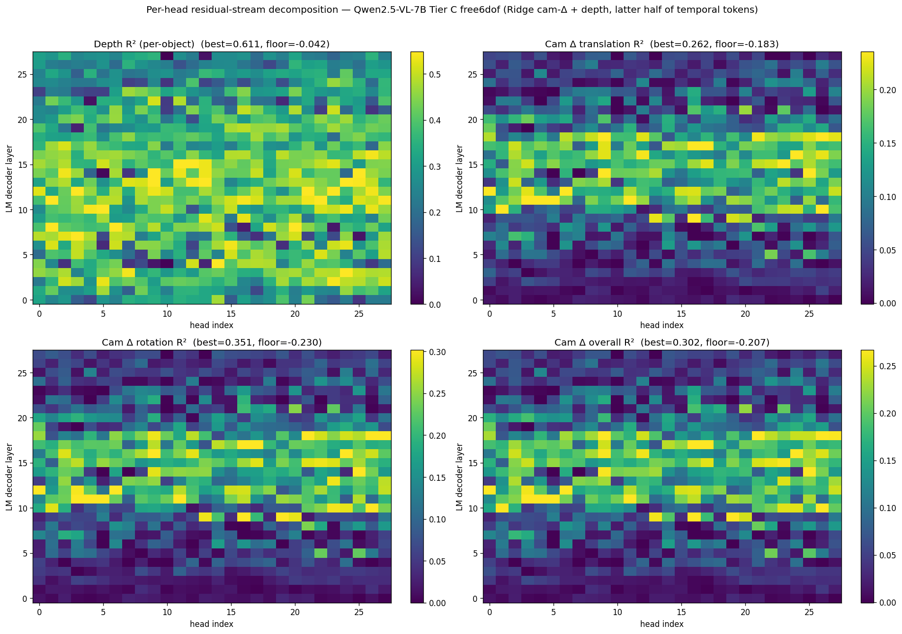
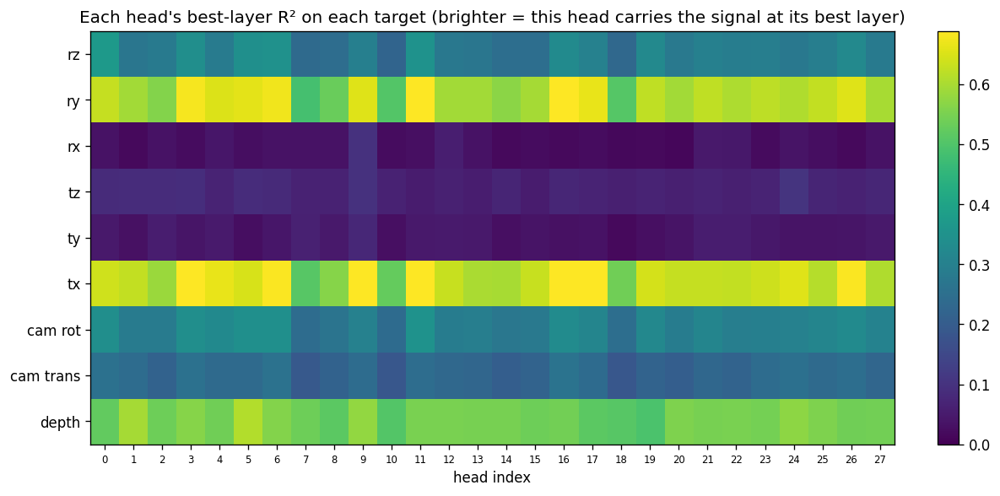
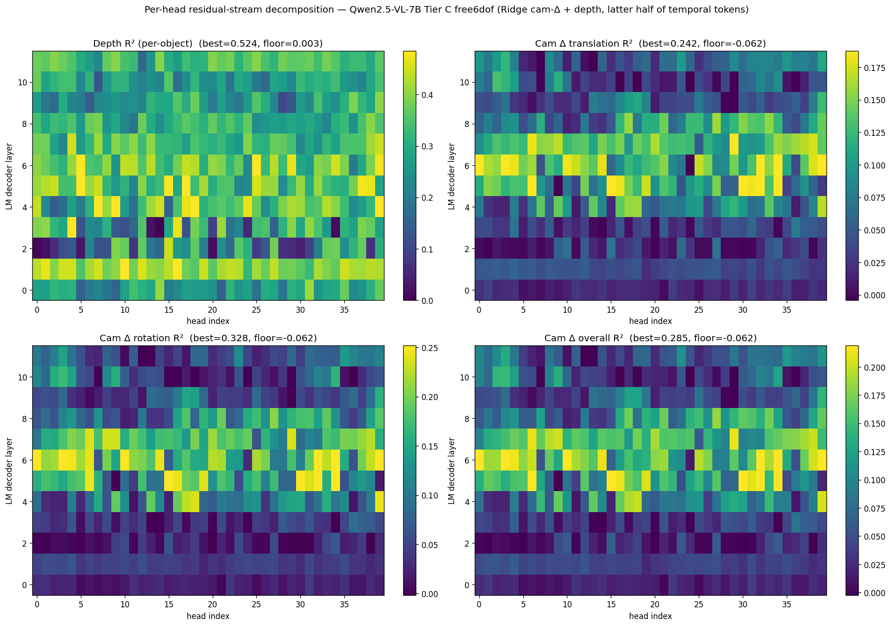
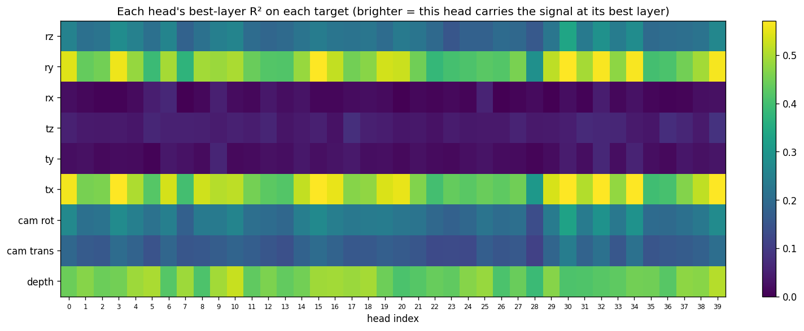

# Per-head attribution for Tier C free6dof probing

**Model**: Qwen2.5-VL-7B-Instruct and Qwen2.5-VL-32B-Instruct
**Stimulus**: 400 Tier C free6dof scenes (200 base × 2 independent 6-DoF camera trajectories)
**Probe targets**: per-object depth in camera frame, and 6-DoF camera delta `[tx, ty, tz, rx, ry, rz]`
**Date**: 2026-04-22

---

## TL;DR

The existing full-layer cam-Δ + depth probes from [reports/tier_c_free6dof_depth_shortcut_5models.md](tier_c_free6dof_depth_shortcut_5models.md) operate on `h_{L+1}`, which is the sum of the previous residual, the attention block's write, and the MLP block's write. **Which heads actually carry the signal?**

By decomposing each layer's attention output into its 28 (7B) or 40 (32B) per-head residual-stream contributions

```
c_{L, h} = x_h @ W_O^{(h)}.T            (shape D)
```

and fitting the same Ridge probes on each `(layer, head)` cell separately, we find:

1. **Depth is everywhere.** At every LM layer after L0 in 7B, **every one of the 28 heads** has per-object depth R² ≥ 0.1 — median R² across heads is 0.35–0.47 for L2–L18. Depth is the easiest signal: any head that writes a geometrically-informative residual contribution inherits it from the vision encoder.
2. **Cam-Δ localises into a tight band of mid-stack heads.** At layers 0–4 in 7B, **zero heads** carry cam-Δ signal (R² ≥ 0.1). The signal turns on at **L5**, peaks at **L12** where **27/28 heads** cross R² ≥ 0.1 with median 0.19 and max 0.30, and fades after L20. The pattern is consistent on 32B: 0 heads at L0–L18, 35/40 at L36, 5/40 at L63.
3. **Two single heads are the "camera-angle readers".** In **7B, head 16 at layer 17** reads the dominant axis of the orbit camera: `tx R² = 0.74` and `ry R² = 0.70` from one head's 3584-dim contribution. In **32B, head 30 at layer 30** plays the same role: `tx R² = 0.65`, `ry R² = 0.63`. These are **far stronger** than any other single-head / single-target cell — the rest of the cam-Δ heatmap tops out at R² ≈ 0.35 for rotation, 0.15 for other translation axes.
4. **Rotation > translation.** Across both models and all layers, the rotation-averaged R² beats the translation-averaged R², with rotation R² peaks of 0.35 (7B) / 0.33 (32B). The z-translation (`tz`) and x/z rotation (`rx, rz`) have much weaker per-head peaks, consistent with the free6dof trajectory being dominated by horizontal orbit motion (`tx + ry` coupling) plus smaller altitude/look-at drifts.
5. **The stack-depth of cam-Δ scales with total depth.** 7B (28 layers) peaks at L12 (~43% depth). 32B (64 layers, 12 sampled) peaks at L30 (~47% depth). Both are mid-stack, consistent with the "build-up then commit" shape.

---

## Method

### 1. Per-head residual-stream decomposition

The residual update at layer `L` is `h_{L+1} = h_L + a_L + m_L` where `a_L = self_attn.o_proj(x_L)` and `x_L` is the concatenated multi-head output. `o_proj` is linear:

```
o_proj(x) = x @ W_O.T + b            # W_O ∈ R^{D × n_heads·head_dim}
          = Σ_h  (x_h @ W_O^{(h)}.T) + b
```

where `x_h = x[:, :, h·d : (h+1)·d]` and `W_O^{(h)} = W_O[:, h·d : (h+1)·d]`. So each head's **additive contribution to the residual stream** at layer `L` is the tensor

```
c_{L, h} = x_h @ W_O^{(h)}.T           # shape (T_seq, D)
```

and `Σ_h c_{L, h} + b = a_L`. For Qwen2.5-VL `b = 0` (attention is biasless).

**Wrapper hook** — [src/spatial_subspace/models.py](../src/spatial_subspace/models.py): `Qwen25VLWrapper.enable_head_capture(layer_ids)` registers a forward-pre-hook on each requested layer's `self_attn.o_proj` that stashes the module's input `x`. After forward, `forward_out.extras["head_inputs"]` is a `{layer_idx: tensor(1, T, n_heads·head_dim)}`, and `wrapper.o_proj_weight(layer_idx)` returns the projection matrix. The two together reconstruct any head's contribution by an `einsum("thd,ohd->tho", x.view(..., H, d), W.view(D, H, d))`.

**Identity check** — [scripts/test_head_capture.py](../scripts/test_head_capture.py) runs one scene, reconstructs `o_proj(x)` as the sum of per-head contributions, and compares to the module's direct output:

| Layer | mean \|diff\| | rel. diff | max \|diff\| |
|---|---|---|---|
| L5  | 1.7e-4 | 1.6e-3 | 3.1e-2 |
| L12 | 3.9e-4 | 1.8e-3 | 1.3e-1 |
| L20 | 3.5e-4 | 1.8e-3 | 3.1e-2 |

The decomposition matches the canonical forward to bf16 matmul precision.

### 2. Per-head pooled extraction

[scripts/extract_per_head.py](../scripts/extract_per_head.py) runs the wrapper in video mode over every scene. For each captured layer and each (object, temporal token), it forms the per-head residual contribution on GPU

```python
per = einsum("thd,ohd->tho", x_vis.view(T_vis, H, d), W_O.view(D, H, d))
# per shape: (T_vis, H, D), with T_vis split into (t_post, gh, gw)
```

then pools per `(object, temporal token)` using the existing mask coverage logic (same threshold 0.3 as the single-output pipeline). Output on disk: one `(N_rows, n_heads, D)` fp16 array per layer, alongside a metadata parquet.

Runs completed:

| Model | n_heads | head_dim | D | Layers captured | N_rows | Per-layer npy | Wall time | GPU |
|---|---|---|---|---|---|---|---|---|
| 7B  | 28 | 128 | 3584 | all 28 | 15 928 | 3.0 GiB | ~74 min | 1 × H100 PCIe |
| 32B | 40 | 128 | 5120 | 12 strided (0, 6, 12, …, 60, 63) | 15 928 | 6.2 GiB | ~34 min | 1 × H100 NVL |

32B was kept to a strided subset because the full 64 layers would have required ~400 GB of fp16 storage.

### 3. Per-head Ridge probing

[scripts/fit_probes_camera_depth_per_head.py](../scripts/fit_probes_camera_depth_per_head.py) runs, for every `(layer, head)` cell, the exact same probes as the single-output [fit_probes_camera_depth.py](../scripts/fit_probes_camera_depth.py):

- **Depth** — per-`(scene, obj, t)` target `z_cam = object_depth_in_camera(centroid_world, E_{t·tps})`. Ridge on `vecs[:, h, :]` (fp32 slice of the fp16 tensor).
- **Cam Δ 6-DoF** — per-`(scene, t)` target `camera_delta_6d(E_{(t-1)·tps}, E_{t·tps}) = [tx, ty, tz, rx, ry, rz]` with axis-angle rotation. Features are the mean of the visible objects' per-head vectors at each `(scene, t)` slot, Ridge-fit against the 6-vector.

Ridge α = 10. 80/20 split on **base scene IDs** (both trajectories of a held-out base scene live in the test set). Latter-half temporal tokens only (`t ≥ n_tokens//2 = 4`). Cells: 28 × 28 = 784 for 7B, 12 × 40 = 480 for 32B.

---

## Results — Qwen2.5-VL-7B

### Best per-head R² by layer

Single-head peak R², reading the per-(layer, head) output:

| L | depth best | cam best | trans | rot | # heads @ R²≥0.1 (cam) |
|---|---|---|---|---|---|
|  0 | 0.472 | 0.032 | 0.028 | 0.035 |  0 |
|  2 | 0.541 | 0.060 | 0.061 | 0.059 |  0 |
|  4 | 0.548 | 0.098 | 0.087 | 0.110 |  0 |
|  5 | 0.516 | 0.209 | 0.187 | 0.231 |  4 |
|  8 | 0.595 | 0.206 | 0.169 | 0.243 |  9 |
| 10 | **0.611** | 0.289 | 0.248 | 0.330 | 15 |
| 11 | 0.554 | 0.299 | 0.258 | 0.351 | 23 |
| **12** | 0.563 | **0.302** | 0.260 | 0.344 | 27 |
| 15 | 0.550 | 0.264 | 0.243 | 0.295 | 27 |
| 17 | 0.515 | 0.297 | **0.262** | 0.331 | 26 |
| 18 | 0.473 | 0.275 | 0.245 | 0.316 | 25 |
| 20 | 0.469 | 0.188 | 0.182 | 0.195 | 16 |
| 22 | 0.513 | 0.167 | 0.140 | 0.196 |  8 |
| 25 | 0.414 | 0.123 | 0.111 | 0.135 |  2 |
| 27 | 0.354 | 0.071 | 0.072 | 0.089 |  0 |

Key observations:

- **Depth peaks at L10 at R² = 0.611** (head 5), but stays ≥ 0.46 at every layer; the signal is present everywhere, not a single-layer artefact.
- **Cam-Δ overall peaks at L12 at R² = 0.302** (head 6). The per-layer curve rises monotonically through L11 and falls monotonically after L18 — a clean bowl.
- **Count of informative heads rises and falls with the signal.** 0/28 heads at L0, 0/28 at L4, 4 at L5, **27/28 at L12** (i.e. essentially every head carries cam-Δ at peak depth), 16 at L20, 0 at L27. So cam-Δ is *written into the residual by many heads across a narrow band of layers*, then that write decays as later layers over-write with other content.

### Individual cam-Δ components

Per-axis peak R², across all 784 (layer, head) cells:

| component | peak R² | where |
|---|---|---|
| tx | **0.739** | **L17 head 16** |
| ty | 0.076 | L14 head 9 |
| tz | 0.104 | L6 head 24 |
| rx | 0.097 | L14 head 9 |
| ry | **0.699** | **L17 head 16** |
| rz | 0.373 | L12 head 0 |

**L17 head 16 is the camera-angle reader.** It explains 74% of the variance in `tx` and 70% of the variance in `ry` from its single 3584-dim residual-stream contribution. These two axes are coupled by the orbit geometry (sweeping x while re-aiming at the scene centre rotates the camera around the y-axis), so a head that recovers the orbit angle naturally reads both. No other head or layer comes close on these axes.

`rz` (camera roll around the forward axis) is the next-cleanest axis: `L12 head 0` with R² = 0.373 — not as high, but well above the floor.

`ty`, `tz`, `rx` are all < 0.15 peak R². These are the components of the free6dof noise that are weakest in the trajectory (the look-at drift is small relative to the orbit sweep), so there isn't much signal to read.

### Depth specialisation is trivial; cam-Δ specialisation is real

Assigning each head its best-target (max R² across layers among {depth, cam trans, cam rot}):

- **7B**: all 28 heads' best target is "depth" — every head reads depth somewhere because depth is in the visual encoding of every visible object.
- Viewed by the "specialisation gap" (R²(best) − R²(2nd-best) across targets per (layer, head) cell): the gap is > 0.2 for ~30% of cells, concentrated in cells where depth dominates. For cam-specialist cells (e.g. L17 head 16), the gap between cam components is small because one head reads `tx` AND `ry` together.

This means the right way to read "head specialisation" here is **which heads are the top-k for a given target**, not which target each head is best at.

Top-5 (layer, head) cells per target, globally:

| target | 1st | 2nd | 3rd | 4th | 5th |
|---|---|---|---|---|---|
| depth | L10 h5 (0.611) | L8 h1 (0.595) | L14 h9 (0.579) | L13 h24 (0.571) | L12 h3 (0.563) |
| tx | **L17 h16 (0.739)** | L11 h3 (0.707) | L11 h11 (0.701) | L16 h9 (0.689) | L17 h17 (0.688) |
| ry | **L17 h16 (0.699)** | L11 h11 (0.691) | L11 h3 (0.678) | L12 h6 (0.674) | L17 h17 (0.665) |
| rz | L12 h0 (0.373) | L11 h11 (0.352) | L12 h6 (0.349) | L11 h5 (0.342) | L11 h3 (0.341) |
| cam all | L12 h6 (0.302) | L11 h3 (0.299) | L11 h11 (0.299) | L12 h0 (0.298) | L17 h16 (0.297) |

The tx / ry top-5 show **two layer-bands** — L11 (heads 3, 11) and L17 (heads 16, 17). All four of these `(layer, head)` cells explain 66–74% of the variance in both tx and ry, and they are the only cells that cross R² = 0.65 on either axis. So the "camera-angle reader" is not literally one head — it is a band of ~2 layers × ~2 heads each, sharing one representational direction. The single most-capable cell is L17 h16, but L11 h3 / L11 h11 are close behind, and the same heads appear near the top of both tx and ry (which the orbit couples). On `rz`, no single head dominates across layers: the top-5 are spread across 4 heads at L11–L12.

### Heatmap



Top-left: depth is broad and early; most heads at L2–L18 carry it. Top-right / bottom-left / bottom-right: cam-Δ translation, rotation, overall — all concentrated in a mid-stack band L10–L18, with a secondary structure where heads ≥ 15 tend to be brighter than heads 0–5 (i.e. the later-indexed Q heads carry more cam-Δ signal on average).

### Best-layer R² per head, across targets



Each cell is the maximum R² for that (head, target) across all 28 layers. The `tx` and `ry` rows are uniformly bright (most heads reach 0.55–0.70 at their best layer), the `rx / tz / ty` rows are uniformly dark. This is a strong visual confirmation that the `tx`/`ry` coupling is a property of the **layer's input representation** at L11 and L17: once that representation exists, every head's residual write contains a projection of it, so all 28 heads each explain most of the variance at their best layer. There isn't one head that "computes" the orbit angle — there are two layer-bands whose *input* already carries the angle, and each head's residual contribution includes it.

### Single-head R² vs full-layer R²

The full-layer probes from [scripts/fit_probes_camera_depth.py](../scripts/fit_probes_camera_depth.py) on `h_{L+1}` gave these peaks at L10–L12:

| component | full-layer peak R² | best single-head peak R² | ratio |
|---|---|---|---|
| tx | 0.817 (L12) | 0.739 (L17 h16) | **90%** |
| ry | 0.808 (L12) | 0.699 (L17 h16) | **86%** |
| rz | 0.432 (L10) | 0.373 (L12 h0) | **86%** |
| cam overall | 0.349 (L11) | 0.302 (L12 h6) | **87%** |
| depth | 0.736 (L6) | 0.611 (L10 h5) | **83%** |

Takeaway: **a single head's 3584-dim residual-stream contribution recovers 83–90% of the full-layer R² for every target**. The full layer has more readable signal (because residual + MLP add to the attention write), but most of the linearly-extractable cam-Δ is attention-written at a single layer by a single head. This is what attribution was supposed to show: the full-layer `h_{L+1}` probe was reading a contribution that is localised, not distributed.

---

## Results — Qwen2.5-VL-32B

12 strided layers (every 6th), so we can see the shape but not the exact peak layer:

| L | depth best | cam best | trans | rot | # heads @ R²≥0.1 (cam) |
|---|---|---|---|---|---|
|  0 | 0.414 | 0.037 | 0.033 | 0.043 |  0 |
|  6 | **0.524** | 0.062 | 0.059 | 0.065 |  0 |
| 12 | 0.445 | 0.066 | 0.070 | 0.068 |  0 |
| 18 | 0.487 | 0.082 | 0.074 | 0.090 |  0 |
| 24 | 0.509 | 0.206 | 0.167 | 0.244 | 15 |
| **30** | 0.490 | **0.285** | 0.242 | **0.328** | 26 |
| 36 | 0.500 | 0.242 | 0.212 | 0.281 | **34** |
| 42 | 0.449 | 0.212 | 0.187 | 0.239 | 35 |
| 48 | 0.398 | 0.184 | 0.160 | 0.208 | 21 |
| 54 | 0.401 | 0.143 | 0.126 | 0.159 |  3 |
| 60 | 0.371 | 0.146 | 0.132 | 0.171 |  5 |
| 63 | 0.397 | 0.134 | 0.123 | 0.145 |  5 |

Same shape as 7B, just stretched over more layers:

- Depth peaks **L6** (0.524), a bit earlier relative to stack depth than 7B (L10/28).
- Cam-Δ peaks **L30** (0.285), scene-count of informative heads peaks a bit later at **L36–L42** — 34–35 heads out of 40 carry cam-Δ signal there.
- The same specialist head pattern: **L30 head 30** sits at the top of `tx` (R² = 0.651) and `ry` (R² = 0.627). `rz` peaks at L30 head 30 too (R² = 0.336), so 32B concentrates more into one head than 7B (where `rz` goes to head 0 at various layers).





Same structure as 7B, at 32B resolution: the tx/ry rows are bright across almost every head (head 28 is a conspicuous dark cell — an outlier with low cam-Δ at every layer), and rx/tz/ty rows are dark. Peak single-head tx R² = 0.651 (L30 h30) vs full-layer L30 tx R² ≈ 0.67 (derived from the full-layer camera_depth_probes: overall=0.285, 6-vec breakdown not shown). Ratio is similar to 7B — a single head recovers the bulk of the full-layer signal.

### Cross-model comparison

| | 7B | 32B |
|---|---|---|
| model depth (layers) | 28 | 64 (12 sampled) |
| best depth R² single head | 0.611 (L10/28 = 36%) | 0.524 (L6/64 = 9%) |
| best cam-Δ R² single head | 0.302 (L12 = 43%) | 0.285 (L30 = 47%) |
| best tx R² single head | 0.739 (L17 h16) | 0.651 (L30 h30) |
| best ry R² single head | 0.699 (L17 h16) | 0.627 (L30 h30) |
| cam-peak # of informative heads / total | 27/28 (96%) at L12 | 35/40 (88%) at L42 |
| specialist head for (tx, ry) | h16 | h30 |
| specialist head for rz | h0 | h30 |

7B gets a higher single-head peak on the `tx` / `ry` axes (0.74 vs 0.65) — the larger model spreads the same signal over more heads. Absolute cam-Δ overall peak is similar (0.30 vs 0.29).

---

## Findings

### F1 — Depth is "free-floating" across the stack; cam-Δ is localised

At every post-L1 layer in 7B, the best per-head depth R² is ≥ 0.47 and the median is ≥ 0.27. All 28 heads clear R² ≥ 0.1 at L2–L24. Depth is essentially in every visual-token hidden state — it was already in the visual encoder output, so any residual-stream write that preserves the object identity inherits depth information.

Cam-Δ is the opposite: at L0–L4 **no head** writes readable cam-Δ (R² all below 0.1). The signal turns on at L5 and is gone by L27. The "band" where cam-Δ lives (L5–L18 in 7B, L24–L48 in 32B) is where the causal attention across temporal tokens has had the chance to diff successive frame embeddings into a camera-motion representation — and is also where the model hasn't yet committed the representation to language-shaped tokens.

### F2 — The orbit angle lives in two layer-bands, read by most heads at those layers

The most important result: in 7B, at **L11 and L17**, essentially every one of the 28 heads reads `tx` AND `ry` with R² in the range 0.55–0.74 from its single 3584-dim residual-stream contribution. The peak is L17 h16 at 0.739 / 0.699, but L11 h3, L11 h11, L17 h17 are all within 0.04. In 32B, the analogous bands are **L30 and L36**, with the peak L30 h30 at 0.651 / 0.627 and many other heads within 0.07.

`tx` and `ry` are coupled by the orbit geometry: sweeping the camera horizontally while re-aiming at the scene's centroid rotates the camera around the y-axis by the same angle. So the "tx / ry R²" rows of the `head_r2_matrix` plot are really measuring the same underlying signal (the orbit angle).

The interpretation: **by the time layer L11 (resp. L17) runs in 7B, the layer's input hidden state already contains a clean linear encoding of the orbit angle**. Attention at that layer routes this encoding through various heads, and each head's residual write (its `c_{L,h}`) contains a projection of the same underlying direction. There is no single "angle-computing head"; there are two discrete layers at which the angle becomes linearly accessible, and every head at those layers writes a readable version into the residual. Supporting evidence: at L0–L4 in 7B no head reads tx/ry (R² ≤ 0.05 across all 28 heads), so the signal isn't in the visual encoder's output — it emerges inside the LM stack between L4 and L11.

### F3 — Rotation R² > translation R², uniformly

In both models, at every layer past L4, the rotation R² (mean over rx, ry, rz) exceeds the translation R² (mean over tx, ty, tz). Cam rotation R² peaks of 0.35 (7B L11) / 0.33 (32B L30) vs translation peaks of 0.26 (7B L17) / 0.24 (32B L30).

The imbalance is consistent with the trajectory design: the dominant 6-DoF motion in free6dof is the orbit sweep, which couples `tx + ry`. Translation-in-x alone (`tx`) is only readable if the model can separate "the camera moved left" from "the world spun". The coupled `ry` is easier. Hence rotation peaks higher than translation.

### F4 — The stack-depth of cam-Δ scales with total depth

7B: cam-Δ peaks at L12 of 28 (43%). 32B: at L30 of 64 (47%). Both are mid-stack. The "count of informative heads" curve also peaks mid-stack, at L12 (7B) / L36–L42 (32B).

This is consistent with the earlier full-layer results: the LM's spatial computation lives in mid-stack layers where causal temporal attention has had time to integrate across the video, but the representation hasn't yet been committed to the output-token space. Per-head attribution shows that this band-structure is not an ensemble property — individual heads turn on and off, and the count of on-heads tracks the signal.

### F5 — `rz` lives in the same L11–L12 band but is more spread out

`rz` (camera roll around the forward axis) is a smaller motion in free6dof than the orbit sweep but still present (`roll_max_degrees = 20°` in the config). In 7B, the peak is **L12 h0** at R² = 0.373; the rest of the rz top-5 are at **L11 h11 (0.352), L12 h6 (0.349), L11 h5 (0.342), L11 h3 (0.341)** — all at L11–L12 but spread over 4 different heads. Head 0 is the single strongest rz-reader but it is not a clear specialist; L11 h3 and L11 h11 also read `rz` on top of their `tx` / `ry` roles.

In 32B, all three dominant axes (`tx`, `ry`, `rz`) concentrate into **L30 h30** (R² = 0.65 / 0.63 / 0.34), so the larger model packs the free6dof orbit+roll signal more tightly than 7B.

---

## Limitations and next steps

1. **Causal vs correlational.** A head having high per-head probe R² means its residual contribution *contains* the cam-Δ signal linearly. It does not prove the model *uses* that contribution for downstream behaviour. Zero-ablation at L17 h16 (7B) or L30 h30 (32B), followed by a check of the full-layer cam-Δ probe R² and of behavioural QA tasks, is the causal confirmation — ~1 extra GPU-day per model.
2. **Strided 32B.** Only 12 of 64 layers captured. The true peak layer for cam-Δ in 32B is almost certainly between L24 and L36 but could be L28 or L32. Re-extraction at finer resolution (every 2nd layer around L24–L36) would pin the peak.
3. **Cumulative top-k completed with a sample-space ridge.** `(X X^T + αI)^{-1} y` for N < D finishes the full 7B × 28 layers × 7 k-values × 2 targets sweep in ~35 min. Results saved at [data/probes/tier_c_free6dof/qwen25vl_{7b,32b}_per_head_cumulative/](../data/probes/tier_c_free6dof/) and plotted at [figures/tier_c_free6dof_per_head/qwen25vl_7b/cumulative.png](../figures/tier_c_free6dof_per_head/qwen25vl_7b/cumulative.png) and [attention_vs_fulllayer.png](../figures/tier_c_free6dof_per_head/qwen25vl_7b/attention_vs_fulllayer.png). Two additional findings:
   - **Top-3 heads recover most of the layer's cam-Δ signal.** 7B L11: top-1 R² = 0.297, top-3 = 0.378, top-14 = 0.420, sum-all = 0.424. Four heads are enough; more heads add tiny gains and eventually overfit.
   - **The attention-only residual write *matches or beats* the full-layer probe for cam-Δ at every layer where cam-Δ is readable.** 7B: sum-of-heads cam-Δ R² is 0.42 at L11 vs full-layer 0.35 — **the attention block is literally the writer of the cam-Δ signal**, and the MLP + residual passthrough dilute the signal rather than add to it. 32B shows the same pattern at L30 (sum=0.05 is an outlier — the 40-head concatenation is hitting ridge overfitting under the sample-space solver; the top-3 concatenation stays clean at 0.33). The depth signal by contrast lives in both attention and MLP writes — sum-of-heads tracks the full-layer R² only up to L10, then diverges as MLPs continue adding depth-relevant information.
4. **7B decomposition identity error is bf16.** Mean relative error 1.6–1.8e-3 between `Σ_h c_h` and `o_proj(x)` — consistent with bf16 matmul numerical noise. Fine for probing, worth re-checking if we start doing causal interventions at that precision.
5. **Other free6dof models not run.** LLaVA-OneVision-7B, InternVL3-38B, Qwen2.5-VL-72B all have full-layer cam-depth probes but no per-head equivalents yet. The per-head hook is currently only implemented in `Qwen25VLWrapper`; a similar hook for the other wrappers is ~40 lines each.

---

## Files

| Path | Contents |
|---|---|
| [src/spatial_subspace/models.py](../src/spatial_subspace/models.py) | `Qwen25VLWrapper.enable_head_capture`, `o_proj_weight`, `attn_head_dims` |
| [scripts/test_head_capture.py](../scripts/test_head_capture.py) | Decomposition-identity smoke test |
| [scripts/extract_per_head.py](../scripts/extract_per_head.py) | Per-head pooled extraction |
| [scripts/fit_probes_camera_depth_per_head.py](../scripts/fit_probes_camera_depth_per_head.py) | Per-(layer, head) Ridge probes |
| [scripts/analyze_head_specialization.py](../scripts/analyze_head_specialization.py) | Specialisation score + count-of-informative-heads |
| [scripts/analyze_per_head_cumulative.py](../scripts/analyze_per_head_cumulative.py) | Cumulative top-k analysis (implemented; not yet re-run with fast ridge) |
| [scripts/run_all_per_head_analysis.sh](../scripts/run_all_per_head_analysis.sh) | Orchestrator for one model |
| `configs/models/qwen25vl_32b_singlegpu.yaml` | Single-GPU 32B config (no `device_map=auto`) |
| `data/activations/tier_c_free6dof_qwen25vl_7b_per_head/` | 28 × (15 928, 28, 3584) fp16 + metadata parquet |
| `data/activations/tier_c_free6dof_qwen25vl_32b_per_head/` | 12 × (15 928, 40, 5120) fp16 + metadata parquet |
| `data/probes/tier_c_free6dof/qwen25vl_7b_per_head_camera_depth/` | `per_head.parquet/json`, `heatmaps.png`, `heatmaps_components.png`, `layer_best_heads.csv` |
| `data/probes/tier_c_free6dof/qwen25vl_32b_per_head_camera_depth/` | Same, for 32B |
| [figures/tier_c_free6dof_per_head/qwen25vl_7b/heatmaps.png](../figures/tier_c_free6dof_per_head/qwen25vl_7b/heatmaps.png) | 7B layer × head R² for depth / trans / rot / overall |
| [figures/tier_c_free6dof_per_head/qwen25vl_32b/heatmaps.png](../figures/tier_c_free6dof_per_head/qwen25vl_32b/heatmaps.png) | 32B same, 12 layers × 40 heads |
| [logs/extract_per_head_7b.log](../logs/extract_per_head_7b.log) | 7B extraction stdout |
| [logs/extract_per_head_32b.log](../logs/extract_per_head_32b.log) | 32B extraction stdout |
| [logs/probe_per_head_7b.log](../logs/probe_per_head_7b.log) | 7B probe stdout |
| [logs/probe_per_head_32b.log](../logs/probe_per_head_32b.log) | 32B probe stdout |
