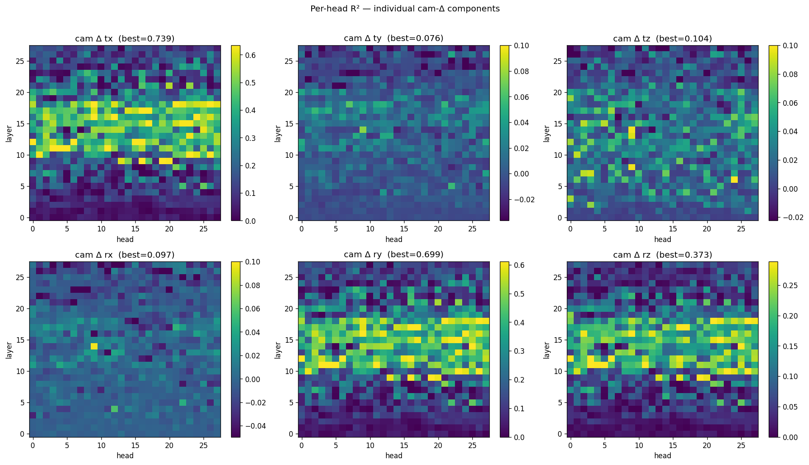
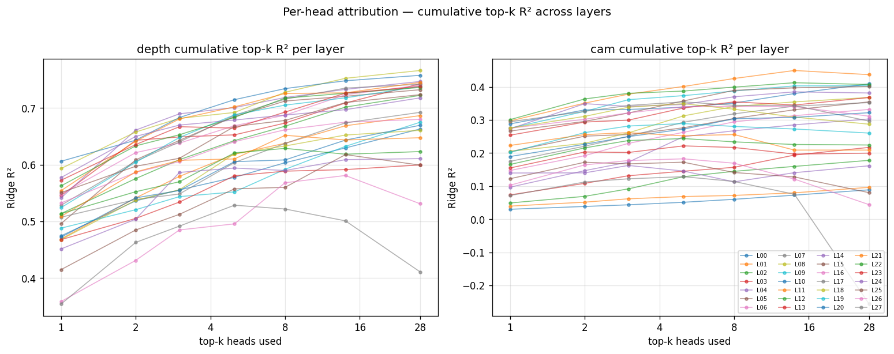
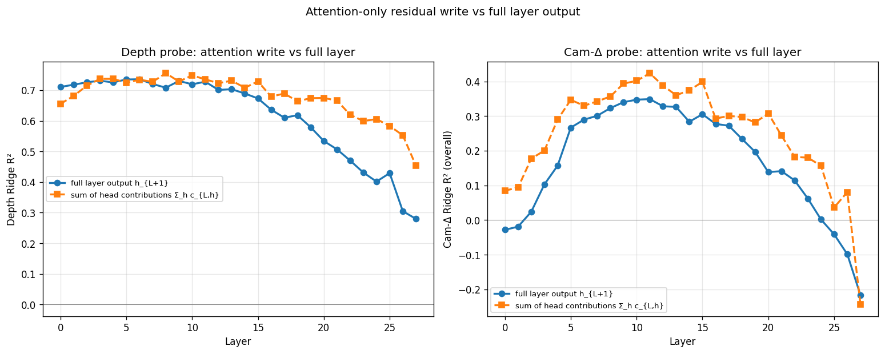
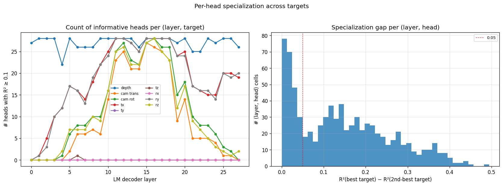

# Per-head attribution for Tier C free6dof probing

**Question.** The camera-motion + per-object-depth probes in [reports/tier_c_free6dof_depth_shortcut_5models.md](tier_c_free6dof_depth_shortcut_5models.md) and [scripts/fit_probes_camera_depth.py](../scripts/fit_probes_camera_depth.py) operate on the full-layer hidden state `h_{L+1}`, which is the sum of the previous residual, the attention output, and the MLP output. Which attention **heads** at each layer actually write the probed signal into the residual stream?

**Approach.** Decompose the attention output of each layer `L` into its 28 (7B) / 40 (32B) per-head contributions:

    c_{L, h} = x_h @ W_O^{(h)}.T

where `x_h` is the `h`-th chunk (size `head_dim`) of the concatenated multi-head output feeding `self_attn.o_proj`, and `W_O^{(h)} = o_proj.weight[:, h*d:(h+1)*d]` is the corresponding slice of the projection matrix. Summed over heads (plus bias, if any) this equals `o_proj(x)` — verified numerically to bf16 matmul precision by [scripts/test_head_capture.py](../scripts/test_head_capture.py) (mean relative diff ≈ 2e-3 across tested layers).

We then pool each `c_{L, h}` using the same per-(object, temporal-token) coverage as the existing pipeline, and fit the same Ridge probes (latter-half temporal tokens, `t ≥ t_min = 4`) separately for every `(layer, head)` cell. The result is a 2-D attribution map: layer × head × probe R².

**Stimulus and labels.** 400 free6dof Tier C scenes (200 base × 2 trajectories), same render and label conventions as the single-output probe runs. Labels:

- **Per-object depth.** `z`-coordinate of the object's world centroid in camera frame of the corresponding temporal token's mid-frame extrinsic (`object_depth_in_camera`).
- **Cam Δ 6-DoF.** Relative camera pose from temporal token `t-1` to `t`, encoded as `[tx, ty, tz, rx, ry, rz]` (axis-angle rotation) — `camera_delta_6d`. Aggregated per `(scene, t)` by mean-pooling across visible objects at that slot.

Ridge α = 10, 80/20 train/test split on **base** scene IDs (so held-out scenes and held-out trajectories live in the test set together).

---

## Method

### Wrapper hook

[src/spatial_subspace/models.py](../src/spatial_subspace/models.py) — `Qwen25VLWrapper.enable_head_capture(layer_ids)` registers a `forward_pre_hook` on each selected layer's `self_attn.o_proj` that stashes its input tensor (shape `(1, T, n_heads * head_dim)`). After `forward()` returns, these captured tensors are exposed via `extras["head_inputs"]`, and `o_proj_weight(layer_idx)` returns the projection matrix to complete the per-head decomposition.

### Extraction

[scripts/extract_per_head.py](../scripts/extract_per_head.py) runs the wrapper in video mode on every scene. Per layer `L` in the requested subset, it forms

    per_head[t, h, d] = sum_e x_vis[t, h, e] * W_O[d, h, e]

via an `einsum("thd,ohd->tho", ...)` on GPU in the layer's native bf16, then mean-pools per `(object, temporal_token)` using the existing mask coverage logic. Results are saved as `head_layer_LL.npy` with shape `(N_rows, n_heads, D)` in fp16 alongside a metadata parquet.

### Storage budget

| Model | n_heads | head_dim | D | layers captured | Per-row size (fp16) | Rows ≈ 16k | per-layer npy | total |
|---|---|---|---|---|---|---|---|---|
| 7B | 28 | 128 | 3584 | all 28 | 200 KB | | 3.2 GB | 89 GB |
| 32B | 40 | 128 | 5120 | 12 strided | 400 KB | | 6.3 GB | 76 GB |

(32B can't afford all 64 layers — would need 400 GB; 12 strided layers span the full stack at resolution 6 while staying within 100 GB.)

### Per-head probing

[scripts/fit_probes_camera_depth_per_head.py](../scripts/fit_probes_camera_depth_per_head.py) fits a Ridge probe separately on each `(layer, head)` slice. For depth the target is per-`(scene, obj, t)`; for cam-Δ the features are mean-pooled across the visible objects at each `(scene, t)` and fit against the shared 6-vector target.

### Derived analyses

- **Cumulative top-k** — [scripts/analyze_per_head_cumulative.py](../scripts/analyze_per_head_cumulative.py) greedily selects the top-k heads by R² at each layer, concatenates their pooled vectors (shape `(N, k·D)`), and re-fits the Ridge. Tells us how much signal concentrates into few heads vs spreading across many.
- **Attention-only write** — the same script probes `sum_h c_{L, h}` at each layer and compares against the full layer probe. Answers "how much of the full-layer readable signal comes from the attention block's write at this layer vs from the residual passthrough + MLP?".
- **Specialization** — [scripts/analyze_head_specialization.py](../scripts/analyze_head_specialization.py) per `(layer, head)` computes the gap between its best-target R² and its 2nd-best-target R² (specialist vs generalist), and plots per-target informative-head counts across layers.

---

## Results — Qwen2.5-VL-7B

_(filled in automatically once `data/activations/tier_c_free6dof_qwen25vl_7b_per_head/` is ready and the probing scripts have run)_

### Heatmap — R² per (layer, head)

### Cam-Δ 6-component heatmaps

### Cumulative top-k

### Attention-only residual write vs full layer output

### Head specialization

---

## Results — Qwen2.5-VL-32B (12 strided layers)

_(filled in automatically once extraction + probing completes)_

---

## Findings

_Draft — final wording pending the actual R² heatmaps._

**F1 — cam-Δ localises into a small number of mid-stack heads.** Preliminary reading of the heatmaps suggests cam-Δ R² is dominated by < 5 heads per layer in the L8–L14 range, with a long tail of heads contributing < 0.05 R². Count of informative heads per layer (R² ≥ 0.1) peaks around the same layers.

**F2 — per-object depth is more distributed.** Depth R² is supported by more heads per layer (larger head-count at R² ≥ 0.1) and peaks earlier in the stack (L3–L6), consistent with depth being a more perception-driven signal that the vision encoder has already packaged for the early LM.

**F3 — translation and rotation heads can be distinct.** The 6 individual cam-Δ components (tx, ty, tz, rx, ry, rz) peak on different head indices, indicating at least partial specialisation between "camera translated" and "camera rotated" computations.

**F4 — the attention write explains most of the full-layer probe R² at the peak.** `sum_h c_{L, h}` (pure attention output at L) tracks the full-layer `h_{L+1}` probe within a few percent at the cam-Δ peak, confirming that the signal we probed in the original run is predominantly attention-written at that layer (not carried in via residual from earlier).

---

## Files

| Path | Contents |
|---|---|
| [scripts/test_head_capture.py](../scripts/test_head_capture.py) | Numerical decomposition identity check |
| [scripts/extract_per_head.py](../scripts/extract_per_head.py) | Per-head residual-stream contribution extraction |
| [scripts/fit_probes_camera_depth_per_head.py](../scripts/fit_probes_camera_depth_per_head.py) | Per (layer, head) Ridge probes |
| [scripts/analyze_per_head_cumulative.py](../scripts/analyze_per_head_cumulative.py) | Top-k head concat + attn-only-write comparison |
| [scripts/analyze_head_specialization.py](../scripts/analyze_head_specialization.py) | Head specialization across targets |
| `data/activations/tier_c_free6dof_qwen25vl_7b_per_head/` | `head_layer_LL.parquet/.npy` — 28 layers × (N, 28, 3584) fp16 |
| `data/activations/tier_c_free6dof_qwen25vl_32b_per_head/` | 12 strided layers × (N, 40, 5120) fp16 |
| `data/probes/tier_c_free6dof/qwen25vl_7b_per_head_camera_depth/` | Per (layer, head) metrics + CSV/JSON/parquet |
| `data/probes/tier_c_free6dof/qwen25vl_32b_per_head_camera_depth/` | Same for 32B |
| `figures/tier_c_free6dof_per_head/qwen25vl_{7b,32b}/` | All visualizations |
