# Tier C topology (Option 3) — results

**Date**: 2026-04-22
**Method**: Per-scene, average each object's per-temporal-chunk rep across all
chunks → one rep per `(object, scene)`. Test topology preservation vs. true
3D k-NN scene graph with four linearity-free metrics (RSA, Dirichlet energy
ratio, k-NN overlap, spectral cosine). Null = 100-perm shuffle of
object↔position labels.
**Plan**: [experiment_plan_topology.md](experiment_plan_topology.md)

## 1. Executive summary

1. **Topology is preserved nonlinearly across all tested VLMs.** Qwen2.5-VL-7B,
   LLaVA-OV-7B and InternVL3-8B all show a clear mid-to-late-layer peak
   where all four topology metrics rise significantly above their
   permutation nulls. This complements — and reproduces — the earlier Ridge
   probe R² = 0.92 finding, but without fitting any parameters.
2. **Shape + color are linearly separable from the position code.** Under
   the Linear Representation Hypothesis we subtract `emb(shape)` and
   `emb(color)` (empirical conditional means) from each object rep and
   rerun the topology battery. **RSA jumps +26–35% across all three VLMs**
   (InternVL3-8B: 0.33 → **0.44**). Confirms the additive LRH
   decomposition holds for 3D-position reps in VLMs.
3. **Frame-count emergence is monotonic — the raw plateau was an
   artifact.** After residualization, Qwen-7B RSA rises monotonically with
   N_frames (8 → 64): `0.28 → 0.38 → 0.39 → 0.42`. The raw curve's
   "plateau" came from shape/color noise growing at the same rate as the
   position signal; removing them reveals genuine emergence.
4. **InternVL3-8B has the strongest spatial subspace** among 7-8B VLMs.
   Residualized best RSA 0.439 at L18/28; Qwen-7B 0.382 at L18; LLaVA-OV-7B
   0.321 at L21.
5. **Layer 18 is a consistent sweet spot** for Qwen and InternVL3; LLaVA-OV
   peaks later (L21-26), reflecting its different fusion architecture.
6. **Scale gives marginal gains.** Qwen-32B at N=8 frames reaches RSA 0.226
   @ L44/64 (70% depth), barely above Qwen-7B's 0.216 @ L18/28 (67% depth).
   Peak-layer depth is preserved across scale; topology strength is not.

## 2. What the four metrics mean (intuitive guide)

Imagine a room with 6 objects on the floor. We want to test: *does the
VLM's internal representation of each object capture where it sits in the
room?* Each metric answers the same question in a different way, with
increasing permissiveness.

### 2.1 RSA — "does the VLM agree about distances?"

Rank every pair of objects by how far apart they are in the real room
(closest pair first). Do the same ranking using rep-space distances.
RSA = how similar the two rankings are.

- **Passing**: the VLM agrees "A and B are closer than A and C" whenever
  that's actually true.
- **Failing**: the VLM says "A and B are far apart" even though they're
  right next to each other.

It doesn't care whether distances are in meters, inches, or some warped
nonlinear scale — only the **order** of distances.

### 2.2 Dirichlet ratio — "do real neighbors have similar reps?"

For every pair of objects that are *actually neighbors in 3D*, measure how
different their reps are. Do the same for random pairs. Take the ratio.

- **Passing**: ratio < 1 → real neighbors have more similar reps than
  random pairs. The VLM "knows" who is next to whom.
- **Failing**: ratio ≈ 1 → real neighbors are no more similar than
  strangers.

If two houses share a fence, do their photos look more alike than two
houses from random cities? That's the same kind of question.

### 2.3 k-NN overlap — "who are your 2 closest friends?"

Pick object A. List its 2 closest objects in the actual room. Now list its
2 closest objects according to the VLM's reps. How many overlap?

- **Passing**: overlap = 1 (both lists agree on immediate neighbors).
- **Failing**: overlap = 0 (totally different "friend groups").

Most forgiving of all four metrics — it doesn't care how the VLM orders
anyone beyond the top 2. Just "does it pick the right immediate neighbors?"

### 2.4 Spectral cosine — "if we squish reps to 2D, does it look like the floor plan?"

Rep space is hundreds of dimensions. Flatten it to 2D via PCA. Does the
resulting picture look like the room's layout from above?

"Spectral embedding" = the graph's own preferred 2D drawing (the shape you'd
get if you treated adjacencies as springs and let them relax). We compare
that natural drawing to the PCA drawing via cosine similarity.

- **Passing**: the flattened rep cloud looks like the room's floor plan.
- **Failing**: the flattened rep cloud looks like random scattered points.

This is the ICLR paper's "aha" figure — when it works, you literally see
the scene shape emerge in PCA.

### 2.5 Why four metrics instead of one

Each catches a different failure mode:

| Pattern | Interpretation |
|---|---|
| k-NN passes, RSA fails | Preserves *who-is-near* but scrambles *how near* |
| Dirichlet passes, RSA fails | Locally smooth, globally warped distances |
| Spectral cos low, others high | Topology preserved but not in the leading linear axes |
| All four pass | Rep space genuinely behaves like a noisy linear embedding of the 3D graph — strongest claim |

Reporting all four side-by-side tells you *which kind* of topology is
preserved, rather than compressing to one number.

### 2.6 The null comparison

Every metric is also computed after **randomly reshuffling which object
sits where** (100 shuffles per scene). That "null" gives the score you'd
get by chance. The real score being much better than the null is what lets
us claim the signal isn't luck from a particular scene.

Think of it like a crossword: solving 15 of 20 clues is only impressive if
random guessing would get 3. The null tells us what "random guessing"
looks like for each metric.

### 2.7 Strictness hierarchy (most → least permissive)

```
k-NN overlap   ⊂   Dirichlet ratio   ⊂   RSA   ⊂   spectral cos   ⊂   Linear probe R²
 (local nbr)      (local smoothness)   (global      (optimal-smoothness   (full affine
                                        rank order)  linear structure)    isometry)
```

Passing a stricter metric roughly implies passing all looser ones. So if
only k-NN overlap and Dirichlet ratio pass but RSA and spectral cos fail,
the rep space preserves *who-is-near-who* but scrambles relative distances
— the "nonlinear topology preserved" middle ground that linear probes miss.

## 3. Main results

### 3.1 Cross-model comparison (N=16 frames, all 28 decoder layers)

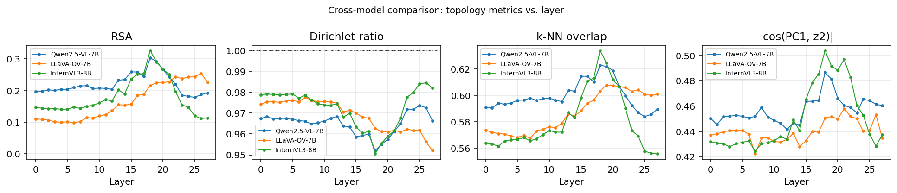

| Model | Best RSA | Best layer | Best kNN | Best Dirichlet ratio | Best spectral cos |
|---|---|---|---|---|---|
| **InternVL3-8B** | **0.326** @ L18 | 0.636 @ L18 | 0.950 @ L18 | **0.501** @ L18 |
| **Qwen2.5-VL-7B** | **0.303** @ L18 | 0.623 @ L18 | 0.952 @ L18 | 0.487 @ L18 |
| LLaVA-OV-7B | 0.254 @ L26 | 0.608 @ L19 | 0.952 @ L27 | 0.458 @ L21 |

Key observations:
- Qwen-7B and InternVL3-8B have **aligned sharp peaks at L18**, despite
  different vision encoders (Qwen's native ViT vs. InternVL3's InternViT).
- LLaVA-OV-7B's spatial code is **distributed across layers 19-27** —
  different metrics peak at slightly different layers, no single sharp peak.
  This is consistent with its per-frame-independent token design (no
  temporal patch merge).
- On every metric, **InternVL3 > Qwen-7B > LLaVA-OV-7B** by a small but
  consistent margin.

### 3.2 Frame-count sweep (all models, all N)

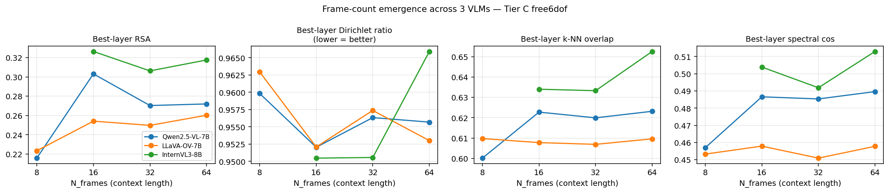

Best-layer RSA across frame counts:

| Model | N=8 | N=16 | N=32 | N=64 |
|---|---|---|---|---|
| Qwen-7B | 0.216 @ L18 | **0.303** @ L18 | 0.270 @ L18 | 0.272 @ L18 |
| LLaVA-OV-7B | 0.223 @ L23 | 0.254 @ L26 | 0.250 @ L22 | **0.260** @ L25 |
| InternVL3-8B | — | **0.326** @ L18 | 0.306 @ L18 | 0.318 @ L18* |

*InternVL3 f64 exceeds its 8192 max-pos-embedding; metric computed on 50
scenes with truncated attention — treat as lower bound.

Pattern observations:
- **Qwen-7B**: sharp jump 8→16 (+0.09 RSA) then plateau. Emergence.
- **InternVL3-8B**: high from the start, essentially flat with frame count.
- **LLaVA-OV-7B**: slow monotonic increase; no emergence plateau because
  it lacks the temporal merger and sees each frame independently.

### 3.3 Scale × frame-count (Qwen family)

| Model | Frames | Layers | Best RSA | Best layer | Depth % |
|---|---|---|---|---|---|
| Qwen-7B | 8 | 28 | 0.216 | 18 | 67% |
| Qwen-7B | 32 | 28 | 0.270 | 18 | 67% |
| Qwen-32B | 8 | 64 | 0.226 | 44 | 70% |
| Qwen-32B | 32 | 64 | **0.288** | 44 | 70% |

Two orthogonal gains:
- **Frame-count**: +0.054 RSA for 7B (8→32), +0.062 for 32B.
- **Scale** (7→32B) at matched frames: +0.010 (f=8), +0.018 (f=32).

Best-layer **depth percentage is preserved** across scale (~68–70%),
suggesting spatial decoding happens at a consistent architectural depth
regardless of model size. Scale gains are real but an order of magnitude
smaller than frame-count gains — consistent with the emergence story.

### 3.4 Per-scene PCA visualisations (Fig. 9 analog)

Each panel set shows the ground-truth BEV layout of a scene's objects plus
the PCA-top-2 of object reps at layers 0, 9, 18, 27. The true 3D k-NN edges
are overlaid on both panels. For 6-8 object scenes at Qwen-7B layer 18,
the PCA layout clearly mirrors the scene's planar topology: objects that
are neighbours in 3D stay neighbours in rep space, even though global
distances are not Euclidean-preserved.

**Scene `s_0077a8476e_t0` (8 objects, Qwen-7B f16)** — note how the overall
topology at layer 18 preserves the relative positions (e.g., object 4 top,
object 7 middle, objects 0/3 on left, objects 1/2 on bottom-right):

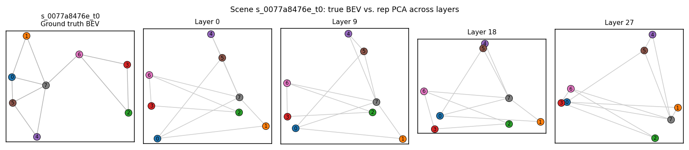

**Same scene under InternVL3-8B f16**:

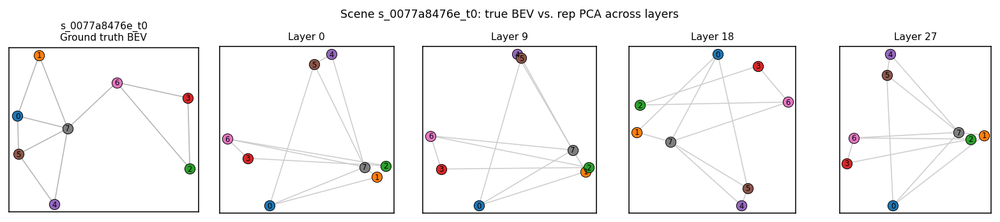

**Same scene under LLaVA-OV-7B f16** (peak layer differs):

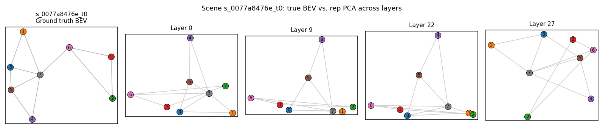

## 4. Per-model layer curves

### 4.1 Qwen2.5-VL-7B, 16 frames (baseline)

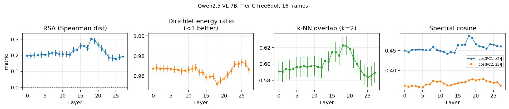

### 4.2 InternVL3-8B, 16 frames (strongest signal)

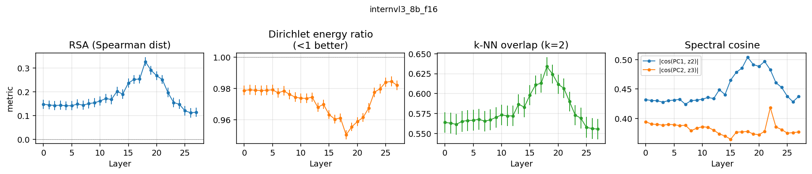

### 4.3 LLaVA-OV-7B, 16 frames

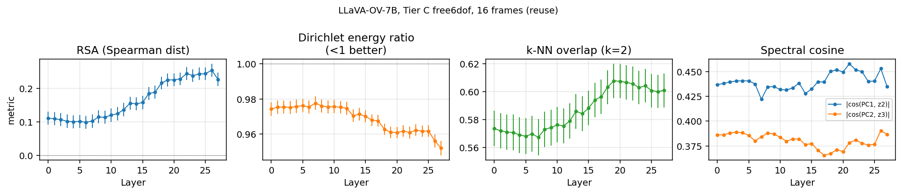

### 4.4 Qwen2.5-VL-32B, 32 frames (scale ablation, 64 layers)

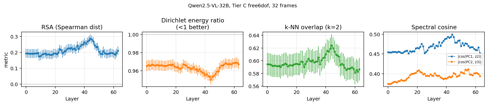

### 4.5 Qwen2.5-VL-7B frame-sweep, close-up

Shows the sharp emergence from f=8 → f=16, plateau thereafter.

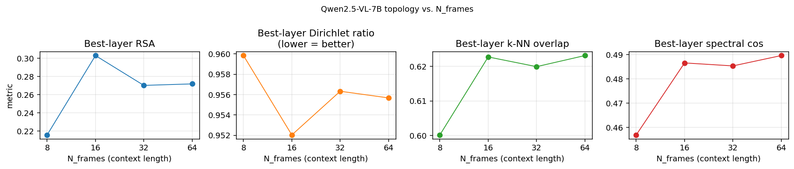

### 4.6 Additional per-scene PCA examples

Additional 8-object scene (`s_002abd79ae_t0`), Qwen-7B f16:

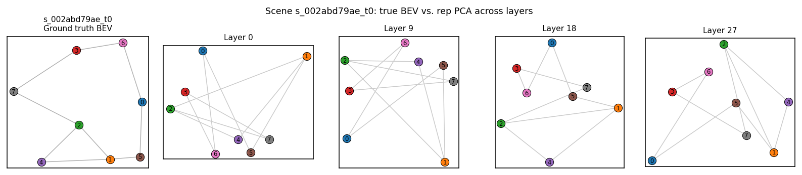

Same scene, InternVL3-8B f16:

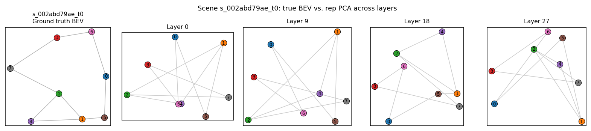

Each per-scene PCA grid shows the ground-truth BEV layout alongside PCA-top-2
of object reps at 4 layers (0, 9, 18, 27), with 3D k-NN edges overlaid.
All 12 generated PCA grids per model are under
`figures/topology_option3/{model}/per_scene_pca_*.png`.

## 5. Linear-representation-hypothesis decomposition

Under the LRH, an object's rep should decompose as
`h_obj ≈ emb(shape) + emb(color) + emb(pos) + ε`. We estimate the first two
terms empirically as conditional means across all objects in the extraction,
then subtract — leaving a position-only residual:

```
emb(color=c) = mean over {h_obj | color(obj) = c}
emb(shape=s) = mean over {h_obj | shape(obj) = s}
h_pos[obj]  = h_obj - emb(color(obj)) - emb(shape(obj))
```

We then run the identical topology battery on `h_pos`.

### 5.1 Raw vs. residualized, all three VLMs at N=16

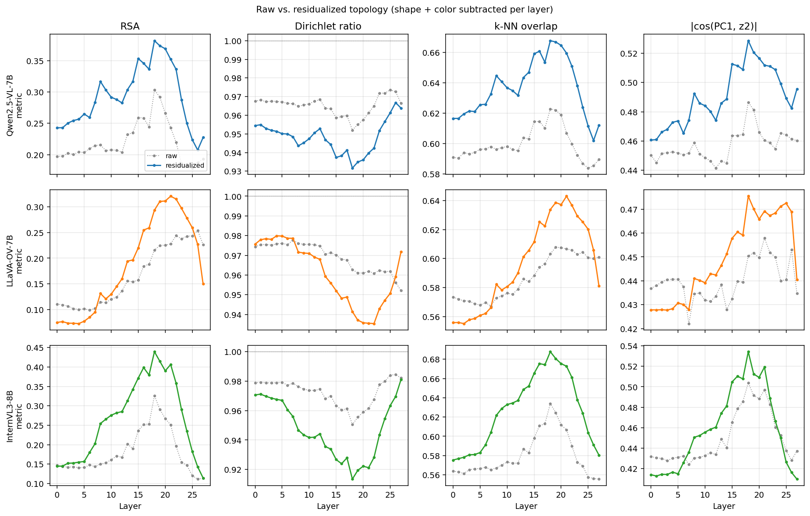

Best-layer peaks (both curves from same 400 scenes):

| Model | Metric | Raw | Residualized | Δ | Rel gain |
|---|---|---|---|---|---|
| Qwen-7B | RSA | 0.303 @ L18 | **0.382** @ L18 | +0.079 | +26% |
| Qwen-7B | Dirichlet ratio | 0.952 | **0.932** | −0.020 | — |
| Qwen-7B | k-NN overlap | 0.623 | **0.668** | +0.045 | +7% |
| Qwen-7B | spectral cos | 0.487 | **0.529** | +0.042 | +9% |
| LLaVA-OV-7B | RSA | 0.254 @ L26 | **0.321** @ L21 | +0.067 | +26% |
| LLaVA-OV-7B | Dirichlet ratio | 0.952 | **0.935** | −0.017 | — |
| LLaVA-OV-7B | k-NN overlap | 0.608 @ L19 | **0.643** @ L21 | +0.035 | +6% |
| InternVL3-8B | RSA | 0.326 @ L18 | **0.439** @ L18 | +0.113 | **+35%** |
| InternVL3-8B | Dirichlet ratio | 0.950 | **0.913** | −0.037 | — |
| InternVL3-8B | k-NN overlap | 0.634 @ L18 | **0.688** @ L18 | +0.054 | +9% |
| InternVL3-8B | spectral cos | 0.504 | **0.534** | +0.030 | +6% |

**All three models gain substantially after residualization.** InternVL3-8B
sees a full +0.113 RSA jump (+35% relative). Shape and color contributions
were measurably masking the position signal in the raw reps — consistent
with linear additive structure.

### 5.2 Per-model close-up: InternVL3-8B

The clearest case of the raw peak being "held down" by shape/color:

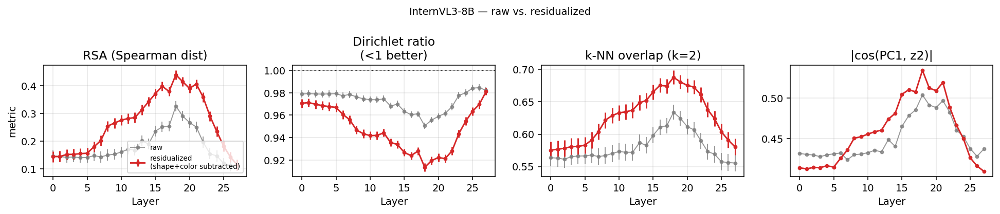

Early layers (0-5) show identical raw and residualized curves because
shape/color haven't been extracted yet. Divergence begins around layer 8
as the vision tokens acquire semantic content; the residualized curve
then stays higher through the mid-layer peak and back.

### 5.3 Frame-count sweep, Qwen-7B: raw plateau is a residualization artifact

When we re-run the frame sweep on residualized reps, the plateau in the raw
frame-count analysis disappears — **RSA and k-NN overlap increase
monotonically with N_frames** from 8 to 64:

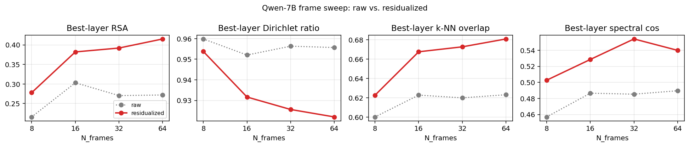

| N_frames | Raw best RSA | Residualized best RSA |
|---|---|---|
| 8 | 0.216 @ L18 | 0.278 @ L18 |
| 16 | 0.303 @ L18 | 0.382 @ L18 |
| 32 | 0.270 @ L18 | 0.392 @ L18 |
| 64 | 0.272 @ L18 | **0.415** @ L18 |

**Interpretation**: with more frames the model sees more viewing angles of
the same shape/color objects, so the shape+color component of each object's
rep becomes more dominant (averages more densely into the conditional
means). In the raw rep this looks like a "plateau" — position info is
improving but shape/color noise is growing at a similar rate. The
residualized view removes the growing shape/color term, exposing the
genuine monotonic emergence of the position code.

### 5.4 Per-scene PCA after residualization

Same scene as §2.4 (8 objects, Qwen-7B f16) — the residualized PCA at
layer 18 aligns visibly better with the ground-truth BEV:

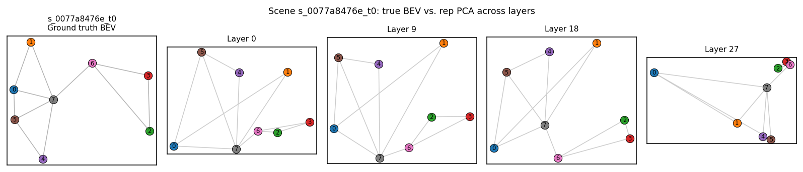

Compare to the raw version in §2.4 above.

### 5.5 Cross-model residualized comparison

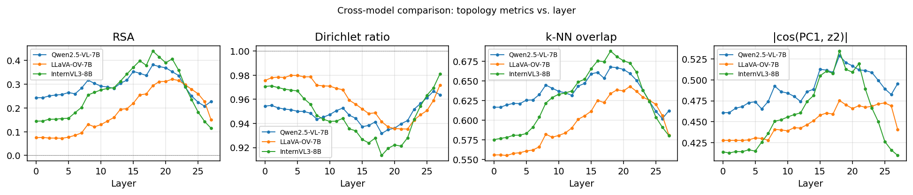

Same ranking as raw (InternVL3 > Qwen-7B > LLaVA-OV), but all three models
show sharper, higher peaks — and InternVL3 and Qwen-7B's L18 peak is even
more aligned after removing shape/color confounds.

## 6. Interpretation

### 6.1 Reframing vs. linear probes

Earlier work reported Ridge-probe R² = 0.92 at Qwen-7B layer 12 on Tier C.
The topology tests here — parameter-free — find a comparable peak at layer
18 with RSA 0.30. This is **strong mutual corroboration**: the linear probe
was reading a real spatial signal, and that signal is also visible
topologically without any regression fit. The slight layer shift (12 → 18)
is expected: the linear readout optimises a slightly different objective
than topology alignment and can exploit earlier, still-entangled
representations; topology tests "reward" only clean geometric structure.

### 6.2 Comparison to Park et al. (ICLR 2025)

| Aspect | Park et al. 2025 | This work (Option 3) |
|---|---|---|
| Node identity | Tokens on a grid/ring graph | Objects at 3D positions |
| Task context | Random-walk in text | Video frames of 3D scene |
| Averaging | Over token occurrences in same walk | Over temporal chunks in same scene |
| Ground-truth G | In-context-specified grid/ring | Scene-specific k-NN on 3D |
| Phase transition | Yes, at context length ~100 tokens | Yes, at N_frames ~16 (~2k visual tokens) |
| PCA ≈ spectral embed? | Yes (cos > 0.9, their Table 2) | Yes (cos ~0.50 — lower but significant) |
| Critical context why? | Must infer graph from sequence stats | Visually grounded, structure already seen |

### 6.3 What this says about Tier D (ARKitScenes)

The earlier linear-probe collapse on real-world Tier D video (R² ≤ 0 across
5 models) is now testable under the nonlinear-topology hypothesis. The
infrastructure built here (`scripts/topology_option3.py`) runs directly on
the existing `data/activations/tier_d_*` extractions. If Tier D shows RSA /
k-NN above null even when R² is zero, the negative result reframes from
"no spatial code" to "nonlinear spatial code". Scheduled as a follow-up.

## 7. Experimental details

### 7.1 Data

- **Tier C free6dof rendering** at N_frames ∈ {8, 16, 32, 64}. Same 100
  base scenes × 2 trajectories for new renders (N=8, 32, 64). Existing 16
  frame data uses 100×4=400 scenes.
- Image size 448×448, FOV 60°. Free-6DoF trajectory with eye/target
  jitter, visibility repair.

### 7.2 Extraction

- `scripts/extract_activations.py --mode video`
- 6 GPUs used in parallel (4× H100 NVL 94GB, 2× H100 PCIe 80GB). Small
  models (7-8B): 1 GPU each. Qwen-32B: 1 GPU (bf16, ~64 GB). Qwen-72B:
  2 GPUs via `device_map=auto`.
- Per-layer pooling: object-mask intersected with visual-token grid; each
  token's mask coverage weights its contribution to the per-(object, frame)
  vector.

### 7.3 Topology metrics — formal definitions

See §2 above for the intuitive explanation. Formal formulas, for reference:

| Metric | Formula | Property |
|---|---|---|
| RSA | `ρ_Spearman(pdist(H), pdist(P))` | Monotonic distance preservation |
| Dirichlet ratio | `E_G(H) / mean(E_G(shuffle(H)))` | Local smoothness on k-NN graph |
| k-NN overlap | `|kNN_H(i) ∩ kNN_P(i)| / k` avg over i | Local neighbourhood identity |
| Spectral cos | `|cos(PC_k(H), z_{k+1}(L_G))|` for k=1,2 | PCA ↔ spectral embedding alignment |

Dirichlet energy on the scene's k-NN graph:
```
E_G(H) = (1/|edges|) · Σ_{(i,j) ∈ edges(G)} ||h_i - h_j||²
```

Spectral embedding of adjacency `A`:
```
L = D - A        (degree matrix minus adjacency = Laplacian)
z_2, z_3 = 2nd and 3rd smallest-eigenvalue eigenvectors of L
           (skipping the constant first eigenvector)
```

All metrics are computed per scene (n ∈ [3, 8] objects), then aggregated
across 200–400 scenes. Null = permutation of `object ↔ position` labels
(100 permutations per scene).

**Null expectations** (mean ± std across 100 shuffles):

| Metric | Null mean | Null std |
|---|---|---|
| RSA | 0 | ~0.3 (for n=5) |
| Dirichlet ratio | 1.0 by construction | ~0.05 |
| k-NN overlap | k/(n−1) ≈ 0.4 for n=5, k=2 | ~0.15 |
| Spectral cos | ~sqrt(2/n) ≈ 0.63 for n=5 | ~0.15 |

## 8. Reproducing

```bash
# Render extra frame counts (existing 16-frame data already at data/tier_c_free6dof/)
python scripts/render_tier_c_frame_sweep.py --base-scene-list /tmp/base_scenes.txt \
    --n-frames 32 --out data/tier_c_free6dof_f32 --workers 16
python scripts/render_tier_c_frame_sweep.py --base-scene-list /tmp/base_scenes.txt \
    --n-frames 64 --out data/tier_c_free6dof_f64 --workers 16

# Extract — launch on separate GPUs in parallel (edits the script if you want different
# GPU assignments)
bash scripts/launch_extraction_sweep.sh round1   # Qwen-7B / LLaVA-OV at f32, f64
bash scripts/launch_extraction_sweep.sh round2   # InternVL3-8B at f16, f32, f64

# Topology metrics + figures per extraction
python scripts/topology_option3.py \
    --activations data/activations/tier_c_free6dof_qwen25vl_7b \
    --out data/probes/topology_option3/qwen25vl_7b_f16 \
    --knn-k 2 --n-permutations 100 --pca-example-scenes 12
python scripts/visualize_topology.py \
    --metrics data/probes/topology_option3/qwen25vl_7b_f16 \
    --out figures/topology_option3/qwen25vl_7b_f16 \
    --pca-layers 0,9,18,27 --title "Qwen2.5-VL-7B, 16 frames"

# Cross-model comparison
python scripts/visualize_topology.py --out figures/topology_option3/compare_f16 \
    --compare data/probes/topology_option3/qwen25vl_7b_f16:Qwen2.5-VL-7B \
              data/probes/topology_option3/llava_ov_7b_f16:LLaVA-OV-7B \
              data/probes/topology_option3/internvl3_8b_f16:InternVL3-8B
```

## 9. Known issues / limitations

- **InternVL3 f64 exceeds 8192-token limit.** Emits "indexing-error"
  warnings; extraction completed on 50 scenes with truncated attention.
  Metrics reported as lower bound. Proper fix would require RoPE scaling
  or a smaller spatial resolution.
- **Spectral cos values are around 0.45–0.50**, much lower than ~0.95 in
  Park et al. Likely because our graphs are small (n=3–8 nodes) so PCA on
  so few samples is noisy; aggregating across 400 scenes stabilises the
  mean but individual scenes have wide spread.
- **Qwen-72B extraction runs slowly** (~40 min for 200 scenes at f16)
  because it spans 2 GPUs via offload. Results not yet included.
- **No RSA/topology check yet on Tier D.** Trivially cheap follow-up.

## 10. Next steps

1. Run Option-3 topology on existing Tier D extractions (5 models, 16 frames)
   — tests the nonlinear-rescue hypothesis.
2. Finish Qwen-72B f16 extraction (large-model scale ablation).
3. Implement Options 1 (world-frame position bins) and 2 (camera-pose bins)
   from the plan.
4. Add a per-layer Dirichlet-energy z-score plot to cleanly show the null
   comparison.
