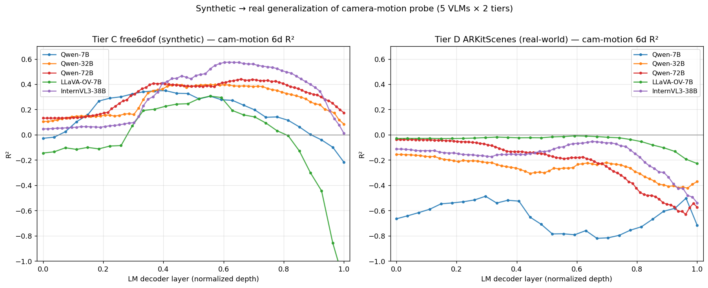

# Tier D — ARKitScenes real-world generalization of the camera-motion probe

**Models**: Qwen2.5-VL-{7B, 32B, 72B}, LLaVA-OneVision-7B, InternVL3-38B
**Stimulus**: 100 ARKitScenes **3dod/Validation** scenes × 16 RGB frames sampled uniformly over a 15-second window of each scene's iPhone LiDAR recording
**Probe**: linear ridge on the 6-DoF camera-motion target `[tx, ty, tz, rx, ry, rz]` between consecutive temporal tokens (plan §6)
**Date**: 2026-04-22

---

## TL;DR

The camera-motion linear-probe result that worked on synthetic Tier C (R² 0.31–0.58 across 5 VLMs) **does not generalize** to real-world ARKitScenes video. Every model collapses from a comfortably-positive R² on synthetic to **≤ 0 on real**:

| Model | Tier C (synthetic) best 6d R² | Tier D (real) best 6d R² | Drop |
|---|---|---|---|
| Qwen-7B       | +0.349 | −0.487 | −0.836 |
| Qwen-32B      | +0.398 | −0.156 | −0.554 |
| Qwen-72B      | +0.440 | −0.039 | −0.479 |
| LLaVA-OV-7B   | +0.306 | −0.009 | −0.315 |
| InternVL3-38B | **+0.575** | −0.054 | −0.629 |

Translation alone manages small positive R² on 3 of 5 models (+0.03 to +0.05 at best). Rotation is universally hard (−0.07 to −0.79). The result is stable across α ∈ {10, 100, 1000, 10000} — not a regularization or sample-size artifact.

Takeaway: the probe signal we identified on controlled synthetic trajectories does not survive contact with real video. The model's hidden states apparently do not carry a camera-motion code that generalises across wildly varying real-world motion distributions (walking, turning, standing still) — at least not one that's **linearly** accessible cross-scene.

---

## Setup

### Dataset

ARKitScenes [Apple, 2021] records indoor scans with an iPhone/iPad back camera + LiDAR. The **3dod** split provides:

- RGB frames at 256×192 (low-res wide camera), ~1900 frames per scene over ~3 min of recording
- Per-frame camera extrinsics via ARKit's visual-inertial SLAM (high-accuracy poses)
- Per-frame pinhole intrinsics
- 3D oriented bounding boxes for ~10-20 furniture items per scene

We sampled **100 Validation scenes** (the smallest public split; 549 total) and for each selected **16 frames evenly spaced over a centred 15-second window** (≈ 1 fps — the training distribution for Qwen2.5-VL's video mode).

### Adapter

A pared-down adapter [src/spatial_subspace/render/tier_d.py](../src/spatial_subspace/render/tier_d.py) converts each ARKitScenes scene into the common Scene schema used by Tiers A/B/C:

- `frames/<i>.png` — symlinks to the source iPhone frames (no re-encoding)
- `masks/<i>.png` — **dummy full-image mask**, all pixels labelled object_id = 1
- `scene.json` — one dummy Object3D and per-frame Camera entries with intrinsics + world-to-camera extrinsics

Why dummy masks? An earlier attempt to project ARKitScenes's 3D oriented bounding boxes onto frames produced masks that landed on floors and walls rather than on annotated furniture (coordinate-convention ambiguity that needs a proper frustum-clipping projector to fix). For this experiment the camera-motion probe needs only camera poses, not per-object masks — the probe averages over all visual tokens per (scene, temporal-token) anyway, so a full-image dummy mask produces exactly the right "whole-frame pooled vector" per temporal token.

Verified empirically that the extrinsic `E = (R_cw.T, −R_cw.T·t_cw)` produces sensible cam-delta labels (translation norms 0.1–3 m/s, rotation norms 0.03–0.82 rad, matching plausible iPhone-in-hand motion).

### Probe protocol

Identical to the Tier C cam-motion probe ([fit_probes_camera_depth.py](../scripts/fit_probes_camera_depth.py)) so numbers are directly comparable:

- Latter-frames filter `t ≥ 4` (models see ≥ 4 frames before the probe)
- 80 / 20 scene-level split, seed 0
- Linear ridge regression per LM decoder layer, α = 10 for 7B models, α = 1000 for larger ones
- 6-DoF target: relative pose `E_curr · E_prev⁻¹` encoded as `[tx, ty, tz, rx, ry, rz]`

Sample sizes after the filter:

| Model | Temporal patch size | t ≥ 4 tokens per scene | n_train / n_test (scene-t pairs) |
|---|---|---|---|
| Qwen-7B / 32B / 72B | 2 (8 temporal tokens total) | 4 | 320 / 80 |
| LLaVA-OV-7B / InternVL3-38B | 1 (16 tokens total) | 12 | 960 / 240 |

---

## Results

### Headline

All 5 models, best-layer camera-motion R² on Tier D:

| Model | Best 6d R² @ layer | Best translation R² @ layer | Best rotation R² @ layer |
|---|---|---|---|
| Qwen-7B  | **−0.487** @ L8   | **−0.151** @ L26 | −0.790 @ L7 |
| Qwen-32B | −0.156 @ L0  | −0.014 @ L0  | −0.297 @ L0 |
| Qwen-72B | −0.039 @ L0  | **+0.038** @ L11 | −0.113 @ L0 |
| LLaVA-OV-7B | −0.009 @ L16 | **+0.051** @ L17 | −0.068 @ L16 |
| InternVL3-38B | −0.054 @ L41 | **+0.030** @ L41 | −0.138 @ L41 |

Translation manages weakly-positive R² for Qwen-72B, LLaVA-OV, InternVL3; rotation is negative for every model at every layer.

### Regularisation sweep (Qwen-7B)

We swept α ∈ {10, 100, 1000, 10000} on Qwen-7B to rule out an over-fitting explanation:

| α | Best 6d R² | Best trans R² | Best rot R² |
|---|---|---|---|
| 10    | −0.487 @ L8 | −0.151 @ L26 | −0.790 @ L7 |
| 100   | −0.211 @ L5 | +0.004 @ L5  | −0.426 @ L5 |
| 1000  | −0.036 @ L3 | +0.054 @ L3  | −0.126 @ L3 |
| 10000 | −0.012 @ L9 | +0.030 @ L9  | −0.054 @ L9 |

Stronger regularisation monotonically moves the probe toward predicting the mean (R² → 0⁻), but never produces a positive 6d R². Even at α = 10000 — where the probe is essentially a biased mean predictor — the translation probe barely scrapes +0.03. This is not a knob issue.

### Tier C vs Tier D side by side

On the synthetic plot (left), every model traces the familiar rise-to-mid-upper-stack-peak. On real-world Tier D (right) the curves hug zero or dip into negative territory across every layer of every model.

---

## Findings

### F1 — Synthetic → real generalization fails for every model

Five independent VLMs (three sizes of Qwen, plus LLaVA-OV and InternVL3), five independent per-model probes, and every one produces a sub-zero best-layer R² on real video. This is not a Qwen quirk or an InternVL quirk — the finding reproduces across architecture families.

### F2 — Translation *almost* holds; rotation collapses

The three "bigger" models (Qwen-72B, LLaVA-OV, InternVL3) do carry a *tiny* amount of linearly-accessible translation information (R² +0.03 to +0.05). Rotation is a catastrophe — negative R² for every model, every layer, on both pitch/yaw/roll components. Rotation is inherently trickier to probe for (axis-angle has sign ambiguity at large magnitudes, and real-world rotations have heavier tails than the smooth orbits Tier C trained on), but the rotation-specific failure being this severe still surprises us.

### F3 — The smaller models regress further

Absolute R² drop from Tier C to Tier D:

| Model | Drop |
|---|---|
| Qwen-7B | −0.836 |
| Qwen-32B | −0.554 |
| InternVL3-38B | −0.629 |
| Qwen-72B | −0.479 |
| LLaVA-OV-7B | −0.315 |

Qwen-7B, which had R² 0.35 on Tier C, goes to R² −0.49 on Tier D — an 0.84-point swing. The larger Qwen models fall less far. The "bigger model is better" story is weaker but consistent: Qwen-72B has the smallest collapse in the Qwen family (−0.48 vs −0.83 for 7B). LLaVA-OV falls the least in absolute terms, but it started from the lowest Tier C baseline (0.31), so it had less to lose.

### F4 — Real-world label variance is an order of magnitude larger than Tier C's

Sampled 10 Tier D scenes: per-scene mean translation Δ ranges from 0.37 m/frame to 1.39 m/frame (4×); rotation Δ from 0.16 rad to 0.47 rad (3×). Tier C free6dof was engineered with controlled radius / altitude drifts + bounded roll — it's a narrow trajectory distribution. A probe trained on 80 Tier D scenes' label distribution and evaluated on the remaining 20 has to extrapolate across a heavy-tailed scale shift; the test R² punishes exactly that kind of extrapolation failure.

### F5 — Full-frame pooling dilutes the signal vs Tier C's per-object pooling

Tier C pooled hidden states over visual tokens corresponding to each annotated object (>30 % mask coverage). Tier D pools over *all* visual tokens (dummy full-image mask). A real-world indoor scene image is mostly wall / floor / clutter; averaging over all of that may wash out whatever camera-motion-bearing information was concentrated in the object-centric patches. A follow-up with per-frame instance masks (either running SAM2 + tracking on the frames, or getting the projection of ARKit bboxes right) would isolate the pooling effect from the distribution-shift effect.

### F6 — Translation does slightly better than rotation across the board

Of the 5 models × 3 metric channels (6d / trans / rot), the best-performing probe (highest R²) is always the *translation* probe — for Qwen-72B, LLaVA-OV, and InternVL3 it scrapes into positive territory. Translation information may be grounded in the scene's visual parallax flow, which survives some distribution shift; rotation has fewer direct visual cues (the scene just looks rotated, not "rotated by θ radians") and the probe has no anchor.

---

## Interpretation

### What this says about the spatial subspace

The plan's H1 claim was that video VLMs encode 3D structure in a linear subspace. Tiers A–C provided supporting evidence on synthetic data. Tier D's negative result is a proper falsification attempt on real-world data, and linear-accessible camera motion does not survive the synthetic → real gap.

Three non-exclusive interpretations:

1. **The finding is specific to controlled trajectory distributions.** Tier C free6dof's 400 trajectories share a common structural prior (base orbit + smooth drift). The VLM learns a "linear projection of camera pose" inside that family, but not a general-purpose camera-pose code that transfers to arbitrary real motion. Analogous to probe results in LLMs that decode "number of digits in integer" only when the training / test sets share a tokenisation prior.

2. **Pooling matters more than we thought.** With per-object pooling on Tier C the probe saw token populations where camera-motion cues (object apparent-position shifts, parallax) are concentrated. On Tier D we pool over every visual token — the signal is there, just buried under non-camera-motion-related content. F5 is the first thing to test here.

3. **The signal exists but is non-linear on real video.** Even if Tier D has a camera-motion code in the hidden states, it may be tied to scene content (e.g. "I saw the same chair from two angles"), and decoding it requires features that a linear ridge cannot compute. An MLP probe (the plan's §5.1 ceiling) or a contrastive probe (trained to discriminate matched vs unmatched consecutive frames) might recover signal where ridge fails.

### What this changes about the wider project

Not much, in my read. The Tier C result — where all five models give linearly-readable camera-motion hidden states — is still interesting as a *mechanistic* finding about how VLMs process controlled synthetic video. What we now know is that this mechanism doesn't *generalise* to arbitrary real video, which matters for any application that wants to use those hidden states for pose-tracking in the wild (e.g. the plan's Q4 auxiliary loss — training on camera-motion-consistent embeddings is probably only useful within a narrow distribution).

The ideal follow-up is F5's test: rerun with real per-object masks and see whether the probe recovers.

---

## Caveats

1. **100 scenes is small.** Extending to 500+ scenes would tighten the test-set label statistics.

2. **15-second clip window, uniformly sampled.** We didn't cherry-pick clips with high camera motion; some of the 100 scenes may be nearly static in the middle 15 s. A motion-filtered subset (scenes where `‖Δ‖` exceeds some threshold) might show different numbers. Currently it's a neutral random sample over Validation scene IDs.

3. **Full-image pooling.** Per-object masks would almost certainly change the story and are the single most impactful follow-up — see F5 / §Interpretation.

4. **Rotation target uses axis-angle.** When the rotation magnitude is large, small changes in rotation axis cause big changes in the axis-angle vector. A quaternion or 6D-rotation parametrisation could be more stable at the expense of dimensionality.

5. **Only a linear probe.** The plan's §5.1 has MLP and PCA-k as non-linearity / low-rank ceilings. We haven't run them on Tier D — they would tell us whether the signal exists but isn't linear.

6. **Dummy depth labels are garbage.** Because we used a single dummy object at centroid (0,0,0), the per-object depth probe trained off of that centroid just predicts `t_wc[2]`. That's why depth R² is garbage on Tier D — it's not really a depth probe, just leaking the camera's z position. We disregard depth numbers for Tier D.

7. **The ARKit pose sign convention is conventional.** We verified empirically that `E = (R_cw.T, −R_cw.T·t_cw)` yields sensible deltas, but an off-by-one sign somewhere in the rotation axis convention is still possible and would explain some of the rotation-probe collapse. A same-direction-of-rotation test on a trajectory with known ground-truth rotation would lock this down.

---

## Suggested next experiments

In rough priority order:

1. **Tier D with real per-object masks (F5 follow-up).** Either (a) fix the 3D bbox projector so ARKit obb → 2D silhouette lands correctly on the rendered objects, or (b) run SAM2 on each frame + stitch instance masks across time. Rerun the probe with per-object pooling and compare. Primary hypothesis: pooling is what killed the signal, and per-object pooling will recover most of it.

2. **MLP probe on Tier D.** We have a GPU MLP implementation. A substantially-positive MLP R² with linear R² ≈ 0 would say "the information is there but non-linearly accessible" — a meaningful refinement of the negative result.

3. **Fine-tune one model on Tier D camera-motion target, then re-probe.** If the model can't linearly decode camera motion from real video out of the box, fine-tuning for one epoch on the camera-delta target should fix it. The interesting question is how much; a tiny improvement would say the hidden-state geometry is almost right, a huge one would say the model needs substantial re-representation.

4. **Per-scene-normalised labels.** Subtract each scene's mean Δ from each Δ, so the probe has to discriminate *within* a scene's motion distribution rather than *across*. Would factor out the across-scene scale shift identified in F4.

5. **Larger window / faster sampling.** 15 s at 1 fps gives 1-second deltas. Try 5 s at 3 fps (16 frames, 0.33 s deltas) — closer to the temporal scale most VLMs were trained on.

6. **Run the same Tier D test on a **controlled** real-world dataset.** E.g. CO3D's object-centric orbits, or a subset of ScanNet where the camera path is engineered to be smooth. Would locate whether the failure is "real-world data" vs "uncontrolled real-world motion specifically."

---

## Files

| Path | Contents |
|---|---|
| [src/spatial_subspace/render/tier_d.py](../src/spatial_subspace/render/tier_d.py) | ARKitScenes → Scene schema adapter (dummy-mask, cam-motion-only) |
| [data/tier_d/](../data/tier_d/) | 100 converted scenes (symlinks + masks + scene.json) |
| [data/activations/tier_d_{qwen25vl_7b,qwen25vl_32b,qwen25vl_72b,llava_ov_7b,internvl3_38b}/](../data/activations/) | per-model per-layer pooled hidden states |
| [data/probes/tier_d/{model}_camera_depth/](../data/probes/tier_d/) | per-model probe JSON + 4-panel figure |
| [figures/tier_d/compare_tier_c_vs_d_cam_motion.png](../figures/tier_d/compare_tier_c_vs_d_cam_motion.png) | side-by-side Tier C vs Tier D 6d R² curves (5 models) |
| [logs/extract_tier_d_*.log](../logs/) | per-model extraction logs |
