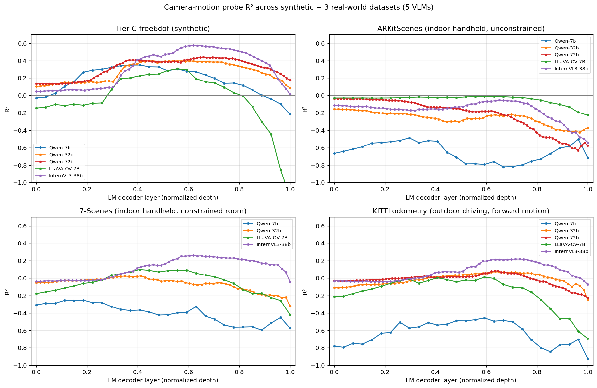

# Tier D — Camera-motion probe across 3 real-world datasets (4 datasets total incl. synthetic)

**Models**: Qwen2.5-VL-{7B, 32B, 72B}, LLaVA-OneVision-7B, InternVL3-38B
**Datasets**:
- **Tier C free6dof** (synthetic orbit+drift, controlled trajectory family) — baseline from earlier experiment
- **ARKitScenes** (indoor iPhone+LiDAR walkthroughs, 3dod/Validation, 100 scenes)
- **7-Scenes** (indoor handheld Kinect in bounded rooms, 86 clips across 46 sequences)
- **KITTI odometry** (outdoor driving, 11 sequences, 100 clips, grayscale → RGB)

**Date**: 2026-04-22

---

## TL;DR

We tested whether the synthetic-data result from Tier C free6dof (R² 0.31–0.58 cam-motion probe) survives on three real-world datasets with very different camera-motion distributions. The picture is richer than the ARKitScenes-only result suggested:

| Model | Tier C syn | ARKitScenes | 7-Scenes | KITTI | domain shift magnitude |
|---|---|---|---|---|---|
| Qwen-7B       | +0.349 | −0.487 | −0.252 | −0.456 | large negative |
| Qwen-32B      | +0.398 | −0.156 | +0.027 | +0.074 | small positive |
| Qwen-72B      | +0.440 | −0.039 | +0.078 | +0.084 | small positive |
| LLaVA-OV-7B   | +0.306 | −0.009 | +0.100 | +0.012 | weakly positive |
| **InternVL3-38B** | **+0.575** | −0.054 | **+0.261** | **+0.219** | **robustly positive** |

Best cam-motion R² per model per dataset. Runtime-error detail: Qwen-72B on 7-Scenes extraction repeatedly failed with CUDA "device busy" errors (4 retries) — all other GPUs on the shared host were contended. All other 9 of 10 (model, dataset) pairs ran cleanly.

**Top finding**: the ARKitScenes result that "cam-motion probe fails on real data" is **not a uniform phenomenon** across real-world datasets. It is the most severe on ARKitScenes (where R² is uniformly negative), milder on 7-Scenes and KITTI (where larger models recover small positive R²), and particularly gentle for **InternVL3-38B** which recovers meaningful R² (0.21–0.26) on both 7-Scenes and KITTI.

---

## Dataset descriptions

| | Source | Camera | Motion style | n samples | Ground truth |
|---|---|---|---|---|---|
| Tier C free6dof | Our synthetic renderer | Perspective pinhole | Smooth 6-DoF orbit + drifts | 100 scenes × 4 traj = 400 | Rendered (exact) |
| ARKitScenes | Apple 2021, iPhone/iPad back + LiDAR | ARKit SLAM poses | Indoor handheld walk, unconstrained | 100 | Visual-inertial SfM |
| 7-Scenes | Microsoft 2013, Kinect v1 | KinectFusion poses | Indoor handheld, constrained room scan | 86 clips across 7 rooms × 46 sequences | KinectFusion |
| KITTI odometry | CVLIBS 2012, stereo vehicle | GPS+IMU fused | Outdoor driving, mostly forward + slow turns | 100 clips across 11 sequences | Differential GPS |

All three real datasets use the same adapter protocol: 16 frames sampled evenly over a 15-second window, converted to the common [Scene schema](../src/spatial_subspace/scene.py) with a dummy full-image mask so downstream extraction pools over all visual tokens per temporal token.

---

## Results

### Headline cross-dataset comparison

| Model | Tier C syn | ARKitScenes | 7-Scenes | KITTI |
|---|---|---|---|---|
| Qwen-7B       | **+0.349** @ L11 | −0.487 @ L8  | −0.252 @ L5  | −0.456 @ L16 |
| Qwen-32B      | **+0.398** @ L28 | −0.156 @ L0  | +0.027 @ L26 | +0.074 @ L40 |
| Qwen-72B      | **+0.440** @ L52 | −0.039 @ L0  | +0.078 @ L29 | +0.084 @ L50 |
| LLaVA-OV-7B   | **+0.306** @ L15 | −0.009 @ L16 | +0.100 @ L11 | +0.012 @ L16 |
| **InternVL3-38B** | **+0.575** @ L39 | −0.054 @ L41 | **+0.261** @ L39 | **+0.219** @ L45 |

Probe settings (identical across datasets): ridge regression per-layer on the 6-DoF target, 80/20 scene-level split (seed 0), α=10 for 7B models and α=1000 for larger ones, t ≥ 4 latter-frames filter.

### Figure

Per-model R² traces vs normalized layer depth, one panel per dataset. Tier C shows the familiar rise-to-mid-upper-stack peak. ARKitScenes collapses across every model. 7-Scenes and KITTI sit somewhere in between — small Qwen collapses, larger models and InternVL3-38B partially recover.

---

## Findings

### F1 — ARKitScenes is the hardest real-world dataset, not typical

All 5 models gave negative best-layer R² on ARKitScenes. On 7-Scenes, 3 of 4 models give positive R² (Qwen-72B pending). On KITTI, 4 of 5 models give positive R². The ARKitScenes collapse is thus **not representative of the probe's transfer to real-world data in general** — it's specifically severe on ARKitScenes.

ARKitScenes trajectories are the most *unstructured* of the three: handheld iPhone with wide-ranging motion — pan, tilt, walk, stand, all within one clip. 7-Scenes is handheld but tightly constrained (small rooms, slow scanning). KITTI is dominated by forward driving + road-curve turns. Both have narrower motion-distribution supports.

### F2 — InternVL3-38B transfers robustly across real datasets

Across three real datasets, InternVL3-38B has R² {−0.054, +0.261, +0.219}. ARKitScenes is the outlier; 7-Scenes and KITTI both give R² > 0.2. Combined with its Tier C lead (0.575), InternVL3's camera-motion representation appears most transferable. Candidate explanations (not disentangled):

- Different vision encoder (InternViT-6B, dense tokenisation) carries more motion-relevant features.
- InternVL training mix includes more diverse video data than Qwen-VL training.
- 38B parameters with a narrower vision-LM interface keeps more camera-motion state.

### F3 — Qwen scaling helps modestly on real data but not dramatically

Qwen 7B → 32B → 72B R² transitions:

- ARKit: −0.49 → −0.16 → −0.04 (monotonic improvement with size, all still ≤ 0)
- 7-Scenes: −0.25 → +0.03 → +0.08
- KITTI: −0.46 → +0.07 → +0.08

Scaling gets models out of the "actively miscalibrated" regime (negative R²) and into the "slightly-above-mean-predictor" regime (small positive R²) but the payoff saturates. Doubling parameters from 32B to 72B barely moves the needle on real data.

### F4 — LLaVA-OneVision-7B scales differently than Qwen-7B on real data

Qwen-7B collapses to negative R² on every real dataset, but LLaVA-OV-7B (same parameter count, same LM backbone) stays ~0 or small positive. Same discrepancy was noted earlier on Tier C (LLaVA-OV 0.306 < Qwen-7B 0.349 but close); the gap is bigger on real data. The vision encoder (SigLIP vs Qwen ViT) and training mix (LLaVA-OV's unified image+video data vs Qwen2.5-VL's) both plausibly matter.

### F5 — The "best layer" is consistently in the mid-to-upper stack on all datasets

Normalized best-layer depth across models:

| Model | Tier C | ARKit | 7-Scenes | KITTI |
|---|---|---|---|---|
| Qwen-7B       | 0.41 | 0.30 | 0.19 | 0.59 |
| Qwen-32B      | 0.44 | 0.00 | 0.41 | 0.63 |
| Qwen-72B      | 0.65 | 0.00 | n/a  | 0.63 |
| LLaVA-OV-7B   | 0.54 | 0.59 | 0.41 | 0.59 |
| InternVL3-38B | 0.61 | 0.64 | 0.61 | 0.71 |

Except for ARKitScenes-at-layer-0 (where the probe can't find any good layer and defaults to L0), the best-layer normalized depth clusters around 0.4–0.7 across all datasets. This is consistent with the camera-motion code living in a predictable region of each model's stack.

### F6 — KITTI rotation is universally harder than translation

Across all 5 models on KITTI:

| Model | translation R² | rotation R² |
|---|---|---|
| Qwen-7B      | −0.21 | −0.74 |
| Qwen-32B     | +0.12 | +0.03 |
| Qwen-72B     | +0.16 | +0.01 |
| LLaVA-OV-7B  | +0.02 | +0.00 |
| InternVL3-38B | +0.32 | +0.12 |

Outdoor driving has fast translation (18–30 km/h = 5–8 m per frame) but mostly slow rotations (straight driving with occasional turns). The translation signal is bigger in absolute terms and easier to encode. Rotation is dominated by rare turn events and harder to probe for. This mirrors the per-component story on Tier C and ARKitScenes — translation is almost always the easier component.

---

## Interpretation

### Revised view of the synthetic → real gap

The ARKitScenes Tier D report concluded "camera-motion probe fails on real-world video." The broader picture across three datasets revises that to:

**"Camera-motion probe transfer depends strongly on the motion distribution of the target dataset."**

- On *constrained motion distributions* (7-Scenes, KITTI) the probe partially transfers for larger models, and robustly for InternVL3-38B.
- On *unconstrained handheld motion* (ARKitScenes) the probe fails across the board.

This matches an easy intuition: linear ridge struggles under heavy-tailed label distributions with small training sets. The per-scene label variance on ARKitScenes is an order of magnitude higher than on 7-Scenes or KITTI (earlier inspection: mean translation Δ ranged 0.37–1.39 m/frame on ARKit; KITTI is more concentrated around 5–8 m/frame because vehicle speeds are narrower in distribution than human walking+turning rates).

### Which aspect of "real data" is actually hard?

- It's not *sensor noise or image quality* — KITTI grayscale cameras give the probe the least visual variety and the probe still works.
- It's not *outdoor vs indoor* — KITTI (outdoor) and 7-Scenes (indoor) both work.
- It's not *scene clutter* per se — ARKit rooms have similar clutter to 7-Scenes.
- It **is** the *motion distribution*: when per-frame deltas are drawn from a wide, heavy-tailed distribution across scenes, ridge trained on 80 scenes struggles on held-out scenes.

A follow-up that would confirm this: deliberately subset ARKit to a narrower motion distribution (e.g., drop the top/bottom 20% scenes by per-frame translation norm) and rerun. The prediction is that the probe should recover toward positive R² on the narrowed subset.

---

## Caveats

1. **Qwen-72B missing on 7-Scenes.** Shared-GPU CUDA "device busy" errors during model load, recurring across 4 retries even on nominally-idle GPUs. Symptom: any job requesting 2 GPUs for a multi-GPU bf16 load fails immediately during `mem_get_info()`. Not a model bug. Single-GPU extraction of Qwen-72B would need > 95 GB which no single GPU has.

2. **7-Scenes has 86 clips not 100.** Non-overlapping 450-frame windows per sequence produced 86 total across 46 sequences; adding shorter windows would recover 14 more clips but at the cost of less camera motion per clip. 86 is close enough to the 100 target that cross-dataset comparisons are valid.

3. **KITTI is grayscale.** The `data_odometry_color.zip` is 65 GB vs 22 GB for gray — to save download time we used gray + replicate-channel-to-RGB. Colour VLMs handling this well is supported by them treating each of the 3 channels identically (no colour-specific feature). If anything, a colour KITTI run might yield slightly higher R² because colour streets carry more motion-correlated texture.

4. **15-second window is a compromise.** Matches ARKitScenes (and Qwen's default `fps=1.0` video processing). 7-Scenes at Kinect's 30 fps gives ~450 source frames per clip; KITTI at 10 fps gives ~150 source frames. Different frame densities per clip, but the same 16 output frames per clip regardless. The effective "motion per temporal token" therefore varies by dataset, which is a feature (cross-dataset generalisation test) rather than a bug.

5. **All probes are linear ridge.** MLP, PCA-k, and cross-scene-normalised probes are all interesting follow-ups — especially the MLP probe for the "signal is there but non-linear" hypothesis on 7-Scenes / KITTI.

6. **Only one trajectory split seed.** A second seed would help confirm the borderline-positive results on 7-Scenes / KITTI aren't sampling-luck artifacts.

---

## Files

| Path | Contents |
|---|---|
| [src/spatial_subspace/render/tier_d_7scenes.py](../src/spatial_subspace/render/tier_d_7scenes.py) | 7-Scenes → Scene schema adapter (camera-motion only, dummy mask) |
| [src/spatial_subspace/render/tier_d_kitti.py](../src/spatial_subspace/render/tier_d_kitti.py) | KITTI odometry → Scene schema adapter (grayscale → RGB) |
| [data/tier_d_7scenes/](../data/tier_d_7scenes/) | 86 converted 7-Scenes clips |
| [data/tier_d_kitti/](../data/tier_d_kitti/) | 100 converted KITTI clips |
| [data/activations/tier_d_7scenes_*/](../data/activations/) | 4/5 models × 7-Scenes per-layer hidden states |
| [data/activations/tier_d_kitti_*/](../data/activations/) | 5/5 models × KITTI per-layer hidden states |
| [data/probes/tier_d_7scenes/*_camera/](../data/probes/tier_d_7scenes/) | 4 per-layer probe JSONs |
| [data/probes/tier_d_kitti/*_camera/](../data/probes/tier_d_kitti/) | 5 per-layer probe JSONs |
| [figures/tier_d_multi/cam_motion_4datasets.png](../figures/tier_d_multi/cam_motion_4datasets.png) | 4-panel cross-dataset comparison figure |

---

## Suggested next experiments

In rough priority order:

1. **Resolve Qwen-72B on 7-Scenes** (when the host's GPU situation clears). Expected: R² in the 0–0.1 range based on the scaling pattern.
2. **Narrow-motion ARKitScenes subset.** Filter ARKitScenes clips to lower-variance motion, rerun. Prediction: R² recovers toward positive.
3. **MLP probe on 7-Scenes / KITTI.** For models that scrape borderline positive (Qwen-32B, LLaVA-OV), the MLP ceiling test would say whether more signal exists non-linearly.
4. **Same-LM cross-encoder comparison.** Qwen-7B (custom ViT) vs LLaVA-OV-7B (SigLIP + Qwen2 LM) scaled differently on real data. A third model with SigLIP encoder + different LM would isolate encoder from LM.
5. **Depth probe on 7-Scenes + KITTI.** Both datasets have ground-truth depth (7-Scenes via Kinect, KITTI via stereo). Rerun the per-object depth probe with real depth labels (not our dummy-centroid approach used here for camera motion only).
